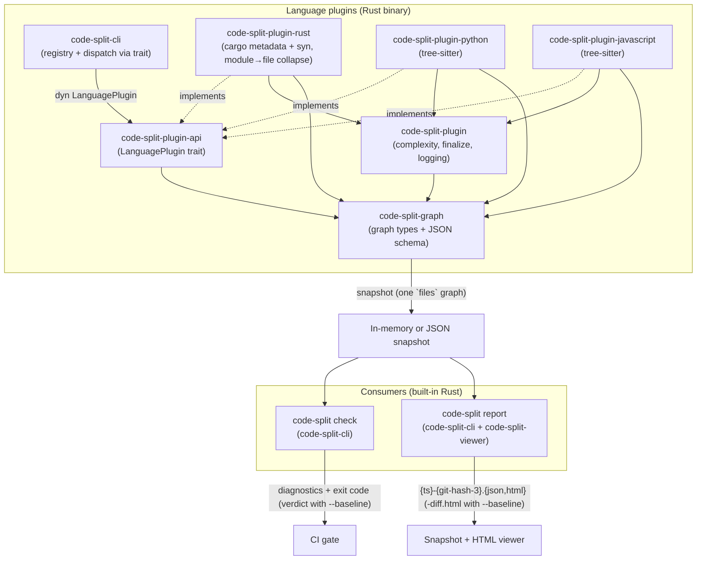
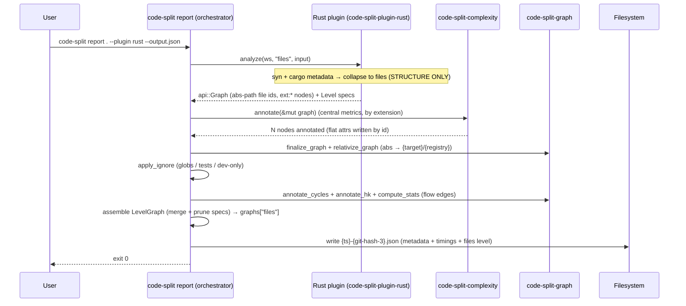
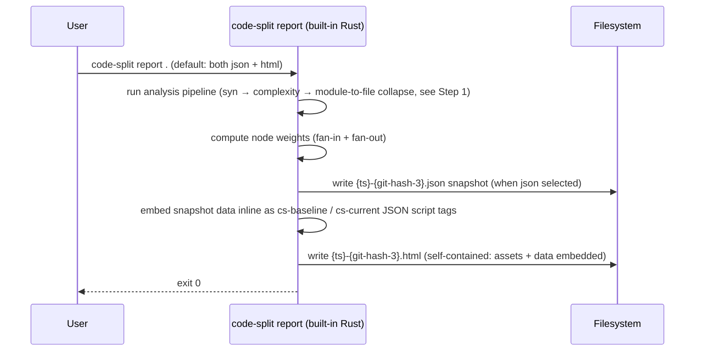
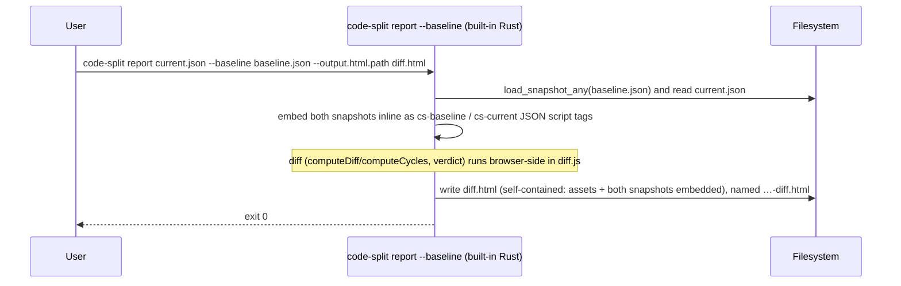
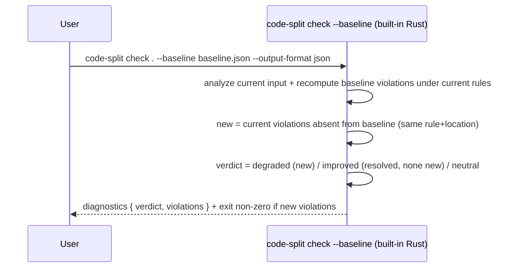

# Technical Design — Code Split

<!-- toc -->

- [1. Architecture Overview](#1-architecture-overview)
  - [1.1 Architectural Vision](#11-architectural-vision)
  - [1.2 Architecture Drivers](#12-architecture-drivers)
  - [1.3 Architecture Layers](#13-architecture-layers)
- [2. Principles & Constraints](#2-principles--constraints)
  - [2.1 Design Principles](#21-design-principles)
  - [2.2 Constraints](#22-constraints)
- [3. Technical Architecture](#3-technical-architecture)
  - [3.1 Domain Model](#31-domain-model)
  - [3.2 Component Model](#32-component-model)
  - [3.3 API Contracts](#33-api-contracts)
  - [3.4 Internal Dependencies](#34-internal-dependencies)
  - [3.5 External Dependencies](#35-external-dependencies)
  - [3.6 Interactions & Sequences](#36-interactions--sequences)
  - [3.7 Plugin System](#37-plugin-system)
  - [3.8 CLI Reference and Examples](#38-cli-reference-and-examples)
- [4. Additional Context](#4-additional-context)
- [5. Traceability](#5-traceability)

<!-- /toc -->

## 1. Architecture Overview

### 1.1 Architectural Vision

Code Split is a pipeline: **extract → evaluate / visualize → (user
modifies) → compare**. The platform is built around a single portable
JSON artifact format that decouples the extraction layer (plugins) from
the consumption layer (the `check` linter and `report` artifact writer).
Either layer can evolve independently as long as the schema version is
respected.

At P1 the platform ships three components:

- **Rust Plugin** (`code-split-rust`): a Cargo workspace analyzer built
  on `syn` (syntactic analysis). It builds the Rust module graph and
  collapses it to a single **file graph**; produces a single snapshot
  per run
- **Check** (`code-split check`): built into `code-split-cli`; analyzes (or
  reads) the input, evaluates cycle rules and thresholds, prints diagnostics,
  and exits non-zero on violation. With `--baseline <snapshot>` it switches
  to a **relative gate** — failing only on *new* violations vs the baseline —
  and emits a verdict (`improved` / `degraded` / `neutral`). Writes no files
- **Report** (`code-split report`): built into `code-split-cli`; analyzes (or
  reads) the input and writes artifacts — a snapshot `.json` and/or a single
  self-contained offline HTML viewer; all JS/CSS assets embedded in the binary
  via `include_str!`. With `--baseline <snapshot>` the HTML becomes a
  baseline↔current diff with a verdict (one shared union layout where the
  Baseline/Current toggle is a CSS visibility flip so common nodes never move),
  named `…-diff.html`. It also emits two refactoring-guidance formats
  (`--output.prompt` / `--output.scorecard`) — the console counterpart of the
  viewer's Prompt Generator, computed by the `recommend` module

The three pillars of the design are:

1. **JSON-first artifact contract** — the single snapshot is the
   sole handoff between all components; any plugin can feed any
   consumer
2. **Offline-first** — every P1 component runs without network access;
   generated HTML reports inline all assets
3. **Pluggable extraction layer** — the built-in plugins (`rust`,
   `python`, `javascript`) all produce the same JSON artifact, so new
   languages can be added as built-in plugins without touching the
   consumer tools

### 1.2 Architecture Drivers

#### Functional Drivers

| Requirement | Design Response |
|-------------|-----------------|
| `cpt-code-split-fr-rust-plugin` | Implemented by the `code-split-plugin-rust` crate (cargo metadata + `syn`), which collapses the module graph to a file graph. Dispatched in-process by `code-split-cli`'s `plugin` registry. Outputs a single snapshot `.json`. |
| `cpt-code-split-fr-lang-plugins` (Python, JS/TS) | Python: `code-split-plugin-python` using `tree-sitter-python`. JS/TS: `code-split-plugin-javascript` using `tree-sitter-javascript` / `tree-sitter-typescript`, supporting both ESM and CommonJS. Both emit `File` nodes + file→file `uses` edges + `External` library nodes, and annotate per-file complexity via the shared `code-split-plugin` crate. |
| `cpt-code-split-fr-file-graph` | All plugins emit a single file graph: `File` nodes with `uses` / `reexports` edges between files, plus `External` library nodes at depth 1 reached by `uses` edges flagged `external: true`. The Rust plugin derives it by collapsing its module graph; Python/JS/TS build it directly from import resolution. |
| `cpt-code-split-fr-html-report` | Built-in Rust renderer in `code-split-cli`: `report` analyzes (or reads) the input, then renders an HTML template with inline assets alongside the JSON snapshot. |
| `cpt-code-split-fr-node-sorting` | Node weight (fan-in + fan-out) is computed at render time and embedded in the HTML; client-side JavaScript sorts the table on user interaction. |
| `cpt-code-split-fr-ai-prompts` | HTML: the viewer's Prompt Generator (`export-popup.js`). CLI: the `recommend` module (`code-split-cli/src/recommend.rs`) drives the `report --output.prompt` (LLM Markdown for one principle) and `--output.scorecard` (console triage) formats from the snapshot's calibrated thresholds — advisory, no exit code. |
| `cpt-code-split-fr-graph-diff` | Browser-side diff in the HTML viewer (`diff.js` `computeDiff`/`computeCycles`): node/edge set difference on the file graph and `affected` propagation, from the two embedded snapshots. The `check --baseline` regression gate is rule-based (re-evaluates rules on the baseline), not a structured graph diff. |
| `cpt-code-split-fr-diff-html-report` | With `report --baseline <snapshot>` the viewer becomes a self-contained diff with color-coded baseline/current views and a verdict; all assets inlined; the file is named `…-diff.html`. |
| `cpt-code-split-fr-diff-text-report` | `check --baseline <snapshot> --output-format json` emits the machine-readable verdict (`improved` / `degraded` / `neutral`) and the list of new violations for CI parsing. |

#### NFR Allocation

| NFR ID | Summary | Allocated To | Design Response |
|--------|---------|--------------|-----------------|
| `cpt-code-split-nfr-offline` | Zero outbound network calls | All components | Rust plugin: no HTTP; `code-split check` / `code-split report`: HTML assets embedded in binary, no CDN references in generated output. |
| `cpt-code-split-nfr-performance` | ≤ 30 s @ 50k LOC (plugin); ≤ 5 s @ 10k nodes (check/report) | `code-split-plugin-rust`, `code-split-plugin`, `code-split-cli` | Syntactic analysis + the module→file collapse run in seconds (no rust-analyzer); `check` / `report` process a snapshot in a single pass. |
| `cpt-code-split-nfr-portability` | JSON artifacts stable within a major version | All components | Schema version field in `meta`; consumers abort on mismatch; additive-only changes within a major version. |

### 1.3 Architecture Layers



| Layer | Responsibility | Technology |
|-------|---------------|------------|
| Plugin — Presentation | Argument parsing, output routing, artifact writing | `clap`, `anyhow` (Rust) |
| Plugin — Application | Dispatch language plugins, assemble the snapshot | `code-split-cli` (Rust) |
| Plugin — Domain | Generic graph model + operations (cycles/hk/stats/snapshot) | `code-split-plugin-api`, `code-split-graph`, `serde` (Rust) |
| Plugin — Contract | The `LanguagePlugin` trait every language plugin implements; the CLI works only against it | `code-split-plugin-api` (Rust) |
| Plugin — Infrastructure | Per-language analysis (one crate each, behind the trait) on a shared utility layer (complexity, finalize, logging) | `code-split-plugin-rust`/`-python`/`-javascript`, `code-split-plugin`, `syn`, `tree-sitter`, `rust-code-analysis` (Rust) |
| Check | Analyze (or read) input, evaluate rules and (with `--baseline`) regressions, print diagnostics, exit non-zero on violation | `code-split-cli` (Rust) |
| Report | Analyze (or read) input, write snapshot JSON + offline HTML viewer (a diff with `--baseline`) | `code-split-cli` + `code-split-viewer` (Rust), Graphviz WASM bundled in binary, assets embedded via `include_str!` |

## 2. Principles & Constraints

### 2.1 Design Principles

#### JSON Artifact Contract as the Sole Integration Surface

- [x] `p1` - **ID**: `cpt-code-split-principle-json-contract`

The single JSON snapshot (one `files` graph plus metadata) is the
ONLY handoff between the plugin layer and the consumer layer. No
in-process coupling between the analysis crates and the report
rendering code is permitted. This contract is versioned via
`schema_version`; consumers abort on a version mismatch.

#### Offline-First

- [x] `p1` - **ID**: `cpt-code-split-principle-offline-first`

Every P1 component must work without network access. Generated HTML
files must contain no external resource references. This is a design
constraint, not a preference — it must be verified in CI.

#### Files-Only Graph Model

- [x] `p1` - **ID**: `cpt-code-split-principle-files-only`

The model is a **generic property graph** (free-form node/edge `kind` +
attribute maps), but today the snapshot carries exactly one level: **files**.
Node kinds in output are `"file"` (a project source file, carrying all metrics)
and `"external"` (a third-party library at depth 1 — one node per library, never
expanded). The one **information-flow** edge kind is `uses` between files; the
structural `contains` (module ownership) and `reexports` (a `pub use` facade) are
recorded but non-flow — excluded from fan-in / HK / cycles and not drawn. An edge is external iff its target is an
`external` node. There is no module, function, or call graph yet: plugins resolve
everything to file→file dependencies before the snapshot is written. The `graphs`
map and the per-level semantics dictionaries leave room for `module` / `function`
levels later with no model change.

#### Internal Coupling Excludes External Libraries

- [x] `p1` - **ID**: `cpt-code-split-principle-internal-coupling`

`fan_in`, `fan_out`, and Henry-Kafura (`HK = sloc × (fan_in × fan_out)²`)
are computed from **internal** file→file edges only. Edges to `External`
library nodes are excluded from these counts and from HK, and are
surfaced separately in `coupling.fan_out_external`. Rationale: HK
measures internal architectural coupling, not the breadth of 3rd-party
library usage, which would otherwise drown out real structural signal.

#### Pluggable Extraction, Stable Consumers

- [x] `p1` - **ID**: `cpt-code-split-principle-pluggable`

The `check` linter and `report` artifact writer are schema consumers, not
language-aware tools. Adding a new language plugin MUST NOT require
changes to any consumer tool. All language-specific knowledge lives
exclusively in the plugin.

### 2.2 Constraints

#### Stable Rust Toolchain

- [x] `p1` - **ID**: `cpt-code-split-constraint-stable-rust`

The Rust plugin must build on stable Rust. `rustc_private` and
nightly-only features are prohibited.

#### Python 3.9+ Minimum

- [x] `p3` - **ID**: `cpt-code-split-constraint-python`

The built-in Python language plugin targets Python 3.9+ as the minimum
version to analyze. No Python runtime is required by the `code-split`
binary itself; the constraint applies to the target workspace being
analyzed, not the execution environment.

## 3. Technical Architecture

### 3.1 Domain Model

**Technology**: a **generic property-graph** model. The contract types live in
`code-split-plugin-api`; the serializable snapshot and computed-data types live
in `code-split-graph`.

The model is deliberately language-agnostic: there are **no** `NodeKind` /
`EdgeKind` / `Visibility` enums and no fixed metric field set. A node has a
free-form string `kind` and a free-form attribute map; a source file is just
`kind == "file"`. The core never interprets `kind`; it reads only the attribute
keys it understands, described per level by the semantics dictionaries.

| Entity | Description | Location |
|--------|-------------|----------|
| Graph | Pure structure: `nodes: Vec<Node>` + `edges: Vec<Edge>`. No computed data. What a plugin's `analyze` returns. | `crates/code-split-plugin-api/src/graph.rs` |
| Node | `id: NodeId`, `kind: String` (`"file"` / `"external"` today), `name: String`, `parent: Option<NodeId>`, `attrs: Attributes` (flattened into the JSON object). | `crates/code-split-plugin-api/src/node.rs` |
| Edge | `source: NodeId`, `target: NodeId`, `kind: String` (`"uses"` / `"contains"` / `"reexports"`), `attrs: Attributes` (usually empty; e.g. a Rust `reexports` edge carries `visibility`). An edge is **external iff its `target` node is external** — there is no `edge.external` flag. | `crates/code-split-plugin-api/src/edge.rs` |
| Attributes | `BTreeMap<String, AttrValue>` (alphabetical → byte-stable). Plugins fill **structural** keys (`path`, `loc`, `visibility`, `version`, `items`, `external`, `crate` — the Rust plugin's per-target owning crate, e.g. `bat` / `bat (bin)`, …); the orchestrator adds **computed** keys (`cyclomatic`, `cognitive`, `sloc`, `lloc`, `cloc`, `blank`, `mi`, `mi_sei`, `length`, `vocabulary`, `volume`, `effort`, `time`, `bugs`, `fan_in`, `fan_out`, `fan_out_external`, `hk`, `cycle`) into the same map by node id. All flat — no nesting. Zero-valued metrics are omitted. | `crates/code-split-plugin-api/src/attrs.rs` |
| AttrValue | Untagged scalar: `Bool` / `Int` / `Float` / `Str` (serialized to its natural JSON form). Metric producers round to 3 significant digits and store an integral value as `Int` so e.g. `1.0` serializes as `1`. | `crates/code-split-plugin-api/src/attrs.rs` |
| NodeId | Stable string key. A **file node's id IS its relativized path** — `{target}/src/a.rs` (no `file:` prefix); an external node is `ext:{name}` (`ext:serde`). During analysis a file id is its absolute path; the orchestrator relativizes it against the named roots. | `crates/code-split-plugin-api/src/node.rs` |
| Level | What a plugin can produce, with its semantics dictionaries: `name`, `edge_kinds`, `node_attributes` / `edge_attributes`, `attribute_groups`, plus `node_kinds: BTreeMap<String, NodeKindSpec>` and `cycle_kinds: BTreeMap<String, CycleKindSpec>` (seeded from `default_node_kinds()` / `default_cycle_kinds()`, overridable), plus an optional `grouping: Grouping` telling the viewer how to cluster nodes — `{ key }` (group by a node attribute's value, e.g. `crate`) or `{ function }` (a named viewer grouper, e.g. `dir`). The orchestrator merges the plugin's structural attribute specs with the central complexity + coupling specs, overlays the plugin's `thresholds()`, computes the `ui` block, then prunes everything to what is actually present. | `crates/code-split-plugin-api/src/level.rs` |
| EdgeKindSpec | `flow: bool` (single source of truth — counted/drawn when `true`; structural like `contains` when `false`), plus optional `label` / `description`. | `crates/code-split-plugin-api/src/level.rs` |
| AttributeSpec | Everything the UI needs to render a metric from data: `value_type`, `label`, `name` (tooltip title), `short` (table header), `description`, `formula` (display), `calc` (an `eval`-able JS expression over sibling attrs — the live derivation), `direction` (`higher_better`/`lower_better`, for delta colour), `abbreviate` (K/M), `group`, `thresholds {info, warning}`. All optional but `value_type`. | `crates/code-split-plugin-api/src/level.rs` |
| NodeKindSpec / CycleKindSpec | Per-kind UI semantics. `NodeKindSpec`: `label`/`plural`/`fill`/`stroke`/`external`. `CycleKindSpec`: `label`/`description`. Generic defaults from `default_node_kinds()` / `default_cycle_kinds()` in `code-split-plugin-api`. | `crates/code-split-plugin-api/src/level.rs` |
| Thresholds | `{ info: f64, warning: f64 }` — two-tier per-metric thresholds; language-calibrated, returned by a plugin's `thresholds()` and overlaid onto the matching `AttributeSpec`. | `crates/code-split-plugin-api/src/level.rs` |
| Preset | A Prompt-Generator principle: `id`, `label`, `title`, `prompt`, `doc_url?`, `sort_metric`, `connections`. The orchestrator builds a generic default catalog (`code-split-cli/src/presets.rs`) and a plugin's `presets(defaults, input)` hook may pass through / edit / extend it. Stored top-level in the snapshot. | `crates/code-split-plugin-api/src/plugin.rs` |
| CycleGroup | SCC with ≥ 2 nodes: `kind: String` (`"test_embed"` / `"mutual"` / `"chain"`), `nodes: Vec<NodeId>`. Each member node also carries a `cycle` attribute. | `crates/code-split-graph/src/level_graph.rs` |
| LevelUi | Computed UI hints: `default_sort`, `sort_metrics`, `size_metrics`, `card_metrics`, `columns`, `summary_metrics` — each a curated metric order filtered to the attributes present, so the viewer hardcodes none of it — plus an optional `grouping` (carried through from the level spec, pruned to a usable attribute) telling the viewer how to cluster diagram nodes. | `crates/code-split-graph/src/level_graph.rs` |
| LevelGraph | One analysis level in the snapshot: the semantics dictionaries (`edge_kinds`/`node_attributes`/`edge_attributes`/`attribute_groups`/`node_kinds`/`cycle_kinds`) + `nodes` + `edges` + `cycles: Vec<CycleGroup>` + `stats: BTreeMap<String, AttrValue>` (flat averages) + `ui: LevelUi`. | `crates/code-split-graph/src/level_graph.rs` |
| Snapshot | The `.json` artifact: `schema_version: "2"`, `generated_at`, `command`, `workspace`, `target`, `plugin`, `config_file?`, `versions`, `roots`, `git?`, `timings`, `graphs: BTreeMap<String, LevelGraph>`, and top-level `presets: Vec<Preset>`. Serialized via `to_canonical_string_pretty` — **canonical JSON** (alphabetical keys; `nodes`/`edges` sorted). | `crates/code-split-graph/src/snapshot.rs` |
| StageTime | Per-stage timing entry: `stage`, `ms`, `detail`. Stored in `Snapshot.timings` in execution order. | `crates/code-split-graph/src/snapshot.rs` |

**Relationships**:

- `Node` → `Node`: linked via `Edge` (`source` → `target`).
- `Graph` → `Node`/`Edge`: ownership; a node carries an optional `parent`
  pointing to a containing node (unused on file nodes today — diagram clustering
  is driven by the level's `ui.grouping`, not the `parent` field).
- Snapshot diff (`--baseline`) is computed **browser-side** by the viewer
  (`diff.js`) from the two embedded snapshots; there is no server-side
  `compare_snapshots` / `CompareSummary` (removed). `check --baseline` gates
  by re-evaluating rules on the baseline, not by a structured graph diff.

### 3.2 Component Model

#### code-split-graph

- [x] `p1` - **ID**: `cpt-code-split-component-core`

Operations **over** the generic model (defined in `code-split-plugin-api`):
cycle detection, Henry-Kafura coupling, aggregate stats, id relativization, and
the serializable `Snapshot` / `LevelGraph` types. Language-agnostic, zero I/O.
Depends on `code-split-plugin-api`, `serde`, `chrono`, `anyhow` only — no
`petgraph`, `cargo_metadata`, `syn`, or analyzers. Which edge kinds count as
information flow is **not hardcoded** — every pass takes a `flow_kinds: HashSet<String>`
the orchestrator derives from the level's `EdgeKindSpec.flow`.

Modules:

- **`cycles.rs`** — `annotate_cycles(graph, flow_kinds) -> Vec<CycleGroup>`:
  Kosaraju SCC over flow edges (today just `uses`). Both `contains` and
  `reexports` are non-flow (`EdgeKindSpec.flow = false`), so a `mod foo;`
  parent/child pair and a `pub use` facade hub (`lib.rs` / `mod.rs`) never
  fabricate cycles. An SCC whose members span **more than one crate** is dropped
  — Rust forbids circular crate dependencies, so it can only be a resolution
  artifact (crate identity read from the node `crate` attribute, falling back to
  the path). Classifies each surviving SCC `"test_embed"` (any member under
  `tests/` / `test_support/` / a `*_test[s]` file) / `"mutual"` / `"chain"` and
  writes a `cycle` attribute on each member node.
- **`hk.rs`** — `annotate_hk(graph, flow_kinds)`: writes `fan_in` / `fan_out` /
  `fan_out_external` / `hk` (`hk = sloc × (fan_in × fan_out)²`) into each
  internal node's `attrs`. `fan_in` / `fan_out` count unique **internal** flow
  partners only; edges whose target is external are counted into
  `fan_out_external` instead. Zero values are omitted.
- **`stats.rs`** — `compute_stats(graph) -> BTreeMap<String, AttrValue>`: the
  mean of each tracked numeric metric across the file nodes (zero/missing values
  excluded; a metric emitted only when its average is positive).
- **`finalize.rs`** — `finalize_graph`: drop self-loops, dedup edges on
  `(source, target, kind)`, prune unreferenced external nodes, sort.
- **`snapshot.rs`** — the top-level `Snapshot` artifact (`schema_version`,
  header, `graphs` map, `presets`) plus its header types `GitInfo` / `StageTime`.
- **`level_graph.rs`** — the widely-imported per-level payload types: `LevelGraph`
  (graph + semantics dictionaries + computed cycles/stats/UI), `LevelUi`, and
  `CycleGroup`. Split out from `snapshot.rs` so their fan-in lands here, not on
  the artifact module (keeps each file's Henry-Kafura low).
- **`relativize.rs`** — `relativize_graph` / `relativize_level`: map absolute
  file paths to `{target}` / `{registry}` / … tokens (following edges, parents
  and cycle node lists) and drop a file node's redundant `path`.
- **`serialize.rs`** — **canonical serialization** (`to_canonical_string` /
  `to_canonical_string_pretty`): round-trips through `serde_json::Value` (a
  `BTreeMap`, so keys come out alphabetical) and sorts `nodes` by `id` and
  `edges` by `source`/`target`/`kind`, byte-stable for unchanged input. Generic
  over any `Serialize`; depends on nothing else in the crate.
- **`attrs.rs`** — the shared attribute helpers every enrichment pass pulls in:
  `round_sig3` / `num_attr` (numeric rounding + the `f64 → AttrValue` bridge) and
  the `attr_f64` / `is_external` reads/predicate. A **leaf** module that depends
  only on the plugin API, never on the crate root — so the passes import helpers
  from here instead of `use crate::…`, which would otherwise close a
  `submodule → lib.rs → submodule` dependency cycle.
- **`lib.rs`** — declares the submodules (`pub mod attrs; … pub mod stats;`) and
  holds `coupling_specs()` (the coupling/cycle `AttributeSpec`s + the `coupling`
  group, merged in by the orchestrator). It carries **no `pub use` re-exports** —
  consumers import each item from its owning submodule path
  (`code_split_graph::snapshot::Snapshot`, `…::cycles::annotate_cycles`,
  `…::attrs::num_attr`, …). Keeping the crate root off the flow graph (no
  re-export hub) is deliberate: a flat prelude gave `lib.rs` a flow edge to every
  submodule (`fan_out`), and Henry-Kafura — `sloc × (fan_in × fan_out)²` —
  squares that, so the root scored a large false-positive HK. (There is no
  server-side snapshot-diff module — `--baseline` diffing is done browser-side by
  the viewer's `diff.js`.)

#### code-split-plugin-api

- [x] `p1` - **ID**: `cpt-code-split-component-plugin-api`

The **foundation** crate: it defines the generic model (`Node` / `Edge` /
`Graph` / `Attributes` / `AttrValue` / `Level` + the `EdgeKindSpec` /
`AttributeSpec` / `AttributeGroup` spec types) and the single trait,
`LanguagePlugin`. It depends on **nothing** of ours (only `serde` + `anyhow`)
and re-exports nothing; every other crate depends on it. The model lives in
topic submodules (`attrs` / `edge` / `graph` / `level` / `node` / `plugin`) and
consumers import from those paths (`code_split_plugin_api::node::Node`,
`…::graph::Graph`, …) rather than a flat crate-root prelude — the root has no
`pub use` hub, which keeps its `fan_out` (and therefore Henry-Kafura HK) low for
a crate that everything else depends on.

`LanguagePlugin` is a **pure parser** contract — `name`, `detect(ws, input)`
(can-parse, replacing markers), `levels` (the levels + their semantics
dictionaries), `analyze(ws, level, input) -> Graph` (**structure only**, no
metrics), `versions` (e.g. `rustc`). `PluginInput` carries `ignore` globs +
free-form `options`, so input can grow without trait changes.

The CLI works **only** against `dyn LanguagePlugin`. The single place that names
concrete plugins is `code-split-cli`'s `plugin::registry() -> Vec<Box<dyn
LanguagePlugin>>`; dispatch (`analyze`), `detect`, and `versions` all iterate
that list. Adding a language is: implement the trait in a new crate, add one
line to `registry()` — nothing else changes.

#### code-split-plugin-rust

- [x] `p1` - **ID**: `cpt-code-split-component-syn`

The Rust language plugin (implements `LanguagePlugin`; analysis in `analyze`),
dispatched by `code-split-cli`. It produces the Rust module graph via syntactic
analysis and collapses it to a file graph (see §3.7) before returning a generic
`api::Graph` — **structure only, no metrics** (complexity is added centrally by
the orchestrator). It builds with a crate-local typed model
(`src/internal.rs` — `Node` / `Edge` / `Visibility`) for the syn/collapse passes
and converts to the generic model at the boundary, so it depends on
`code-split-plugin-api` only (not `code-split-graph`, not `rust-code-analysis`).
Calls `cargo metadata` **with `--offline`** (code-split never hits the network —
it resolves from the warm cargo cache, surfacing an actionable error otherwise);
classifies crates as local vs. external; walks local source trees with `syn` to
extract the module hierarchy and `use` / `pub use` statements, emitting internal
crate / module / trait nodes and `contains` / `uses` / `reexports` edges. It also runs a `syn::visit`
path collector over each file to capture **bare qualified paths** in
expressions/types (≥ 2 segments, no `use`) **and qualified paths inside
`#[derive(...)]`** (e.g. `serde::Serialize`), resolved through the same
full resolver as `use` statements.

Resolution runs in **two phases** so cross-crate edges can be submodule-precise:
phase A walks every workspace crate, building all module nodes and a per-crate
library module index; phase B then resolves the collected `use` / bare-path
references against (1) the owning crate's index (intra-crate / `crate` / `self`
/ `super`), (2) the **workspace libraries** (each a module index + `pub use`
re-export table) — a cross-crate `other_crate::sub::Item` walks the dependency
crate's index to the file that owns `Item` (→ its `sub.rs`), falling back to the
crate root when the path stops at a root item — and (3) the extern-crate map
(registry deps → one crate-root / `External` node). `std`/`core`/keyword-only
paths are ignored; external crates are added as `Crate` nodes with
`external = true` and their source is never read. Resolution is
**re-export-aware**, both intra- and cross-crate: when a path's trailing segment
is not a submodule but a symbol the resolved module re-exports
(`pub use error::DomainError`, or another crate's `pub use access_scope::AccessScope`),
it follows the `pub use` chain to the file that **defines** the symbol instead of
anchoring on the facade — so `crate::X` / `super::X` and `other_crate::X` land on
the definer, not on a 17-line `lib.rs` / `mod.rs` hub (which would otherwise
collect a huge false `fan_in`). Module
node ids are namespaced **per target** (`mod:{pkg}::{kind}:{name}::…`): a package
exposing a library and a same-named binary (`bat` lib + `bat` bin) keeps two
distinct module trees, so `crate::X` in the library never mis-resolves onto the
binary's `main.rs` (which would otherwise invent an impossible library→binary
edge and an inflated `main.rs` fan_in). Each module records its owning crate,
surfaced on the collapsed file node as the per-target `crate` attribute. A
per-package `visited_files` `HashSet<PathBuf>` guard prevents double-walking
source files when a workspace has both `lib` and `bin` targets declaring the
same modules. A `mod` with `#[path = "…"]` is resolved via that
attribute (relative to the declaring file's directory) before the default
`name.rs` / `name/mod.rs` lookup.

These module-level nodes are **internal**: the Rust plugin's collapse
pass (see §3.7) folds them down to file nodes (`kind == "file"`, id = the
file's absolute path) and external library nodes (`ext:{name}`, carrying
`external: true`, the resolved `version`, and the dependency's source `path`)
before returning. The orchestrator then relativizes the absolute file ids to
`{target}/…` and the external `path` to `{registry}/…`.

**Edge sources & remaining blind spots**: file→file / file→library edges
come from three sources — (1) `use` / `pub use` statements; (2) bare
qualified paths in expressions/types (`commands::run()`, `other_crate::item`,
`crate::a::Alpha`); (3) qualified paths inside `#[derive(...)]`
(`serde::Serialize`) — all resolved the same way as `use`. A `mod foo;`
declaration emits a `Contains` edge that is kept in the JSON but treated as
structural ownership only — not drawn, not counted in fan_in / HK / cycles.
What remains uncaptured: any path **inside a macro body** (the macro's own path
is recorded, e.g. `anyhow::bail!`, but the tokens it wraps are not — macros are
never expanded), an old-style `extern crate foo;` (no path), and a cross-crate
reference into a registry dependency (no local module index) which still
collapses onto the single `External` node. A file reached only via `Contains`
(e.g. a module declared with `mod foo;` but never referenced by path or `use`)
has `fan_in` 0 and can appear isolated on the map.

#### code-split-complexity

- [x] `p1` - **ID**: `cpt-code-split-component-complexity`

The **central, language-agnostic** complexity pass — the single place that knows
`rust-code-analysis` (Mozilla, via the `ffedoroff/rust-code-analysis` fork on
branch `patch/update-tree-sitter-0.26.8`). Plugins emit structure only; this
crate computes metrics. Depends on `code-split-plugin-api` (the model) and
`code-split-graph` (for `num_attr`).

**Interface**: `annotate(graph: &mut Graph) -> usize`. It iterates every file
node (`kind == "file"`, whose `id` is the file's absolute path at this stage),
reads the file, picks a parser **by extension** (`rs` → Rust, `py` → Python,
`ts`/`mts`/`cts` → TypeScript, `tsx` → Tsx, `js`/`jsx`/`mjs`/`cjs` → JavaScript),
computes the file's root `FuncSpace`, and writes the metrics into the node's
`attrs` as flat keys. There is no per-plugin extension list or parser callback —
the dispatch lives here. Whole-file aggregate, so all functions, methods, arrow
functions and closures roll up into the file's single node.

`metric_specs()` exposes the metric `AttributeSpec`s + their groups (complexity /
halstead / loc / maintainability), which the orchestrator merges into each
level's dictionaries and then prunes to the keys actually present.

**Metrics written per file** (flat `attrs` keys; each omitted when it rounds to
zero; the LOC block is gated on `sloc > 0`, the Halstead block on `volume > 0`):

| Group | Keys |
|----------|------|
| complexity | `cyclomatic`, `cognitive`, `exits`, `args`, `closures` |
| maintainability | `mi`, `mi_sei` |
| loc | `sloc`, `lloc`, `cloc`, `blank` |
| halstead | `length`, `vocabulary`, `volume`, `effort`, `time`, `bugs` |

Coupling (`fan_in` / `fan_out` / `fan_out_external` / `hk`) and `cycle` are added
later by `code-split-graph` (`annotate_hk` / `annotate_cycles`), not here.

#### code-split-plugin-python (built-in)

- [x] `p3` - **ID**: `cpt-code-split-component-python-plugin`

In-process Python plugin implemented in `code-split-plugin-python/src/lib.rs`.
Uses `tree-sitter-python` (already a transitive dep via `rust-code-analysis`)
for AST traversal and `walkdir` for file discovery.

**Pipeline**:

1. **Scan** — walk all `.py` files under the workspace, skipping `.venv`,
   `__pycache__`, `node_modules`, and any dot-prefixed directory.
2. **Module index** — derive dotted module paths from file paths:
   `parser/shops/amazon/pdp.py` → `parser.shops.amazon.pdp`;
   `parser/shops/amazon/__init__.py` → `parser.shops.amazon`.
3. **Per-file node** — emit one `File` node per `.py` file.
4. **Import resolution** — resolve `import_statement` and
   `import_from_statement` nodes. Imports that resolve to a project file
   emit a file→file `uses` edge (including `__init__.py` package imports,
   which point at the package's `__init__.py` file); relative imports
   (`.`, `..`, `.submodule`) are resolved against the current module's
   package path. Imports that do not resolve to a project file produce an
   `External` library node (`ext:<top-level-package>`, one per top-level
   package such as `numpy`) reached by a `uses` edge flagged
   `external: true`.

It implements `LanguagePlugin` (`analyze` returns a generic `api::Graph`,
structure only) and depends on `code-split-plugin-api` only. `detect` matches
`pyproject.toml` / `setup.py` / `setup.cfg`.

**ID scheme**:
- File: the file's absolute path (relativized to `{target}/...` by the
  orchestrator; no `file:` prefix)
- External library: `ext:numpy` (carries `external: true`)

**Visibility heuristic**: emitted as a `visibility` string attr — `__name`
(no trailing dunder) → `private`; `_name` → `restricted`; otherwise → `public`.

**Complexity** is added centrally by `code-split-complexity` (by `.py`
extension) — the plugin computes none.

#### code-split-plugin-javascript (built-in)

- [x] `p3` - **ID**: `cpt-code-split-component-js-plugin`

In-process JavaScript plugin implemented in
`code-split-plugin-javascript/src/lib.rs` (`name = "javascript"`, scans
`.js`/`.jsx`/`.mjs`/`.cjs` via `tree-sitter-javascript`, `detect` = a
`package.json` marker). It implements `LanguagePlugin` (`analyze` returns a
generic `api::Graph`, structure only) and **also exposes the shared ECMAScript
logic** the TypeScript plugin reuses by composition: `analyze_ecmascript(ws,
exts, lang_for_ext, candidate_exts_order)` (the walker / import-specifier
extractor / resolver — the tree-sitter node kinds are identical across the JS
and TS grammars), `ecmascript_level(name)`, `detect_with_marker`, and
`external_package`. Depends on `code-split-plugin-api` + `tree-sitter` +
`tree-sitter-javascript` (no `tree-sitter-typescript`). Uses `walkdir` for file
discovery.

**Source root detection**: if `src/` exists in the workspace, scans from
`src/`; otherwise scans from the workspace root. This avoids picking up
non-source `.js` files (config, scripts, test fixtures) in projects that
follow the `src/` layout convention.

**Pipeline**:

1. **Scan** — walk `.ts`, `.tsx`, `.js`, `.jsx` files from source root,
   skipping `node_modules`, `dist`, `.venv`, dotfile directories,
   `.gen.ts`, `.config.ts/js`.
2. **File index** — map each file's relative path to its absolute path.
3. **Per-file node** — emit one `File` node per source file.
4. **Import resolution** — resolve ES `import` statements and CommonJS
   `require()` calls. Imports that resolve to a project file emit a
   file→file `uses` edge; handles the `@/` path alias (→ source root),
   relative paths, and index-file collapsing (extensions tried in order:
   `.ts`, `.tsx`, `.js`, `.jsx`, `index.ts`, `index.tsx`, `index.js`,
   `index.jsx`). Imports that do not resolve to a project file produce an
   `External` library node (`ext:<package>`, one per top-level package —
   `react`, `@scope/pkg`) reached by a `uses` edge flagged
   `external: true`.

**ID scheme**:
- File: the file's absolute path (relativized to `{target}/...`; no `file:` prefix)
- External library: `ext:react`, `ext:@scope/pkg` (carries `external: true`)

**Visibility**: JS/TS have no visibility; every file node gets `visibility:
"public"`.

**Complexity** is added centrally by `code-split-complexity` (by extension) —
the plugin computes none.

#### code-split-plugin-typescript (built-in)

- [x] `p3` - **ID**: `cpt-code-split-component-ts-plugin`

In-process TypeScript plugin (`name = "typescript"`, scans
`.ts`/`.tsx`/`.mts`/`.cts`, `detect` = a `tsconfig.json` marker). It does **not**
duplicate parsing logic: it depends on `code-split-plugin-javascript` and drives
the shared `analyze_ecmascript` helper, passing the `tree-sitter-typescript`
grammars (`LANGUAGE_TYPESCRIPT` for `.ts`/`.mts`/`.cts`, `LANGUAGE_TSX` for
`.tsx`) and a TS-first candidate-extension order, plus `ecmascript_level` /
`detect_with_marker`. This is the "ts inherits js via composition" arrangement
(two crates; `-typescript` depends on `-javascript`). Same id scheme,
visibility, and central-complexity rules as the JS plugin.

#### code-split-cli

- [x] `p1` - **ID**: `cpt-code-split-component-cli`

The single user-facing binary `code-split`. There is no default command —
a bare invocation prints help. `main()` owns two subcommands — `check` and
`report` — both taking a single polymorphic positional `[input]` (a directory
to **analyze**, or a `.json`/`.html` snapshot to **read**, via
`analyze_input` → `is_snapshot_input`):

The binary is decomposed by concern — `main()` only parses and dispatches:
`cli.rs` (the clap argument model), `analyze.rs` (input dispatch, the snapshot
path, and snapshot loading), `pipeline.rs` (the directory-analysis pipeline +
`LevelGraph` assembly, owning the `Analyzed` result), `check.rs` (`run_check`),
`report.rs` (`run_report`), `recommend.rs` (prompt/scorecard), and the `config/`
module (`model` / `load` / `ignore` / `rules` / `violations`, re-exported through
its `mod.rs` facade). `pipeline.rs` concentrates the high fan-out orchestration
behind a single caller (`analyze_input`), keeping every file's Henry-Kafura HK
low.

The shared analysis core (`analyze_input`, used by both `check` and `report`)
either reads an embedded snapshot (`.json`/`.html` input — `analyze_from_snapshot`,
which rejects `--plugin`/`--ignore` since there is nothing to analyze) or
analyzes a directory (`analyze_directory`, in `pipeline.rs`). For a directory it
loads layered config (the `config/` module — code-split.toml / Cargo.toml
metadata / CLI flags);
resolves the plugin name (CLI `--plugin` → config `plugin` → marker
auto-detect, all under `auto`); invokes the selected built-in plugin
(`rust` / `python` / `javascript` / `typescript`) via `plugin::analyze`, getting
a structural `api::Graph` + the plugin's `Level`s. It then runs the orchestrator
pipeline (see §3.6): `code-split-complexity::annotate` (central metrics, while
ids are still absolute paths), `finalize_graph`, `relativize_graph` against the
detected roots, `config::apply_ignore` (path globs, `tests` test-file stripping,
and `dev_only_crates` via `cargo metadata`), then `annotate_cycles` +
`config::apply_cycle_rules`, `annotate_hk` and `compute_stats` over the level's
flow edges. Finally it assembles the `LevelGraph` — merging the plugin's
structural attribute specs with `code-split-complexity::metric_specs` and
`code-split-graph::coupling_specs`, then **pruning** the node/edge attribute
dictionaries, edge kinds and groups to what is actually present — and wraps it in
the snapshot's `graphs` map under `"files"`.

- **`check`** (the linter): runs the shared analysis core, then
  `config::check_violations` over cycle checks (`--cycle-rule <KIND=on|off|N>`,
  parsed into `config::CycleRule` = `Off` | `Max(n)`; a kind's cycles are reported
  only when their per-graph count exceeds its budget, so `Max(0)` is strict and
  `Max(7)` forbids the 8th) and metric thresholds (`--threshold
  <file.METRIC=N>`). No severity tiers. There is a single threshold
  scope — `file` (the files graph) — metrics written directly under
  `[rules.thresholds.file]`. `check_node_metrics` runs the per-file
  thresholds on every file node — emitting `threshold.file.<metric>`.
  Threshold values accept `_`
  separators and `K`/`M`/`G` suffixes via `config::parse_number` (CLI flags and a
  `deserialize_with` adaptor on `MetricThresholds` for quoted TOML strings); an
  invalid configuration is a hard error, never a silent fallback to defaults —
  the config structs are `#[serde(deny_unknown_fields)]`, so an unknown/stale key
  (e.g. `json-name`) fails with a field-named error rather than being ignored.
  Every `Violation` is identified
  by its dotted rule id (the config key / CLI flag, e.g. `threshold.file.loc`) and
  tagged with a concern group from the `config::RULES` catalog
  (`CYC`/`CPX`/`CPL`/`SIZ`; one entry per metric resolved by `rule_doc` — the
  trailing metric segment — with `rule_tuning` deriving the flag/config knob,
  documented in [ERRORS.md](ERRORS.md)). Prints diagnostics in the selected `--output-format`
  (`human` / `json` / `github` / `sarif`): `human` (`print_human_diagnostics`)
  renders each finding as a self-contained block (rule id, group, `where` = `id —
  path`, `issue`, `why`, `fix`, `tune`, `ref`) so it doubles as an AI prompt;
  the `ref` link and the `sarif` `helpUri` are absolute GitHub URLs (`DOCS_URL` →
  `…/blob/main/docs/ERRORS.md#group-<g>`) so they're clickable from anywhere.
  `sarif` describes the fired rules under `tool.driver.rules`. With
  `--suggest-config`, `human` output then calls `print_current_values` — the
  current per-kind cycle counts and the per-file metric maxima
  as paste-ready `code-split.toml` blocks for baselining (off by default;
  machine formats omit it). Honours `--top <N>` (report only the N worst) and exits
  non-zero on any violation; `--exit-zero` suppresses the non-zero exit. Writes no
  files. With `--baseline <snapshot>` (`.json`/`.html`, loaded via `load_snapshot_any`)
  the gate switches to **relative** mode: it recomputes the baseline's violations under
  the current rules and fails only on *new* ones (those not already present under the
  same `(rule, location)` signature) — pre-existing violations are tolerated. The
  comparison yields a verdict (`degraded` if any new violations, `improved` if some were
  resolved and none added, else `neutral`), included in the diagnostics (a trailing line
  in `human`, a wrapping `{ verdict, violations }` object in `json`).
- **`report`** (`run_report`): runs the shared analysis core (analyzing the
  directory or reading the snapshot), then writes artifacts. Which formats are
  written, and where, is decided by one flag family, `--output.<fmt>[.path]`
  (`<fmt>` = `json` / `html` / `prompt` / `scorecard`), backed by `want_format`:
  a `--output.<fmt>` presence flag or a `--output.<fmt>.path` selects that
  format; for `json`/`html` the `[output.<fmt>]` config (`enabled`, else a
  configured `path`) is consulted next; if **nothing** selects anything across
  all formats, **both** `json` and `html` are written (`prompt`/`scorecard` are
  flag-only and never default). Each `.path` is a name template, or `stdout`/`-`
  to write to the stdout stream (`is_stream` / `write_artifact`). The JSON
  snapshot records `config_file` when a config was found. Names are templates
  (`render_name`) with placeholders `{project-dir}`, `{ts}`, `{git-hash}`
  (12-char short commit) and `{git-hash-N}` (first N chars) — plus `{preset}`
  for the recommendation formats. `{ts}` is the snapshot's `generated_at`
  formatted as a local timestamp — read once, not a fresh clock call per file,
  so every artifact of a run shares one stamp that matches the embedded
  `generated_at` (for a snapshot input it is the original analysis time).
  Resolved as **`--output.<fmt>.path` flag
  › `[output.<fmt>] path` config › built-in default**
  (`DEFAULT_JSON_PATH` / `DEFAULT_HTML_PATH` = `.code-split/{ts}-{git-hash-3}.{json,html}`;
  `DEFAULT_PROMPT_PATH` = `.code-split/{ts}-{git-hash-3}-{preset}.md`;
  `DEFAULT_SCORECARD_PATH` = `stdout`).
  The HTML viewer template and all assets (CSS, JS) are embedded in the binary
  via `include_str!` from `crates/code-split-viewer/src/assets/`, and the snapshot
  data is embedded inline in the same file as `cs-baseline` / `cs-current` JSON
  `<script>` tags (`render_html_viewer`). With `--baseline <snapshot>` the HTML
  becomes a diff view (current = this run, baseline = the file) plus a verdict,
  and its name gains a `-diff` marker before `.html`
  (`{ts}-{git-hash-3}-diff.html`); the JSON snapshot is always the current
  input (never a diff). `--baseline` accepts a `.json` snapshot or a prior
  `.html` report — the embedded snapshot is extracted via `load_snapshot_any`
  (preferring the `cs-current` tag, falling back to `cs-baseline`). `report`
  always exits `0`. The single `.html` file is fully self-contained — no
  relative-path references, no `fetch`, so it opens straight from `file://`.
  The **`prompt` / `scorecard`** formats are the refactoring-guidance outputs
  (`write_recommendations` → the `recommend` module, the console counterpart of
  the viewer's Prompt Generator): `prompt` emits the LLM Markdown for one
  principle, `scorecard` a console triage table. They share `--preset`
  (optional; default = `recommend::worst_preset`), `--severity` (`info` /
  `warning` / `auto`; repeatable for the scorecard, single for the prompt) and
  `--top`; these knobs are validated up front (rejected without a
  prompt/scorecard format, and an explicit `--index` is rejected with a hint to
  use `--top`). See [§3.2 `code-split-cli` recommendation engine](#code-split-cli-recommendation-engine).

**Responsibility boundary**: holds no domain logic; no analysis, no
rendering, no rules. Its sole job is argument parsing, plugin
dispatch, and artifact I/O routing.

#### code-split-cli recommendation engine

- [x] `p2` - **ID**: `cpt-code-split-component-recommend`

`crates/code-split-cli/src/recommend.rs` is the console counterpart of the HTML
viewer's Prompt Generator (`export-popup.js`) — it derives refactoring guidance
from the snapshot's calibrated `node_attributes[*].thresholds`. It is pure
(reads a `LevelGraph` + `presets`, no I/O) and language-agnostic (it hardcodes no
metric — it reads each preset's `sort_metric` and the metric's thresholds from
the snapshot). Functions:

- `reco_for(level, metric) -> Reco` — the file nodes ranked worst-first
  (tie-broken `sloc` → `items`) plus the `warning` / `info` breach counts;
  mirrors the viewer's `recoFor`. The pseudo-metric `"cycle"` ranks the cycle
  members (by HK) and both counts equal that set's size.
- `worst_preset(level, presets)` — the principle with the most violations
  (`warning` count, tie-broken by `info`, then catalog order), used when
  `--preset` is omitted.
- `compose_prompt(level, presets, preset_id, severity, top)` — the same Markdown
  the viewer emits (`composePrompt` + `buildContent`): intent + summary +
  principle-doc link + task checklist, then the ranked offending modules, then
  the preset's connection lists (`common` / `in` / `out`, only those with edges).
- `render_scorecard(plugin, level, presets, severities, top, narrow)` — the
  console triage: a per-principle table (`warning` / `info` counts + worst
  module) and the worst modules overall (`node_breaches` ranks by selected-tier
  breach count, then HK), with a next-step hint to the worst principle.

`run_report`'s `write_recommendations` resolves the preset/severity/top, then
calls these. All of it is **advisory** — it never affects an exit code (that is
`check`'s job).

#### HTML assets (`crates/code-split-viewer/src/assets/`)

- [x] `p1` - **ID**: `cpt-code-split-component-html-assets`

Static assets for the `code-split report` HTML output (a single-snapshot viewer,
or a baseline↔current diff with `--baseline`), embedded into the `code-split`
binary via `include_str!`.

> **Status — migrated to schema `"2"` and fully data-driven.** A new
> `schema.js` is the single data-access layer; every consumer (`diff.js`,
> `layout.js`, `app.js`, `node-table.js`, `summary.js`, `diagram.js`,
> `modal.js`, `export-popup.js`) reads from the snapshot dictionaries: flat node
> `attrs`, `edge.source/target`, `node.cycle`, per-level `node_attributes` /
> `edge_kinds` / `node_kinds` / `cycle_kinds` / `attribute_groups` / `ui`, and
> top-level `presets`. **No metric/kind/colour/threshold/prompt is hardcoded by
> name** — the former JS catalogs (`COL_NAMES` / `COL_TIPS` / `COL_FORMULAS` /
> `METRIC_DESCS` / `NM_LABELS` / `METRIC_TH_BY_LANG` / `PROMPTS` /
> `PRINCIPLE_DOCS` / `PRESET_*`) are gone, replaced by `node_attributes` specs
> (`label`/`name`/`short`/`description`/`formula`/`calc`/`direction`/`thresholds`),
> `node_kinds` colours, and the `presets` catalog. Metric formulas show via
> `AttributeSpec.formula`; the live derivation is `eval`-ing `AttributeSpec.calc`
> over the node's attributes (`schema.js` `calcDisplay`). Preview a real report
> with `code-split report <dir> --output.html.path=out.html` (self-contained).
>
> **The per-file rows below describe the pre-rewrite structure** (column ids,
> `metricCalc`, cargo-cache wording, `#L<line>` source anchors, the old catalog
> names). Behaviorally the assets now source all that data from the snapshot via
> `schema.js`; treat the rows as a UI-feature map, not a literal field reference.

Files:

| File | Purpose |
|------|---------|
| `index.html` | Shell template with a single Files view section and the diff/review summary table. **There is no `<nav>`** — everything lives in one `<header>` row: `.header-brand` ("CODE SPLIT"); `#title` (the project path only, ellipsis-capped, full value in its `title`); a `.header-meta` group with two **snapshot controls** (`.snap-group`, `data-snap="baseline"` left + `data-snap="current"` right) each showing the snapshot's **branch + commit** (ellipsis-capped) — no date; a `#meta-mode` **toggle button** between the two controls (diff only — click it or press **`t`** to switch baseline⇄current; hidden in review). **Clicking a snapshot control body** switches the shown side (replacing the removed Baseline/Current nav buttons), `.snap-active` marks it, and a **⚙ gear** on each control opens `#snap-popup` (click, not hover) with the snapshot details **and its actions**: Replace, Remove (either side — offered only while the *other* side survives), and Set the missing side. Each control is shown only when its snapshot exists; two hidden file inputs (`#input-baseline` / `#input-current`) back the upload actions. The **Prompt Generator** button (`#nav-prompt-btn`, "… AI" + the `#nav-warn-count` distinct-warning-**types** count — metrics with ≥1 file over their `warning` threshold, plus `cycle` as one binary type; `window.warningTypeCount`; hidden when zero) now lives in the **Details table header**, right of the node count — not in the page header. There is one graph level, so no level switcher. No control panel / status chips / review buttons. The map is one shared union layout; the Baseline/Current toggle is a CSS visibility flip (`.hide-{nodes,edges}-{added,removed}` on the `.svg-frame`), so common nodes never move. The active side is reflected in the `side=baseline/current` URL param, the node-table title (`Details` / `Details Baseline` / `Details Current`), and a `Baseline` / `Current` badge on the node-popup and Prompt-Generator headers; **Current** is the default side. |
| `index.css` | Layout, nav, SVG styling; cross-highlight: `.row-hl` (solid blue bg) and `g.node.node-hl` (blue drop-shadow) for hover; `.row-selected` (solid amber bg `rgb(254,245,222)`) and `g.node.node-selected > polygon/ellipse` (yellow fill + amber stroke) for persistent selection — hover rules last so they win; a node that is both selected **and** in a cycle keeps its **red** cycle stroke (a higher-specificity `.node-selected:is(.cycle-status-…)` rule, mirrored in the popup by `.diag-cycle.diag-selected`) — the cycle outline always wins, the yellow fill still marks it selected; `body.shift-select` changes the cursor over the map (crosshair on `.svg-frame`, `copy` on `g.node`) to signal Shift-to-select, and `body.ctrl-link` changes it (`alias` on `g.node`) to signal open-source-on-modifier-click (⌘ on macOS, Ctrl elsewhere); while either modifier class is on `body` it also sets `user-select: none` (so a Shift/⌘-click on a card never drag-selects label text) and reveals the popup's own `#node-modal-hints` legend; on the map, the modifier class (or the right-edge hover that sets `.show-zoom`) reveals the right-side `.zoom-controls` / `.size-controls` **and** the bottom-left `.kbd-hints` shortcut legend, as a cue the modes exist/are active (the legend's key labels are filled per-platform in JS — ⌘ vs Ctrl); the map uses a GitHub-style drag-to-pan cursor — `grab` (open hand) on `.svg-frame svg` at rest, `grabbing` (closed hand) under `.svg-frame.panning` while dragging (winning over a node's `pointer`); the same modifier cursors apply inside the popup diagram (`#node-modal-diagram g[data-diag-node]:not(.diag-ext)` → `copy`/`alias`; `.diag-ext` → `not-allowed`), and `#node-modal-diagram … .diag-selected > rect` gives popup cards the main-map selection highlight; `.nm-src` styles the modal's git-host "Source" link; header-slot visibility is JS-driven (`updateHeader`), with `.snap-active` highlighting the shown slot and `.sp-side` styling its `Baseline` / `Current` hover-tooltip label; `#node-modal` fills 100% width/height (fullscreen); `body.overflow:hidden` set on open, cleared on close. The popup main card `.mn-card` keeps the default cursor; only its `.mn-copy` labels (title + each `key: value` row) get a `copy` cursor, since copying is per-label. Popup hover labels (`.sn-hint`) do **not** recolour on hover (no highlight — only the tooltip appears). Inline `` `code` `` spans in a tooltip description render as `.tt-desc .tt-code` (highlighted, `white-space:nowrap`). On `.copied` the card body (`.mn-card-body`) is hidden and a centred `.mn-copied-msg` ("copied", value preview in `.mn-copied-val`) is shown for ~1s. The `hide-nodes-*` / `hide-edges-*` rules drive the Baseline/Current visibility flip on the shared union layout (toggled per-side by `applySideVisibility`); the same helper sets a `.svg-frame.side-baseline` / `.side-current` marker that **gates the red cycle stroke** (a `baseline-only` cycle is red only on the baseline side, `current-only` only on the current side, `both` on either) — including the selected-and-in-cycle override. The `show-cycle-*` cycle-chip overrides remain in the file but are unused. |
| `graphviz.umd.js` | Graphviz compiled to WASM via `@hpcc-js/wasm` (~802 KB, self-contained, no network required); renders DOT→SVG in-browser |
| `snarkdown.umd.js` | Tiny (~2 KB) Markdown→HTML renderer (`window.snarkdown`), vendored so it works offline; used by `export-popup.js` to render the generated prompt as a styled preview |
| `diff.js` | Browser-side diff computation: `computeDiff()` (node/edge status), `computeCycles()` via `buildSCCOf()` helper — prefers backend `graph.cycles` array when present (accurate `CycleKind` classification); falls back to Tarjan SCC on edges when absent; marks nodes/edges as `baseline-only`/`current-only`/`both`/`none`; `computeMeta()` returns `{ target, baseline, current }` — either side may be null (the current snapshot is primary, the baseline optional). |
| `layout.js` | `buildDOT()` — for the single file graph: internal `file` nodes are blue (`fillcolor="#dbe9f4" color="#4d6f9c"`) and clustered per the level's **`ui.grouping`** spec — `{ key }` groups by a node attribute's value (the Rust plugin sets `{ key: "crate" }`, so files cluster by their owning crate, the value doubling as the cluster label), `{ function }` runs a named grouper from the local `GROUPERS` registry, and when `grouping` is absent the default `dir` grouper falls back to the **full project-relative directory path** (`crates/code-split-cli/src/config`, the `{root}/` token stripped, not a truncated tail). External nodes always cluster into their own kind bucket; `external` library nodes (when present) are amber with dashed amber edges. `contains` edges are **skipped** (kept in the JSON as structural ownership, but never drawn on the main map). **At most one edge is emitted per `(from, to)` pair** — a file that both `use`s and `pub use`-reexports the same target draws a single arrow. Cycle-status class still added for CSS red-stroke overlay; `class="node-<kind> status-<status> cycle-status-<cs>"` on every node/edge. In `loc`/`hk` size mode nodes become circles scaled by the metric and labelled with it abbreviated to a **whole number** (`fmtShort` — no decimals, e.g. 1.6M → 2M). Because the layout is shared across the Baseline/Current sides, each circle is laid out at the **max** of its baseline/current diameter (`layoutDiam`) so the per-side resize (`applySideSizing`, around the fixed centre) never overflows its reserved slot; the metric sizing helpers (`metricNodeDiam` / `metricNodeVal` / `fmtMetricShort` / `metricFontSize`) are module-scope so layout and the post-render resize use identical math |
| `modal.js` | `getModal()` returns (or lazily creates) the `#node-modal` overlay; `closeModal()` / `closeModalSilent()` hide it and restore `body.overflow`; fixed-position tooltip on `.nm-has-hint`; delegated click handlers for `.nm-copy-btn` (textContent ✓ feedback) and `.mn-card` (copies the clicked `.mn-copy` label's `data-copy`, adds a CSS `copied` class for ~1s — no textContent swap, since it is an SVG group). While the modal is open a `keydown` listener handles **Esc** (close) and **Space** (toggle `#node-modal-cb`, the selection checkbox — `preventDefault` avoids page-scroll and a double-toggle). The `#node-modal-diagram` click handler mirrors the main map's modifier gestures (`window.isOpenSrcClick` / `shiftKey`): **⌘/Ctrl-click** opens a side node's source (`window.nodeSourceUrl`), **Shift-click** toggles its selection (`window.toggleNodeSelected` + live `diag-selected`); a plain click navigates (`openModalForNode`). 3rd-party (`diag-ext`) cards are inert under either modifier (no select, no source, no ⌘-navigate). The central `.mn-card` reacts to modifiers too: ⌘/Ctrl-click views its source, Shift-click toggles its selection (routed through `#node-modal-cb` for full sync) — a *plain* click copies only when it lands on a specific `.mn-copy` label (the title or a `key: value` row), copying that label's own value; a click on the bare card copies nothing. External main cards (`diag-ext`) are inert. Every diagram render goes through `setModalDiagram(html)`, which sets the SVG and re-attaches a `#node-modal-hints` legend (same `window.kbdHintsHtml`) **inside** `#node-modal-diagram`, so the legend sits bottom-left of the SVG area (not the page) and shows while a modifier is held. |
| `export-popup.js` | `openExportPopup()` — "Prompt Generator" popup. Top row: a checkbox group (Paths / connections common / in / out — each **disabled + unchecked when it would contribute nothing** for the active node set, recomputed on every change) and a source selector: `<N> Selected` (real selected-row count) **OR** an editable count + a **sort-metric dropdown** (`sorted by` HK / SLOC / fan-out / cyclomatic / cognitive / item count / in-a-cycle). The recommended set is the **top-N nodes sorted** by the chosen metric (`recoFor` sorts the full pool worst-first — it is a *sort*, not a `> threshold` filter, so raising the count keeps adding the next rows). Two-tier thresholds per metric (`METRIC_TH_BY_LANG`, tiers **`info`** / **`warning`**) drive only the **colour**: the count is red while ≤ the `warning` count, yellow up to the `info` count, normal beyond. The thresholds are **empirically calibrated and language-specific** (each language has its own block; unknown languages fall back to `rust`), so that ~50 % of projects breach `info` and ~10 % breach `warning`. Rust (calibrated on 21 crates ≥2K SLOC): `hk` 150 000/10 000 000, `sloc` 800/3 000, `fan_out` 8/18, `item_count` 20/50; `cyclomatic` and `cognitive` are **not tracked for Rust** (file-level cyclomatic ≈1 and cognitive absent in the corpus). **These numbers are kept in sync with `principles/<lang>/metric-thresholds.md`** (the human-readable derivation; must be updated in the same commit as a threshold change). Default count is **1**; with nothing selected the `Selected` radio + `OR` are hidden and the source defaults to Recommended. Clicking a preset points the dropdown at the preset's metric (`PRESET_METRIC`; cycle presets use cycle membership) and sets the count to its headline recommendation (strict count if any, else neutral). Preset buttons (equal-width grid, ~2 rows): `CPX` (reduce complexity) plus the SOLID/principle set (ADP, SRP, OCP, LSP, ISP, DIP, DRY, KISS, LoD, MISU, CoI, YAGNI), labelled by bare code with a count badge on the right — a **low-sensitivity** display: the `warning`-level count as a calm pill in the **text colour** (`.exp-preset-count--warn`, not red), else the `info`-level count as a **plain number** (`.exp-preset-count--info` — no pill, no highlight), else empty (no zero). The button itself gets **no border/colour emphasis** for either tier — only the badge differs. The Recommended count field mirrors this: warning → `.exp-rec-warn` (text-colour tint), info → left plain. Each preset stores a language-neutral `title\n\nsummary` in `PROMPTS`; `composePrompt(key)` wraps it into a **Markdown** instruction the AI receives — `# <title>`, `## Summary`, `**Full principle:** [<url>](<url>)` (the link text is the full URL so it is never hidden behind a short code; `principles/<lang>/<slug>.md` via `PRINCIPLE_DOCS`/`principleUrl`; `lang` from the snapshot's `plugin`, JS→`typescript`), then a `## Task` checklist (download & read the principle, report violations in the modules below, save the report to `.code-split/<YYYYMMDD-HHMMSS>-<CODE>.md`). Each preset auto-selects relevant connection checkboxes via `PRESET_CHECKS` (node **paths are always included**). Output (Markdown) = composed prompt + a `## Modules` list + `## Connections — common/in/out` edge lists per active checkboxes. In Recommended mode the path list is titled `## Modules ordered by <metric>`, each line `` - `src/a.rs` (HK: 19300) `` annotated with the node's value, preceded by a one-line explanation of that metric and its `**Formula:**` (`metricHeader` → `METRIC_DESCS`/`METRIC_FORMULAS`); connection lines render endpoints as paths, not ids. The raw Markdown lives in a hidden `<textarea id="export-textarea">` (the Copy source); the user sees it rendered to HTML by **snarkdown** in `#export-preview` — a white document card on the popup's soft-grey background, styled by `.exp-md-preview` (headings, lists, links, `` `code` ``). Fixed-size `Copy markdown ⎘` button overlaid bottom-right. **State persists in the URL**: `epWriteUrlState` mirrors the full popup state into the query string (`ep` = level/open, `eppreset`, `epsrc`, `epn`, `epsort`, `epconn`, repeated `epsel` per selected id) on every change; `epClearUrl` strips it on close; on load `app.js` reads `epReadUrl()`, restores the selection before the tables render, and re-opens the popup via `openExportPopup(level, restore)` — so a refresh restores the popup exactly. Popup is created once and re-used across opens. |
| `panzoom.js` | `setupPanZoom()` — viewBox-based drag-to-pan; +/−/fit/fullscreen buttons bottom-right (visible when mouse in right 15% of frame); size-mode buttons (■/LOC/HK) top-right re-render the active view; dblclick on SVG background zooms 2× at cursor; stores the fit-all viewBox on `frame.dataset.naturalVB` so `renderView` can preserve pan/zoom across re-renders; fullscreen overlay (`fs-bar`) — the relocation of the old `<nav>` into it is now a guarded no-op since the nav bar was removed (controls live in the header) |
| `ui.js` | Intentionally empty — Baseline/Current visibility on the shared union layout is handled by `applySideVisibility` (CSS class flip) in `app.js`, so there is no separate chip-filtering module. Kept as a file because the report inlines its assets by name. |
| `app.js` | `DOMContentLoaded` handler. `window.viewSide` (`'baseline'`/`'current'`, restored from the `side=` URL param and defaulting to **current**) selects which side the node table / modal show and which side's elements are visible on the map; `viewMode()` / `viewModeSuffix()` derive the `baseline` / `current` / review label used across the UI (URL, table title, popup/Prompt-Generator badges). The map is laid out **once** from `unionGraph()` (the diff's union graph — already external-free; externals appear only in the per-node modal, drawn in amber); `activeGraph()` returns the active snapshot's nodes for the table / modal. `setViewSide()` (fired by **clicking a header snapshot control**, not nav buttons) does **not** relayout — it flips the CSS visibility (`applySideVisibility` → `.hide-{nodes,edges}-{added,removed}`, plus a `.side-baseline`/`.side-current` marker that gates side-aware cycle highlighting) and, in the metric size modes, resizes each circle to the active side's value around its fixed centre (`applySideSizing`), then refreshes the tables, the warning count, the shown control (`updateActiveSnapGroup` → `.snap-active`) and the `side=` URL (`navSetSide`). `renderView()` lays out the union via `drawSVG` (which, above `SVG_NODE_LIMIT` = 500 nodes, shows a `too many nodes: N` placeholder with a *Render diagram* confirmation button instead of laying out a slow large graph — confirmed once per frame via `frame.dataset.bigConfirmed`; the confirmation click shows the same `Computing layout…` `.loading-indicator` as a mode switch and defers the blocking layout a tick so it paints first), then applies side visibility + sizing and re-applies the node-table selection; pan/zoom is preserved across **size-mode** re-renders (the Baseline/Current toggle no longer relayouts) by carrying the *relative* zoom + fractional centre vs `frame.dataset.naturalVB` (so differing layout extents don't drift the framing). `updateHeader()`: **review** = only one snapshot present (no baseline, or no current); each control is shown only when its snapshot exists, `#title` is the project, and the `#meta-mode` **toggle button** shows only in a diff. `setupModeToggle()` wires that button and the global **`t`** hotkey → `toggleViewSide()` → `setViewSide(otherSide)`. `setViewSide()` also re-renders an open node modal for the new side (`window._modalNode`) and clears stale hover highlights. `buildSummary()` is mode-aware. Reads inline `cs-baseline` / `cs-current` JSON via `readEmbeddedSnapshot` into `window.BASELINE` / `window.CURRENT`; `setupSnapPopup()` opens `#snap-popup` on a control's **⚙ gear** click (dismiss on outside-click / Escape) and wires its **Actions** (Replace / Remove / Set, per side, via the hidden `#input-baseline`/`#input-current` or by dropping a side) plus the control-body click-to-switch-side; `setupFileControls()` only handles the chosen file; `recomputeAll()` rebuilds DIFF/CYCLES/META after a swap. `window.flyoutHeader` relocates the live `<header>` into the node-modal / Prompt-Generator overlay (panzoom does the same for fullscreen) so its controls stay reachable; the Prompt Generator button itself lives in the Details table (node-table.js). On load it also reads `epReadUrl()` and, if the Prompt Generator was open, restores its selected nodes (into `window._ntSelected`) **before** the tables render, then re-opens it via `openExportPopup(level, restore)`. |
| `diagram.js` | `buildDiagramSVG(node)` — inline SVG popup diagram for a selected node. Edges are read from the **active side's** raw snapshot (`activeGraph(level)` → `window.CURRENT`/`window.BASELINE` per `viewSide`) so external library nodes (filtered from `window.DIFF`) are still visible **and the popup stays in-status** — viewing the baseline shows only baseline neighbours (no added/current-only nodes), viewing current shows only current neighbours (no removed/baseline-only nodes). Connections are **deduped by node** (`collectConns`) into just two columns per direction — an unlabelled internal-`connections` column and a separate grey `external` column — both on the **same tier** (side by side). Each card records the *set* of edge kinds linking it to the main node. The popup is the **detailed** view, so it shows **every** edge kind — `uses`, `reexports` and `contains` — not just flow edges (unlike the main map, which draws only `uses`). One arrow per column: the internal arrow is labelled `Fan-in: N` / `Fan-out: N` — the **flow** metric (`node.fan_in`/`fan_out`), shown only when non-zero, since the column may also list non-flow (reexport / contains) neighbours; the external arrow is grey with no label (external edges count as `fan_out_external`, not `fan_in`/`fan_out`). **Side card layout**: a centred title (always visible). The card has two CSS-toggled states (`g[data-diag-node]:hover` in `index.css`): by default (`.sn-simple`) it shows only the bare `hk` (left, abbreviated, e.g. `189K`/`1.5M`; **nothing** when hk is absent — no `—`) and `loc` (right); on hover (`.sn-detail`) those become labelled `value:key` (`189K:hk` / `loc:210`, and `0:hk` when hk is absent) and a `pr` chip (private nodes) is revealed top-right. The bottom row of connection-kind slots (split into thirds) follows the kind's `flow` flag: **non-flow** kinds (`reexport` / `contains`) are shown **always** (they carry no metric and would otherwise be invisible), while the **flow** kind (`uses`) sits in the hover detail next to the metric. **Tooltips** are the styled `#tt` ones shared with the node table (`renderDescTooltip` — title + bold formula line + description), so a metric's tooltip is byte-identical everywhere: each hk/loc label carries `data-tip`/`data-tip-formula` keyed to the same `COL_TIPS`/`COL_FORMULAS` (the whole `value:key` string is one hover target), each connection-kind label its own description, the title shows the node `path`, and the `pr` chip explains private visibility. Metric tooltips additionally carry `data-tip-calc` — the formula filled with this node's real numbers (`metricCalc`), rendered as a third line so the value's derivation is visible. This is set wherever the inputs are stored and the formula faithfully reproduces the displayed value: `hk` (`sloc × (fan_in × fan_out)²`), Halstead `volume` (`length × log₂(vocabulary)`), `bugs` (`effort^⅔ ÷ 3000` — the engine's actual definition, not the classic `volume ÷ 3000`) and `time` (`effort ÷ 18`). It is deliberately omitted where the computation would not match the displayed value: `mi`/`mi_sei` (the engine feeds MI a different cyclomatic aggregation than the per-file `cyclomatic` we store, so it wouldn't reconcile), `cyclomatic`/`cognitive`, and Halstead `length`/`vocabulary`/`effort` (no stored sub-terms — N₁/N₂, η₁/η₂, difficulty). The matching node-table value cells show the identical computation, but **lazily**: the cells carry no precomputed tooltip attributes — `setupTooltip` derives the description / formula / computation on hover (from the row's node), so nothing is built for cells the user never points at. Every tooltip's title is the metric's **full name** (`COL_NAMES`, e.g. "Halstead volume" — never the abbreviated column label or the cell value), via `data-tip-title` or the element's column id. Arrow labels read `Fan-in: N` / `Fan-out: N`. Hovering a label shows its `#tt` tooltip but does **not** recolour it (no highlight). No native `<title>` tooltips on the cards (they conflicted with `#tt`). External (3rd-party) cards and their arrows are **grey** (`#ececec` fill / `#9aa0a6` stroke), tagged `diag-ext` — they are inert under modifiers (not selectable, no source link). Nodes that are selected on the main map render here with the same yellow highlight (`diag-selected` on the side `[data-diag-node]` / main `.mn-card`, recoloured by `#node-modal-diagram … .diag-selected > rect` in the CSS). Toggling selection runs `markPopupSelected(id)`, which updates **every** card for that node — a cycle node appears twice (once as fan-in, once as fan-out) plus possibly the central card, and all toggle together. External cards show the library name (without the `ext:` prefix) and no metrics; an opened external main card uses the same layout as an internal file card — a centred title plus left-aligned `key: value` rows: `kind` (`external`), `version`, and the cargo-cache `path` (e.g. `{registry}/tokio-1.49.0`). The modal field table (left) lists every external field — `id`, `kind`, `version`, `external`, plus the full path — and routes metric rows through the same `#tt`/`COL_FORMULAS` tooltip, with the tooltip attached to the whole `<tr>` so it fires on both the key and the value. The main node card shows `path` / `hk` / `loc` (no `id`) — its labels carry the same `#tt` tooltips (incl. the `hk` computation); a `visibility` row is shown only when **not** `public` (e.g. `private`), since `public` is the default and appears in the left field list; the **grouping field** (`ui.grouping.key`, e.g. `crate`) is shown as its own row too, unless it is already displayed (path / visibility) or surfaced as a metric; copying is **per-label**: each `.mn-copy` label (the title and every `key: value` row) copies **its own** value on a plain click; a click on the bare card copies nothing (a modifier click acts instead — see modal.js). On copy it flashes the copied value above a centred `copied` confirmation for ~1s (no native `<title>`, to avoid conflicting with `#tt`). Because the relativizer drops a file node's `path` attr when it equals the id, the card/field/copy path **falls back to the node id** (the id IS the relativized path); the `path` label's tooltip shows the **absolute** on-disk path (`absPath` expands the `{target}`/`{registry}`/… token from the snapshot's `target`/`roots`), while external cards keep the compact `{registry}/…` token in the line and expand it only in the tooltip. The main-card `key: value` rows render at **font-size 14** (title 16). The metric table spells out abbreviated keys via `NM_LABELS` (`hk` → "Henry-Kafura", `mi` → "Maintainability Index", `mi_sei` → "Maintainability Index (SEI)", `fan_in`/`fan_out` → "Fan-in"/"Fan-out"). **Column budget**: each tier's groups (internal `connections` + `external`) **share** a `MAX_TIER_COLS` (5) column budget, split proportionally to their card counts (`allocCols`, e.g. 4+1 / 3+2); rows beyond what fits are **not** truncated — the diagram fits the panel width (`width:100%; max-width:VW; height:auto`) and **scrolls inside an inner `.nm-diagram-scroll` wrapper**; `#node-modal-diagram` itself stays a non-scrolling positioning frame so the shortcut legend (`#node-modal-hints`) anchored there stays in the SVG area instead of scrolling away. On open, `setModalDiagram` → `centerDiagramNode` scrolls that wrapper so the central node sits at the viewport's vertical centre (via the SVG's `data-node-cy` fraction), with the fan-in tier above and fan-out below reached by scroll. For project (non-external) files the left field table adds a **Source** row after `path` — a link to the file on the project's git host, built by `gitWebBase`/`gitSourceUrl` from the snapshot's `git.origin` (SSH/HTTPS normalized to a web blob URL: GitLab `/-/blob/`, GitHub `/blob/`) at `git.commit`, anchored to `#L<line>` when the node has one. `setupTooltips` also removes graphviz's native `<title>` from each map node and tags it with `data-node-id`, so hovering a map node shows the shared `#tt` tooltip (after the 300 ms delay) with its basic fields — title (name), `path`, the grouping field (e.g. `crate`) when present, then `hk` / `sloc` (`renderNodeTooltip`). `setupTooltips` also wires two map modifier gestures that skip the modal: **Shift-click** toggles a node's selection (`toggleNodeSelected` — syncs the shared `_ntSelected` set, the row, its checkbox and the footer), and the **"open source" modifier-click** (`⌘` on macOS, `Ctrl` elsewhere — `IS_MAC`/`isOpenSrcClick`) opens the node's source (`nodeSourceUrl` → `window.open`, project files only). A window `keydown`/`keyup`/`blur` listener (`initMapModifiers`, keyed on `OPEN_SRC_KEY`) toggles `body.shift-select` / `body.ctrl-link` for the cursor cues. |
| `nav.js` | `openModalForNode(nodeId, level)` — the **single entry point** for the node modal (map-node and table-row clicks both route here). Resolves the node on the **active side** (`activeGraph`), else the union (`window.DIFF`, then raw snapshot for externals). If the node is **not on the active side** (a removed node viewed as current, or an added node viewed as baseline) it renders an "Not present in the … snapshot." placeholder — no card, no (stale) values, empty diagram. Otherwise builds the card/body/diagram, attaches the checkbox, records `window._modalNode` (so a baseline⇄current toggle re-renders it), and mounts the flyout header (`flyoutHeader.mount`). Calls `window.hideMetricTooltip()` before re-rendering so a tooltip anchored to the replaced element never lingers. |
| `node-table.js` | Sortable per-file table ("**Details**" section — re-titled "Details Baseline" / "Details Current" in a diff to track the active side — collapsed by default; a row click routes through `openModalForNode`). The header shows the title + row-count badge always, and now hosts the **Prompt Generator** button (`#nav-prompt-btn`, moved here from the page header) right of the count; the **search box and `⎘ Copy <N> selected` button appear only when expanded** (CSS on `.node-table-wrap.collapsed`); the copy button shows the live selected-row count. `cyclomatic`/`cognitive` columns are omitted; non-name columns are narrow. A **summary footer row** (`.nt-foot`) shows the **average** for each numeric column and a **count** for text columns (Name = total rows; Cycle = nodes in a cycle); its numeric cells carry a `data-tt` percentile distribution (p1/p10/p50/p90/p99 via `pctOf`) shown through the shared `#tt` tooltip, exactly like the summary section. Metric tooltips elsewhere in the table are derived **lazily** on hover (`setupTooltip`), never precomputed per cell — `setupTooltip` also serves the main-map nodes (`g.node[data-node-id]` → `renderNodeTooltip`: name / path / group / hk / sloc). `setupTooltip` shows the shared `#tt` tooltip after a **300 ms** hover delay (`SHOW_DELAY`, cancelled on leave) to avoid flicker on passing hovers, and `renderDescTooltip` renders light markup in the description — `<br>` line breaks and `` `code` `` spans (rendered as highlighted, non-wrapping `.tt-code`) — everything else stays escaped. `window.hideMetricTooltip()` (and a capture-phase document `click` handler) force-hides `#tt` so it never lingers when popup nodes are switched or the modal closes. |
| `summary.js` | Review/diff summary table. Per-metric rows show the median (`p50`) with a `data-tt` percentile-distribution tooltip (`nodePercentiles`). `COL_NAMES`/`COL_TIPS`/`COL_FORMULAS` (full name / description / formula per column id) are the single source of truth reused by the node table and popup. The **Nodes-in-cycles** row's tooltip lists the cycle-group counts per kind (e.g. `mutual: 1, chain: 2`) from the active snapshot's `cycles`. |

**Affected status**: unchanged nodes/edges adjacent to changed (added/removed)
nodes or edges are promoted to `affected` status. Computed in `diff.js`
`computeDiff()` (browser-side), not in Rust.

**Cycle detection**: `computeCycles()` in `diff.js` runs Tarjan SCC on the
before and after adjacency lists of the file graph. Edges to external library
nodes are excluded from SCC construction (a leaf library cannot close a cycle).
Nodes/edges receive `cycle-status-{baseline-only|current-only|both|none}` class in
the DOT output, and the summary table reports cycle counts. Cycle members are
**always drawn with a red stroke** — `index.css` colours any non-`none`
`cycle-status-*` node/edge red unconditionally (no toggle); the per-node popup
(`diagram.js`) marks cycle nodes red the same way via `isCycleNode`.

**Offline guarantee**: no CDN references in any asset; `graphviz.umd.js`
embeds the WASM binary as a base91-encoded string and instantiates it from
an `ArrayBuffer` — works from `file://` with no network access.

### 3.3 API Contracts

Interfaces are defined in PRD §7. This section notes the implementation
binding.

#### Unified CLI (`cpt-code-split-interface-cli`)

- **Technology**: Rust binary with `clap`-derived subcommands
  (`check`, `report`; no default command). Both take a polymorphic positional
  `[input]` (directory → analyze; `.json`/`.html` snapshot → read) and accept
  `--baseline <snapshot>`.
- **Location**: `crates/code-split-cli/src/` — `main.rs` dispatches to `cli`,
  `analyze`, `pipeline`, `check`, `report`, `recommend`, and the `config` module.
- **Output**: `report` writes a snapshot `.json` and/or an HTML viewer to the
  paths selected by `--output.<fmt>[.path]` (default
  `.code-split/{ts}-{git-hash-3}.{json,html}`); each `.path` is a name template
  or `stdout`/`-`, resolved as **`--output.<fmt>.path` flag › `[output.<fmt>]
  path` config › built-in default**

#### Plugins (built-in, in-process)

Plugins are not external binaries. The three plugins — `rust`, `python`,
`javascript` — are compiled into the `code-split` binary and invoked
in-process; each writes its graphs directly into the shared `GraphBuilder`.
See [§3.7 Plugin System](#37-plugin-system).

#### Report Generator (`cpt-code-split-interface-report-cli`)

- **Technology**: built-in Rust renderer in `code-split-cli`
- **Location**: `crates/code-split-cli/src/report.rs` (`run_report`) +
  `code-split-viewer` (`render_html_viewer`)
- **Template**: inline HTML string with all JS/CSS embedded; the snapshot data
  is embedded inline as `cs-baseline` / `cs-current` `<script>` tags. With
  `--baseline <snapshot>` the HTML is a baseline↔current diff named `…-diff.html`.

#### Check / Regression Gate (`cpt-code-split-interface-check-cli`)

- **Technology**: built-in Rust linter in `code-split-cli`
- **Location**: `crates/code-split-cli/src/check.rs` (`run_check`,
  `emit_diagnostics`)
- **Output**: diagnostics in `--output-format human|json|github|sarif` plus an
  exit code. With `--baseline <snapshot>` the gate is relative (fails only on new
  violations) and emits an `improved` / `degraded` / `neutral` verdict.

#### Graph JSON Schema (`cpt-code-split-interface-graph-schema`)

- **Location**: defined by `Snapshot`, `Node`, `Edge` structs in
  `crates/code-split-graph/src/`
- **Versioning**: `schema_version: "1"`; additive fields are minor;
  breaking changes require a major-version bump

### 3.4 Internal Dependencies

| Consumer | Dependency | Interface |
|----------|------------|-----------|
| `code-split-cli` | `code-split-plugin-api` | `LanguagePlugin` trait — the only contract the CLI uses to talk to plugins |
| `code-split-cli` | `code-split-plugin-{rust,python,javascript,typescript}` | one `Box<dyn LanguagePlugin>` each, listed in `plugin::registry()` |
| `code-split-cli` | `code-split-complexity` | `annotate()` (central metrics) + `metric_specs()` |
| `code-split-cli` | `code-split-graph` | `Snapshot`/`LevelGraph`, `annotate_cycles`/`annotate_hk`/`compute_stats`, `relativize_graph`, `finalize_graph`, `coupling_specs`, canonical serialization |
| `code-split-cli` | `code-split-viewer` | `render_html_viewer()`, `extract_embedded_snapshot()` |
| `code-split-plugin-{rust,python,javascript,typescript}` | `code-split-plugin-api` | `impl LanguagePlugin` (name/detect/levels/analyze/versions) |
| `code-split-plugin-typescript` | `code-split-plugin-javascript` | shared ECMAScript walker/resolver (`analyze_ecmascript`, `ecmascript_level`, …) |
| `code-split-complexity` | `code-split-plugin-api`, `code-split-graph` | the model; `num_attr` |
| `code-split-graph` | `code-split-plugin-api` | the generic model it operates on |
| `code-split-viewer` | `code-split-graph` | `Snapshot`, `to_canonical_string` |
| `code-split-cli` (`run_report`) | the analyzed snapshot (+ optional `--baseline`) | top-level metadata + `graphs` map; rendered via `code-split-viewer` |
| `code-split-cli` (`run_check`) | the analyzed snapshot | `graphs` map; per-rule violation evaluation (relative gate re-evaluates the baseline's rules) |

**Rules**:

- No circular dependencies among the Rust crates; **everything depends on
  `code-split-plugin-api`** (the bottom of the graph).
- **The `LanguagePlugin` trait (in `code-split-plugin-api`) is the only contract
  between the CLI and the language plugins.** The sole place that names concrete
  plugins is `code-split-cli`'s `plugin::registry()` — a `Vec<Box<dyn LanguagePlugin>>`.
  Everything else (dispatch, marker-based auto-detect, version metadata) iterates
  that list and never hardcodes a language. Adding a language = add a crate +
  one line in `registry()`.
- Only `code-split-plugin-rust` may depend on `cargo_metadata` and `syn`.
- Only `code-split-complexity` may depend on `rust-code-analysis` — it is the
  single, central, by-extension metrics pass; plugins emit structure only.
- Language-specific code/names (markers, parsers, `rustc` version) live **only**
  in the `code-split-plugin-*` crates; `code-split-complexity`,
  `code-split-plugin-api` and `code-split-graph` are language-agnostic.
- `code-split-graph` has zero I/O and zero analyzer dependencies.
- The stderr progress/timing log (`code-split-plugin-api::log`) lives in the
  foundation crate so both the CLI's stage timers and the plugins' sub-command
  shell-outs (`cargo metadata`, `rustc`) emit one consistent `[HH:MM:SS.mmm]`
  format. `log::timed(label, f)` wraps every external invocation and prints its
  duration to millisecond precision; `code-split-cli`'s `logger` delegates its
  formatting here.
- The Rust plugin's module→file collapse lives in `code-split-plugin-rust/src/lib.rs`.
- `code-split-cli` orchestrates: it dispatches the language plugins (through the
  trait) and hands the snapshot to `code-split-viewer` for rendering.

### 3.5 External Dependencies

| Dependency | Interface | Purpose |
|------------|-----------|---------|
| `cargo_metadata` crate | `MetadataCommand::exec()` | Enumerate workspace crates and path-dependencies |
| `syn` crate | `syn::parse_file`, `syn::visit::Visit` | Parse Rust source for module hierarchy and `use` statements |
| `rust-code-analysis` (fork: `ffedoroff/rust-code-analysis`, branch `patch/update-tree-sitter-0.26.8`) | `metrics(&parser, path) -> Option<FuncSpace>` | Tree-sitter-based multi-language complexity metrics |
| `serde` + `serde_json` | derive macros, `to_writer_pretty` | JSON serialization |
| `clap` | derive macros | CLI argument parsing |
| Python stdlib | `json`, `pathlib`, `argparse` | JSON processing, file I/O, CLI parsing in Python tools |

### 3.6 Interactions & Sequences

#### Step 1 — Plugin Dispatch and Artifact Write

**ID**: `cpt-code-split-seq-extract`



#### Step 2 — Report Generation

**ID**: `cpt-code-split-seq-report`

`report` re-analyzes the workspace (the same plugin pipeline as Step 1) and
then writes artifacts.



#### Step 4 — Compare against a baseline

**ID**: `cpt-code-split-seq-baseline`

A comparison is `--baseline <snapshot>` on `report` (an HTML diff) or `check` (a
machine verdict / regression gate). The current side is the positional `[input]`
— analyzed now, or an already-existing snapshot, so the comparison can run over
two snapshot files without re-analyzing anything.





### 3.7 Plugin System

#### Plugin Resolution

All plugins are built into the `code-split` binary; there is no external
or dynamic plugin loading. Resolution only selects which built-in plugin
to run.

The plugin defaults to `auto`. When `--plugin auto`, the analysis core
(behind `check` / `report`) resolves the plugin *name* in this order,
stopping at the first match:

```
1. Explicit flag    --plugin <name> (≠ auto) on the command line
                    → use that built-in plugin

2. Config           the `plugin` key in code-split.toml /
                    Cargo.toml metadata (if set and ≠ auto)
                    → use that built-in plugin

3. Auto-detect      each plugin's `detect(ws, input)` over `registry()`:
                    Cargo.toml → rust;
                    pyproject.toml / setup.py / setup.cfg → python;
                    package.json → javascript;
                    tsconfig.json → typescript
```

The resolved name must be one of the four compiled-in plugins — `rust`,
`python`, `javascript`, or `typescript` — which is then invoked in-process. JS
and TS are now **separate** plugins (no aliases): `detect` auto-selects, and a
project carrying both a `package.json` and a `tsconfig.json` is ambiguous → error
asking for an explicit `--plugin`. Multiple matching markers or none → the same
error.

#### Snapshot File Format

`code-split report` writes the snapshot to the path selected by
`--output.json[.path]`, defaulting to `.code-split/{ts}-{git-hash-3}.json`
(timestamp + first 3 chars of the commit) in the current working directory:

```
.code-split/<YYYYMMDD-HHMMSS>-<hash3>.json
```

The name template is resolved as **`--output.json.path` flag › `[output.json]
path` in config › built-in default**, with placeholders `{project-dir}`
(slugified workspace name), `{ts}`, `{git-hash}` (12-char short commit) and
`{git-hash-N}` (first N chars). Example: `code-split report /path/to/axum-api
--plugin rust --output.json.path=.code-split/{ts}-{git-hash-3}.json` →
`.code-split/20260522-112233-a3f.json` (or `axum-api-20260522-112233.json` if
`[output.json] path = "{project-dir}-{ts}.json"`).

The file combines metadata and the `graphs` map (one entry per analysis level;
today only `files`) in one document. Each level bundles its semantics
dictionaries with the structural graph and the computed cycles/stats:

```json
{
  "schema_version": "2",
  "generated_at":   "2026-05-22T11:22:33Z",
  "command":        "code-split report /path/to/axum-api --plugin rust",
  "workspace":      "/Users/alice/projects/code-split",
  "target":         "/Users/alice/projects/axum-api",
  "plugin":         "rust",
  "versions": { "code-split": "1.0.0-alpha.3", "rustc": "1.78.0" },
  "roots": {
    "registry": "/Users/alice/.cargo/registry/src/index.crates.io-abc123",
    "target":   "/Users/alice/projects/axum-api"
  },
  "git": { "branch": "…", "commit": "a3f9c21b4d5e", "dirty_files": 4, "origin": "git@…:team/axum-api.git" },
  "timings": [ { "stage": "rust", "ms": 0, "detail": "17 nodes from 8 files" }, … ],
  "graphs": {
    "files": {
      "edge_kinds":       { "uses": { "flow": true, "label": "uses", "description": "…" }, "contains": { "flow": false, … } },
      "node_attributes":  { "cyclomatic": { "value_type": "int", "label": "Cyclomatic", "name": "Cyclomatic complexity", "short": "Cyclomatic", "formula": "branches + 1", "direction": "lower_better", "group": "complexity" }, "hk": { "value_type": "float", "calc": "sloc * (fan_in * fan_out) ** 2", "thresholds": { "info": 150000, "warning": 10000000 }, … }, … },
      "edge_attributes":  { "visibility": { "value_type": "str", "label": "Visibility" } },
      "attribute_groups": { "complexity": { "label": "Complexity", "description": "…" }, … },
      "node_kinds":       { "file": { "label": "File", "fill": "#dbe9f4", "stroke": "#4d6f9c" }, "external": { "external": true, … } },
      "cycle_kinds":      { "mutual": { "label": "Mutual", "description": "…" } },
      "ui":               { "default_sort": "hk", "columns": [...], "summary_metrics": [...], "sort_metrics": [...], "size_metrics": [...], "card_metrics": [...] },
      "nodes": [
        { "id": "{target}/src/a.rs", "kind": "file", "name": "a.rs", "sloc": 30, "cyclomatic": 1, "hk": 480, "cycle": "mutual", "visibility": "public", … },
        { "id": "ext:serde", "kind": "external", "name": "serde", "external": true, "version": "1.0.228", "path": "{registry}/serde-1.0.228" }
      ],
      "edges": [ { "source": "{target}/src/a.rs", "kind": "uses", "target": "ext:serde" }, … ],
      "cycles": [ { "kind": "mutual", "nodes": ["{target}/src/a.rs", "{target}/src/b.rs"] } ],
      "stats": { "cyclomatic": 1, "hk": 240, "sloc": 26, … }
    }
  },
  "presets": [ { "id": "ADP", "title": "…", "prompt": "…", "doc_url": "…", "sort_metric": "cycle", "connections": ["common","out"] }, … ]
}
```

All node/edge attributes are **flat** (no nested `complexity`/`coupling`
objects); a file node carries no `path` (its id IS its path); an edge is
external iff its `target` is an `ext:` node (no `edge.external`). Every metric's
label/name/formula/`calc`/direction/threshold is in `node_attributes`, node/cycle
kinds in `node_kinds`/`cycle_kinds`, column/sort ordering in `ui`, and the
Prompt-Generator principles in top-level `presets` — so the viewer renders
entirely from this data and hardcodes none of it.

`workspace` is the directory where `code-split` was invoked (cwd). `target`
is the analyzed project path. `roots` are named prefixes for path
resolution: `roots[name] + "/" + rest` → absolute path. All node `path`
values and `file:` IDs use `{name}/…` notation referencing these roots.

The Rust plugin populates roots automatically via `detect_roots()`:

| Root | Source | Example |
|------|--------|---------|
| `target` | analyzed project path | `/path/to/my-crate` |
| `cargo` | `$CARGO_HOME` or `~/.cargo` | `/Users/alice/.cargo` |
| `registry` | first `index.crates.io-*` dir under cargo | `.../registry/src/index.crates.io-abc123` |
| `rustup` | `$RUSTUP_HOME` or `~/.rustup` | `/Users/alice/.rustup` |
| `rust-src` | `rustc --print sysroot` + `/lib/rustlib/src/rust/library` | `.../toolchains/stable-aarch64-apple-darwin/.../library` |

`rust-src` is only added when the path exists on disk; omitted otherwise.
It shortens stdlib paths like `{rustup}/toolchains/stable-aarch64-apple-darwin/lib/rustlib/src/rust/library/alloc/src/vec/mod.rs`
to `{rust-src}/alloc/src/vec/mod.rs`.

**Assembly**: the built-in plugin returns a structural `api::Graph` with
absolute file-path ids. The orchestrator runs the central complexity pass, then
`relativize_graph` — which rewrites node ids (and edge `source`/`target`, node
`parent`, and the external `path` attr) from absolute paths to `{target}/…` /
`{registry}/…` tokens, and drops a file node's redundant `path`. It then runs
cycles/hk/stats, assembles the `LevelGraph`, prepends all metadata, prunes roots
to those actually used (so a JS/TS/Python snapshot carries only `target`, a Rust
snapshot `target` + `registry`), and writes the final snapshot.

`versions` records the `code-split` binary version plus any toolchain versions
the plugin reports (e.g. `rustc` for the Rust plugin).

The `git` fields are collected by `code-split` before invoking the plugin
(`crates/code-split-cli/src/git.rs`):

| Field | Source |
|-------|--------|
| `branch` | `git -C <workspace> rev-parse --abbrev-ref HEAD` |
| `commit` | `git -C <workspace> rev-parse --short=12 HEAD` (12-char short SHA) |
| `dirty_files` | `git -C <workspace> status --porcelain \| wc -l` |
| `origin` | `git -C <workspace> config --get remote.origin.url` (omitted if empty/absent) |

Each field can be overridden via a `--git.<field>` flag (`GitOverride`), so a CI
job can inject clean values mapped from its platform variables — a detached CI
checkout otherwise reports the branch as `HEAD`, and files the job writes inflate
the dirty count. The merge is per field (a flag wins, the rest fall back to the
commands above); when `branch`, `commit`, and `dirty-files` are **all**
overridden, the commands are not run at all (the CI fast path, which also works
in a tree with no `.git`).

If branch/commit fail (and are not overridden) the `git` key is omitted entirely — no error is raised.
`origin` feeds the HTML viewer's per-node "Source" link (`git@host:grp/proj.git`
or `https://…` is normalized to a web blob URL — GitLab `/-/blob/`, GitHub
`/blob/` — at the commit).

`code-split report` embeds this metadata in the generated HTML as a visible
"Snapshot info" panel — for both snapshots when `--baseline` is given.

#### Built-in Plugin: Rust

At P1 the only built-in plugin is `rust`. It is compiled directly into
the `code-split` binary and invoked in-process, so no sub-process overhead
is incurred. Its internal structure is the `code-split-plugin-rust` crate
(cargo metadata + `syn`), which also collapses the module graph to a file
graph; it is not a separate binary on disk. There is no rust-analyzer
dependency, so the run completes in seconds.

##### Analysis Modes and Prerequisites

The Rust plugin has two modes selected by flags on the analyzing commands
(`code-split check` / `code-split report`):

| Mode | Flag | `cargo` required | Network / registry | External nodes |
|------|------|------------------|--------------------|----------------|
| Full | *(none)* | yes | no — `cargo metadata --offline`, cache-only | yes |

The project does NOT need to compile — `syn` parses source syntactically and
tolerates errors. Only dependency resolution (`cargo metadata`, run with
`--offline`) is required; it reads from the already-warm cargo cache, so
code-split makes no network calls. If the cache isn't populated, the plugin
emits an actionable error telling you to warm it (e.g. `cargo fetch`).

##### Full Mode — Step-by-Step

```
code-split report /path/to/my-crate --plugin rust
```

1. `code-split-cli` resolves the output path(s) from `--output.<fmt>[.path]` /
   config / the built-in `.code-split/` default, creating parent directories
   as needed when the artifacts are written.
2. Collects git state (`branch`, `commit`, `dirty_files`) from
   `/path/to/my-crate`.
3. Runs the syntactic stage (`code-split-plugin-rust`):
   a. Runs `cargo metadata --offline --format-version=1` inside the workspace.
   b. Identifies all local packages (those with a `path` source).
   c. For each local package, locates the crate root (`lib.rs` /
      `main.rs` / `[lib] path`).
   d. Recursively follows `mod foo;` declarations using `syn`, building
      the module tree and collecting all `use` / `pub use` statements.
   e. Emits `Crate`, `Module`, `Trait` nodes and `Contains`, `Uses`,
      `Reexports` edges into `GraphBuilder`.
   f. External crates are added as opaque `Crate` nodes with
      `external = true`; their source is never read.
4. Annotates complexity (`code-split-plugin`, with a `RustParser`):
   a. Walks all `.rs` files in the workspace with `walkdir`.
   b. For each file, parses it with `rust-code-analysis` to obtain a
      `FuncSpace` tree.
   c. Annotates each file-backed `Module` node with whole-file metrics
      from the root space (matched by canonical path).
5. Collapses the module graph to a **file graph** (in `code-split-plugin-rust`):
   a. Every `.rs` file becomes one `File` node (`file:<path>`); inline
      `mod {}` modules fold into their containing file.
   b. `Uses` / `Reexports` / `Contains` edges are re-pointed from module
      ids to the file ids that own them, so file→file connections are
      preserved. Cross-file `Contains` edges (`mod foo;` declarations) are
      **kept** in the snapshot as structural ownership metadata, but are
      not drawn / not counted in fan_in / HK / cycles; self-edges and
      crate→crate `Contains` are dropped.
   c. External crates collapse to `External` library nodes (`ext:<name>`)
      at depth 1; edges into them are flagged `external: true`. Each carries
      its cargo-cache `path` (the crate's `Cargo.toml` directory, e.g.
      `{registry}/tokio-1.49.0`), later relativized to a `{registry}`/`{cargo}`
      root.
   d. Cross-crate references are **submodule-precise**: `use
      other_crate::sub::Item` resolves (in the module-graph stage) to the
      module node for `sub`, which collapses to a file→file edge to that
      crate's `sub.rs`. A path that stops at a crate-root item resolves to the
      crate node, which maps to the crate-root file (`lib.rs` / `main.rs`) — so
      root-level items still produce a file→file edge to the root. Crate→crate
      dependency edges (from `cargo metadata`) are dropped as crate-level meta.
6. Runs `annotate_all_cycles` (SCC → `CycleKind`) and `annotate_hk`
   (internal `fan_in`/`fan_out`/`hk`; `fan_out_external` separately) on
   the file graph, then `annotate_stats`. Named roots that did not shorten
   any node path are pruned (`prune_unused_roots`), so the header lists only
   relevant roots.
7. Writes the final snapshot `.json` (metadata + `timings` + `files` graph)
   via `to_canonical_string_pretty` — canonical, byte-stable JSON.

##### Failure Modes

| Situation | Behavior |
|-----------|----------|
| `cargo` not on `$PATH` | exit 1 — "cargo not found" (the Rust plugin requires `cargo` for `cargo metadata`) |
| `cargo metadata` fails (dependency resolution error) | exit 1 — cargo stderr forwarded verbatim, including the underlying dependency resolution failure |
| Workspace member glob matches no directories | warning logged; zero crates emitted for that glob |
| A source file has a syntax error | `syn` parse failure logged as a warning; file is skipped; analysis continues |
| Output directory not writable | exit 1 before analysis starts |

#### P3 Framework-Specific Plugins

Framework plugins (Django, WordPress, etc.) MAY emit additional metadata
beyond the base schema vocabulary by using the `metadata` object on nodes
and edges. The `kind` field MUST remain one of the base kinds (`file`,
`external`) so base consumers can still process the graph.
Framework-specific semantics are expressed in `metadata.<plugin>.*` keys
and are ignored by base consumers.

Example — a Django-specific annotation on a file node:

```json
{
  "id": "file:{target}/myapp/signals.py",
  "kind": "file",
  "name": "signals.py",
  "path": "{target}/myapp/signals.py",
  "metadata": {
    "django": {
      "signal": "post_save",
      "sender": "User"
    }
  }
}
```

### 3.8 CLI Reference and Examples

The full CLI surface is documented in [CLI.md](CLI.md). The two commands are
`check` (verdict + exit code, no files) and `report` (artifacts). Both take a
polymorphic `[input]` and accept `--baseline <snapshot>`.

#### Snapshots — `code-split report --output.json`

`report` analyzes the project (or reads a snapshot input) and writes the
snapshot to the path selected by `--output.json[.path]` (default
`.code-split/{ts}-{git-hash-3}.json`, e.g. `.code-split/20260522-112233-a3f.json`).

**Rust (built-in)**

```bash
# 1. Default snapshot only: .code-split/20260522-112233-a3f.json ({ts}-{git-hash-3})
code-split report . --plugin rust --output.json

# 2. Explicit path — for a named state
code-split report . --plugin rust --output.json.path=.code-split/before-refactor.json
```

**Python (built-in)**

```bash
# 1. Default dated snapshot
code-split report ~/projects/my-lib --plugin python --output.json

# 2. Explicit path for a named state
code-split report . --plugin python --output.json.path=.code-split/v2.4.0.json

# 3. Snapshot to stdout for a pipe
code-split report . --plugin python --output.json.path=stdout | jq '.plugin'
```

**JavaScript / TypeScript (built-in)**

```bash
# 1. Default dated snapshot
code-split report ~/projects/frontend --plugin javascript --output.json

# 2. Named snapshot, ignoring node_modules and dist
code-split report . --plugin javascript \
    --output.json.path=.code-split/src-only.json \
    --ignore node_modules --ignore dist
```

---

#### Visualization — `code-split report`

With no `--output.*` flag, `report` writes the snapshot `.json` **and** the
HTML viewer together into `.code-split/`.

```bash
# 1. Snapshot + viewer side by side, in .code-split/ (default: both json + html)
code-split report . --plugin rust
open .code-split/20260522-112233-a3f.html   # default {ts}-{git-hash-3}.html

# 2. Only the HTML viewer, to docs/ for sharing with the team
code-split report . --plugin rust --output.html.path=docs/coupling.html

# 3. CI: artifacts into the CI folder
code-split report . --plugin rust \
    --output.html.path=/artifacts/code-split/report-pr-1234.html
```

---

#### Compare against a baseline — `--baseline`

A comparison is `--baseline <snapshot>` on `report` (an HTML diff named
`…-diff.html`) or `check` (a machine verdict for CI). Because `[input]` is
polymorphic, the current side can be an already-existing snapshot, so the
comparison runs over two files without re-analyzing.

```bash
# 1. HTML diff: baseline vs the current tree
code-split report . --baseline .code-split/main.json --output.html.path=diff.html
open diff.html

# 2. HTML diff: two existing snapshots (no analysis)
code-split report .code-split/pr.json --baseline .code-split/main.json \
    --output.html.path=diff-refactor.html

# 3. CI: regression gate / JSON verdict for a PR comment
code-split check . --baseline /artifacts/code-split/main.json --output-format json \
    | jq '.verdict'
```

---

#### Full end-to-end workflow

```bash
# Step 1+2: snapshot the baseline + open the viewer (report writes both)
code-split report . --plugin rust --output.json.path=.code-split/before.json
open .code-split/20260522-112233-a3f.html   # {ts}-{git-hash-3}.html, inspect the heavy nodes

# -- Step 3: the user makes changes (by hand or with an AI) --

# Step 4a: gate the change in CI against the baseline (fail only on new violations)
code-split check . --baseline .code-split/before.json --output-format json

# Step 4b: render the HTML diff against the baseline in one run
code-split report . --plugin rust --baseline .code-split/before.json
open .code-split/my-crate-20260522-112233-diff.html   # --baseline names it -diff.html; a diff view + verdict
```

## 4. Additional Context

**Repository layout**:

```
code-split/
  crates/
    code-split-graph/             # Rust — graph types, JSON schema, StageTime, cycles/hk/diff
    code-split-plugin-api/        # Rust — the LanguagePlugin trait (plugin contract)
    code-split-plugin/            # Rust — shared plugin utils: complexity, finalize, logging
    code-split-plugin-rust/       # Rust — Rust analysis: cargo metadata + syn, module→file collapse
    code-split-plugin-python/     # Rust — Python analysis: tree-sitter
    code-split-plugin-javascript/ # Rust — JS/TS analysis: tree-sitter
    code-split-viewer/            # Rust — HTML viewer: assets + render_html_viewer
    code-split-cli/               # Rust — orchestrator, plugin registry/dispatch, check linter, report
      src/
        plugin/            # Built-in plugins: rust.rs (incl. module→file collapse), python.rs, javascript.rs, finalize.rs (file-graph normalizer for Python/JS), mod.rs
        presets.rs         # Generic Prompt-Generator preset catalog (principles)
        recommend.rs       # Recommendation engine: scorecard + prompt formats (CLI counterpart of the viewer's Prompt Generator)
        assets/            # HTML/CSS/JS assets embedded via include_str!
          index.html       # Shell template (single Files view); cs-baseline / cs-current JSON script tags embedded inline at render time
          index.css        # Node/edge/nav styling (external nodes amber)
          graphviz.umd.js  # Graphviz WASM (~802 KB, offline)
          snarkdown.umd.js # Markdown→HTML renderer (~2 KB, offline) for the prompt preview
          layout.js        # buildDOT — DOT graph construction (external nodes amber/dashed)
          panzoom.js       # Pan/zoom logic
          schema.js        # Snapshot data-access layer (specs, evalCalc/calcDisplay)
          app.js           # Entry point, event wiring
          diff.js          # Browser-side diff + cycle computation
          node-table.js    # Sortable node table
          summary.js       # Diff/review summary table
          modal.js         # Node modal overlay
          diagram.js       # Popup fan-in/fan-out SVG diagram (column layout)
          export-popup.js  # Prompt-generator popup
          nav.js           # openModalForNode — node popup navigation
          utils.js         # Shared helpers
          ui.js            # (empty — baseline/current visibility handled in app.js on the union layout)
  docs/
    PRD.md
    DESIGN.md
  principles/              # Principle corpus (used at P3 for prompt generation)
    rust/                  # Rust-specific principle docs
    python/                # Python-specific principle docs
    typescript/            # TypeScript/JavaScript principle docs
```

**Out of scope for this revision (deferred to P2/P3)**:

- Recommender rules catalog and `Finding` types (removed from P1)
- LLM prompt generation (P2 for AI prompts, P3 for principles prompts)
- CI artifact integration (P2)
- Additional language plugins (P3)

**Module→file collapse trade-off**: Rust dependencies are expressed via
module paths (`use crate::foo::bar`), not file paths. Rather than emit a
separate module graph, the Rust plugin builds the module tree and then
collapses it to files — folding inline `mod {}` modules into their file
and re-pointing `use`/`pub use` edges to files — so file→file
connections are fully preserved in the single graph model. There is no
function-level call graph: resolving call sites semantically would
require rust-analyzer (slow, volatile), which has been removed.

**HTML asset bundling**: All JS/CSS assets for the `code-split report` viewer
(single-snapshot or `--baseline` diff) are embedded into the binary via
`include_str!`. The
Graphviz WASM bundle is committed under
`crates/code-split-viewer/src/assets/` and never fetched at runtime.
Generated HTML files work offline via `file://` with no network access.

## 5. Traceability

- **PRD**: [PRD.md](PRD.md)
- **Graph JSON Schema**: `crates/code-split-graph/schemas/graph.schema.json`
- **ADRs**: pending — `docs/ADR/0001-files-only-graph.md` and
  `docs/ADR/0002-four-step-pipeline.md` to be authored after this
  design is accepted
