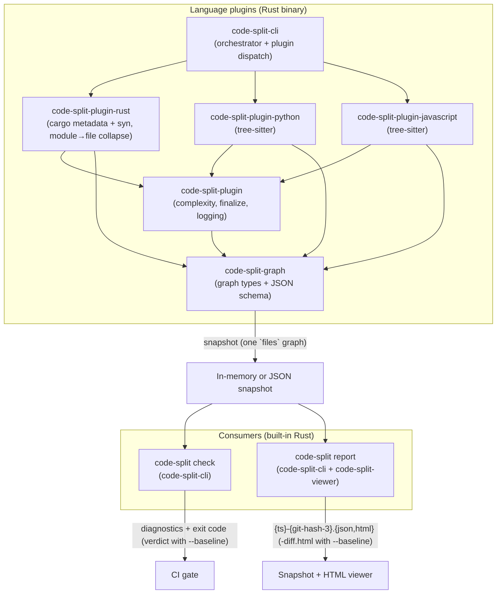
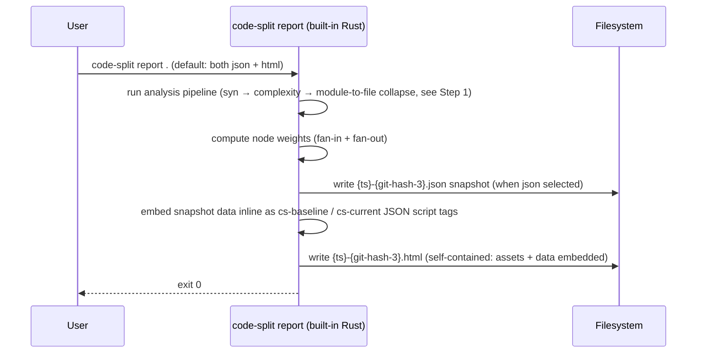
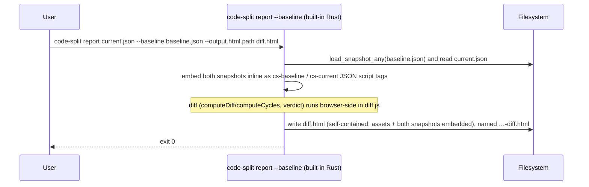
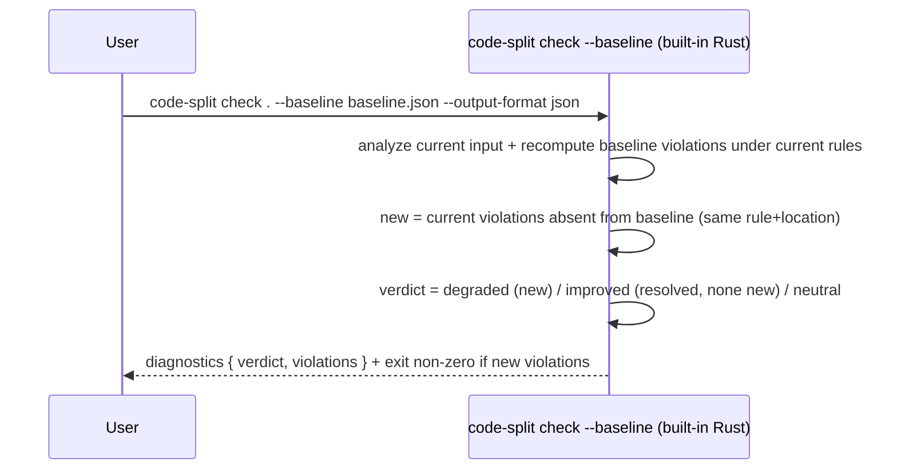

# Technical Design — Code Split

<!-- toc -->

- [1. Architecture Overview](#1-architecture-overview)
  - [1.1 Architectural Vision](#11-architectural-vision)
  - [1.2 Architecture Drivers](#12-architecture-drivers)
  - [1.3 Architecture Layers](#13-architecture-layers)
- [2. Principles & Constraints](#2-principles--constraints)
  - [2.1 Design Principles](#21-design-principles)
  - [2.2 Constraints](#22-constraints)
- [3. Technical Architecture](#3-technical-architecture)
  - [3.1 Domain Model](#31-domain-model)
  - [3.2 Component Model](#32-component-model)
  - [3.3 API Contracts](#33-api-contracts)
  - [3.4 Internal Dependencies](#34-internal-dependencies)
  - [3.5 External Dependencies](#35-external-dependencies)
  - [3.6 Interactions & Sequences](#36-interactions--sequences)
  - [3.7 Plugin System](#37-plugin-system)
  - [3.8 CLI Reference and Examples](#38-cli-reference-and-examples)
- [4. Additional Context](#4-additional-context)
- [5. Traceability](#5-traceability)

<!-- /toc -->

## 1. Architecture Overview

### 1.1 Architectural Vision

Code Split is a pipeline: **extract → evaluate / visualize → (user
modifies) → compare**. The platform is built around a single portable
JSON artifact format that decouples the extraction layer (plugins) from
the consumption layer (the `check` linter and `report` artifact writer).
Either layer can evolve independently as long as the schema version is
respected.

At P1 the platform ships three components:

- **Rust Plugin** (`code-split-rust`): a Cargo workspace analyzer built
  on `syn` (syntactic analysis). It builds the Rust module graph and
  collapses it to a single **file graph**; produces a single snapshot
  per run
- **Check** (`code-split check`): built into `code-split-cli`; analyzes (or
  reads) the input, evaluates cycle rules and thresholds, prints diagnostics,
  and exits non-zero on violation. With `--baseline <snapshot>` it switches
  to a **relative gate** — failing only on *new* violations vs the baseline —
  and emits a verdict (`improved` / `degraded` / `neutral`). Writes no files
- **Report** (`code-split report`): built into `code-split-cli`; analyzes (or
  reads) the input and writes artifacts — a snapshot `.json` and/or a single
  self-contained offline HTML viewer; all JS/CSS assets embedded in the binary
  via `include_str!`. With `--baseline <snapshot>` the HTML becomes a
  baseline↔current diff with a verdict (one shared union layout where the
  Baseline/Current toggle is a CSS visibility flip so common nodes never move),
  named `…-diff.html`

The three pillars of the design are:

1. **JSON-first artifact contract** — the single snapshot is the
   sole handoff between all components; any plugin can feed any
   consumer
2. **Offline-first** — every P1 component runs without network access;
   generated HTML reports inline all assets
3. **Pluggable extraction layer** — the built-in plugins (`rust`,
   `python`, `javascript`) all produce the same JSON artifact, so new
   languages can be added as built-in plugins without touching the
   consumer tools

### 1.2 Architecture Drivers

#### Functional Drivers

| Requirement | Design Response |
|-------------|-----------------|
| `cpt-code-split-fr-rust-plugin` | Implemented by the `code-split-plugin-rust` crate (cargo metadata + `syn`), which collapses the module graph to a file graph. Dispatched in-process by `code-split-cli`'s `plugin` registry. Outputs a single snapshot `.json`. |
| `cpt-code-split-fr-lang-plugins` (Python, JS/TS) | Python: `code-split-plugin-python` using `tree-sitter-python`. JS/TS: `code-split-plugin-javascript` using `tree-sitter-javascript` / `tree-sitter-typescript`, supporting both ESM and CommonJS. Both emit `File` nodes + file→file `uses` edges + `External` library nodes, and annotate per-file complexity via the shared `code-split-plugin` crate. |
| `cpt-code-split-fr-file-graph` | All plugins emit a single file graph: `File` nodes with `uses` / `reexports` edges between files, plus `External` library nodes at depth 1 reached by `uses` edges flagged `external: true`. The Rust plugin derives it by collapsing its module graph; Python/JS/TS build it directly from import resolution. |
| `cpt-code-split-fr-html-report` | Built-in Rust renderer in `code-split-cli`: `report` analyzes (or reads) the input, then renders an HTML template with inline assets alongside the JSON snapshot. |
| `cpt-code-split-fr-node-sorting` | Node weight (fan-in + fan-out) is computed at render time and embedded in the HTML; client-side JavaScript sorts the table on user interaction. |
| `cpt-code-split-fr-graph-diff` | Browser-side diff in the HTML viewer (`diff.js`), plus `compare_snapshots()` in `code-split-graph` for the `check --baseline` regression gate: node/edge set difference on the file graph, weight delta per node, `affected` propagation. |
| `cpt-code-split-fr-diff-html-report` | With `report --baseline <snapshot>` the viewer becomes a self-contained diff with color-coded baseline/current views and a verdict; all assets inlined; the file is named `…-diff.html`. |
| `cpt-code-split-fr-diff-text-report` | `check --baseline <snapshot> --output-format json` emits the machine-readable verdict (`improved` / `degraded` / `neutral`) and the list of new violations for CI parsing. |

#### NFR Allocation

| NFR ID | Summary | Allocated To | Design Response |
|--------|---------|--------------|-----------------|
| `cpt-code-split-nfr-offline` | Zero outbound network calls | All components | Rust plugin: no HTTP; `code-split check` / `code-split report`: HTML assets embedded in binary, no CDN references in generated output. |
| `cpt-code-split-nfr-performance` | ≤ 30 s @ 50k LOC (plugin); ≤ 5 s @ 10k nodes (check/report) | `code-split-plugin-rust`, `code-split-plugin`, `code-split-cli` | Syntactic analysis + the module→file collapse run in seconds (no rust-analyzer); `check` / `report` process a snapshot in a single pass. |
| `cpt-code-split-nfr-portability` | JSON artifacts stable within a major version | All components | Schema version field in `meta`; consumers abort on mismatch; additive-only changes within a major version. |

### 1.3 Architecture Layers



| Layer | Responsibility | Technology |
|-------|---------------|------------|
| Plugin — Presentation | Argument parsing, output routing, artifact writing | `clap`, `anyhow` (Rust) |
| Plugin — Application | Dispatch language plugins, assemble the snapshot | `code-split-cli` (Rust) |
| Plugin — Domain | Graph types, JSON schema, builder API | `code-split-graph`, `petgraph`, `serde` (Rust) |
| Plugin — Infrastructure | Per-language analysis (one crate each) on a shared plugin layer (complexity, finalize, logging) | `code-split-plugin-rust`/`-python`/`-javascript`, `code-split-plugin`, `syn`, `tree-sitter`, `rust-code-analysis` (Rust) |
| Check | Analyze (or read) input, evaluate rules and (with `--baseline`) regressions, print diagnostics, exit non-zero on violation | `code-split-cli` (Rust) |
| Report | Analyze (or read) input, write snapshot JSON + offline HTML viewer (a diff with `--baseline`) | `code-split-cli` + `code-split-viewer` (Rust), Graphviz WASM bundled in binary, assets embedded via `include_str!` |

## 2. Principles & Constraints

### 2.1 Design Principles

#### JSON Artifact Contract as the Sole Integration Surface

- [x] `p1` - **ID**: `cpt-code-split-principle-json-contract`

The single JSON snapshot (one `files` graph plus metadata) is the
ONLY handoff between the plugin layer and the consumer layer. No
in-process coupling between the analysis crates and the report
rendering code is permitted. This contract is versioned via
`schema_version`; consumers abort on a version mismatch.

#### Offline-First

- [x] `p1` - **ID**: `cpt-code-split-principle-offline-first`

Every P1 component must work without network access. Generated HTML
files must contain no external resource references. This is a design
constraint, not a preference — it must be verified in CI.

#### Files-Only Graph Model

- [x] `p1` - **ID**: `cpt-code-split-principle-files-only`

The snapshot carries exactly one graph level: **files**. Node kinds in
output are `File` (a project source file, carrying all metrics) and
`External` (a third-party library, recorded at depth 1 — one node per
library, never expanded). Edge kinds are `uses` and `reexports` between
files, plus `uses` edges flagged `external: true` from a file to a
library node. There is no module, function, or call graph: language
plugins resolve everything down to file→file dependencies before the
snapshot is written.

#### Internal Coupling Excludes External Libraries

- [x] `p1` - **ID**: `cpt-code-split-principle-internal-coupling`

`fan_in`, `fan_out`, and Henry-Kafura (`HK = sloc × (fan_in × fan_out)²`)
are computed from **internal** file→file edges only. Edges to `External`
library nodes are excluded from these counts and from HK, and are
surfaced separately in `coupling.fan_out_external`. Rationale: HK
measures internal architectural coupling, not the breadth of 3rd-party
library usage, which would otherwise drown out real structural signal.

#### Pluggable Extraction, Stable Consumers

- [x] `p1` - **ID**: `cpt-code-split-principle-pluggable`

The `check` linter and `report` artifact writer are schema consumers, not
language-aware tools. Adding a new language plugin MUST NOT require
changes to any consumer tool. All language-specific knowledge lives
exclusively in the plugin.

### 2.2 Constraints

#### Stable Rust Toolchain

- [x] `p1` - **ID**: `cpt-code-split-constraint-stable-rust`

The Rust plugin must build on stable Rust. `rustc_private` and
nightly-only features are prohibited.

#### Python 3.9+ Minimum

- [x] `p3` - **ID**: `cpt-code-split-constraint-python`

The built-in Python language plugin targets Python 3.9+ as the minimum
version to analyze. No Python runtime is required by the `code-split`
binary itself; the constraint applies to the target workspace being
analyzed, not the execution environment.

## 3. Technical Architecture

### 3.1 Domain Model

**Technology**: Rust structs and enums in `code-split-graph`; JSON schema
in `crates/code-split-graph/schemas/graph.schema.json`.

| Entity | Description | Location |
|--------|-------------|----------|
| Graph | Ordered collection of nodes and edges; serialized to JSON as the single `files` graph | `crates/code-split-graph/src/graph.rs` |
| Node | `id`, `kind`, `name`, `path?`, `external?`, `version?` (resolved semver, on Rust crate/`External` nodes), `visibility?`, `complexity?`, `cycle_kind?` | `crates/code-split-graph/src/graph.rs` |
| Edge | `from`, `to`, `kind`, `external?`, `visibility?` | `crates/code-split-graph/src/graph.rs` |
| NodeKind | Enum. Output kinds: `File` (a project source file), `External` (a 3rd-party library at depth 1). The variants `Crate`, `Module`, `Trait` are internal-only — used by `code-split-plugin-rust` while building the Rust module tree and collapsed into `File`/`External` by the Rust plugin before serialization; they never appear in a snapshot. | `crates/code-split-graph/src/graph.rs` |
| EdgeKind | Enum. Output kinds: `Uses`, `Reexports` (both between files; `Uses` to an `External` node when the edge is flagged `external`), and `Contains`. A `Contains` edge records a Rust `mod foo;` declaration (parent file → child file): it is **kept in the JSON snapshot as structural ownership metadata**, but consumers treat it as ownership rather than information flow — it is not drawn on the main map and is excluded from fan_in / HK / cycle detection. Self-edges and cross-crate `Contains` are dropped during the collapse; only cross-file parent→child `Contains` survive. | `crates/code-split-graph/src/graph.rs` |
| CycleKind | Enum: `TestEmbed` (Rust `#[cfg(test)]` back-edge), `Mutual` (SCC size 2), `Chain` (SCC size ≥ 3). Set on each node in a cycle via `cycle_kind`. | `crates/code-split-graph/src/graph.rs` |
| CycleGroup | SCC with ≥ 2 nodes: `kind: CycleKind`, `nodes: Vec<NodeId>`. Stored in `Graph.cycles`. | `crates/code-split-graph/src/graph.rs` |
| NodeId | Stable string key with no line numbers or byte offsets. Schemes: `file:{path}` for a source file, `ext:{name}` for an external library. | `crates/code-split-graph/src/graph.rs`, `crates/code-split-graph/src/snapshot.rs` |
| Complexity | Nested code-metrics object on a node. Top-level scalars: `cyclomatic`, `cognitive`, `exits`, `args`, `functions`, `closures` (zero-valued fields omitted). Sub-objects: `coupling?` (`fan_in`, `fan_out`, `fan_out_external`, `hk` — omitted when all fan values are 0), `maintainability?` (`mi`, `mi_sei`), `loc?` (`source`, `logical`, `comments`, `blank`), `halstead?` (`length`, `vocabulary`, `volume`, `effort`, `time`, `bugs`). Entire `complexity` object omitted when all sub-fields are zero/absent. Present on `File` nodes; absent on `External` nodes. All numeric fields use 3-significant-digit truncation; whole numbers serialized without decimal point. | `crates/code-split-graph/src/graph.rs` |
| Coupling | `fan_in`, `fan_out` (internal file→file counts), `fan_out_external` (distinct external libraries depended on), `hk` (Henry-Kafura from internal counts only). | `crates/code-split-graph/src/graph.rs` |
| AvgCoupling | Average coupling stored inside `GraphStats`: `fan_in`, `fan_out`, `hk` (all f64, zero-valued fields omitted). | `crates/code-split-graph/src/graph.rs` |
| GraphStats | Optional summary attached to the `files` graph after all annotations. Mirrors the `Complexity` node structure with averages: top-level `cyclomatic`, `cognitive`; sub-objects `coupling?` (`AvgCoupling`), `maintainability?`, `loc?`, `halstead?`. Zero-valued scalar fields and absent sub-objects are omitted. Percentiles are not stored — the viewer computes them client-side from raw node data. Populated by `annotate_stats()` in `code-split-graph`. | `crates/code-split-graph/src/graph.rs`, `crates/code-split-graph/src/stats.rs` |
| Snapshot | A single `.json` file combining `workspace` (cwd), `target` (analyzed project), `plugin`, `config_file?` (path of loaded config file, omitted when none), `roots` (named path prefixes; pruned to only those actually used to shorten a node path, so e.g. a JS/TS/Python snapshot carries no Rust toolchain roots), `versions`, `git`, `timings`, and a `graphs` object with a single key: `files`. Serialized via `to_canonical_string_pretty` — **canonical JSON**: every object key alphabetical, `nodes`/`edges` arrays sorted by stable key — so unchanged code re-serializes byte-for-byte (no `HashMap`-order churn). | `crates/code-split-graph/src/snapshot.rs` |
| StageTime | Per-stage timing entry: `stage` (name), `ms` (elapsed milliseconds), `detail` (human summary). Stored in `Snapshot.timings` in execution order. | `crates/code-split-graph/src/snapshot.rs` |
| CompareSummary | Computed from two `Snapshot`s (baseline, current) by `compare_snapshots`: added/removed/affected/unchanged counts for nodes and edges on the `files` graph, plus cycle/SCC counts per side. Drives the `check --baseline` regression gate. | `crates/code-split-graph/src/diff.rs` |

**Relationships**:

- `Node` → `Node`: linked via `Edge`.
- `Graph` → `Node`/`Edge`: ownership; nodes carry an optional `parent`
  pointing to the containing node.
- `CompareSummary` is computed from two `Snapshot`s and owns no graph data —
  it carries only counts.

### 3.2 Component Model

#### code-split-graph

- [x] `p1` - **ID**: `cpt-code-split-component-core`

Provides the shared vocabulary: graph types, kind enums, the
`GraphBuilder` API, and the JSON serialization logic. Has zero I/O.
Depends on `petgraph` and `serde` only; no `cargo_metadata` or `syn`.

Modules beyond graph types:

- **`cycles.rs`** — `annotate_all_cycles`: Kosaraju SCC on the file
  graph over `Uses`/`Reexports` edges only (`Contains` is excluded — a
  `mod foo;` declaration plus the child importing the parent's types is a
  Rust idiom, not an architectural cycle). Classifies each SCC as
  `TestEmbed` (a test-named file in the SCC) / `Mutual` / `Chain`, sets
  `node.cycle_kind` and writes `graph.cycles: Vec<CycleGroup>`.
- **`hk.rs`** — `annotate_hk`: computes Henry-Kafura complexity
  (`hk = sloc × (fan_in × fan_out)²`) for every file node and writes the
  result into `node.complexity.coupling`
  (`Coupling { fan_in, fan_out, fan_out_external, hk }`). `fan_in` /
  `fan_out` count **internal** file→file `uses`/`reexports` edges only;
  edges flagged `external` are excluded and counted into
  `fan_out_external` instead, so HK reflects internal coupling rather
  than 3rd-party library breadth. The `loc` factor is the same one shown
  in `complexity.loc` (`loc.source`). With no loc or no internal
  in/out coupling, `hk` is 0.
- **`diff.rs`** — `compare_snapshots(baseline, current) -> CompareSummary`:
  mirrors `computeDiff()` from `diff.js`; computes added/removed/affected/
  unchanged counts for nodes and edges in the file graph, then propagates
  `affected` to unchanged nodes adjacent to changed edges. Used by the
  `check --baseline` regression gate.
- **`snapshot.rs`** — snapshot types plus path relativization
  (`relativize_graphs` / `rewrite_ids`, mapping absolute paths to
  `{target}` / `{cargo}` / … tokens) and **canonical serialization**
  (`to_canonical_string` / `to_canonical_string_pretty`): round-trips
  through `serde_json::Value` (a `BTreeMap`, so keys come out alphabetical)
  and sorts the `nodes`/`edges` arrays by a stable key. This guarantees a
  deterministic, byte-stable snapshot for unchanged input.

#### code-split-plugin-rust

- [x] `p1` - **ID**: `cpt-code-split-component-syn`

The Rust language plugin (`pub fn run`), dispatched by `code-split-cli`. It
produces the Rust module graph via syntactic analysis, annotates complexity
through the shared `code-split-plugin` crate (passing a `RustParser`), and
collapses the module graph to a file graph (see §3.7) before returning. Calls
`cargo metadata` **with `--offline`** (code-split never hits the network — it
resolves from the warm cargo cache, surfacing an actionable error otherwise);
classifies crates as local vs. external; walks local
source trees with `syn` to extract the module hierarchy and `use` /
`pub use` statements, emitting `Crate` / `Module` / `Trait` nodes and
`Contains` / `Uses` / `Reexports` edges. It also runs a `syn::visit`
path collector over each file to capture **bare qualified paths** in
expressions/types (≥ 2 segments, no `use`), resolved through the same
full resolver as `use` statements: this captures both cross-crate
(`other_crate::item` → the extern crate) and intra-crate paths
(`commands::run()` → the local `commands` module, `crate::a::Alpha` →
its module), while `std`/`core`/keyword-only paths are ignored. External
crates are added as `Crate` nodes with
`external = true`; their source is never read. A `visited_files`
`HashSet<PathBuf>` guard in `process_package` prevents double-walking
source files when a workspace has both `lib` and `bin` targets declaring
the same modules.

These module-level nodes are **internal**: the Rust plugin's collapse
pass (see §3.7) folds them down to `File` / `External` nodes before the
snapshot is written.

**Edge sources & remaining blind spots**: file→file / file→library edges
come from two sources — (1) `use` / `pub use` statements; (2) bare
qualified paths in expressions/types (`commands::run()`, `other_crate::item`,
`crate::a::Alpha`), captured by the path visitor and resolved the same way
as `use`. A `mod foo;` declaration emits a `Contains` edge that is kept in
the JSON but treated as structural ownership only — not drawn, not counted
in fan_in / HK / cycles. What remains uncaptured: a bare reference whose
target is a re-export reached through the crate root resolves to the
**crate-root file** (e.g. `crate::Edge` → `lib.rs`) rather than the module
that defines it, and any `use` hidden inside a macro body (macros are never
expanded). A file reached only via `Contains` (e.g. a module declared with
`mod foo;` but never referenced by path or `use`) has `fan_in` 0 and can
appear isolated on the map.

#### code-split-plugin

- [x] `p1` - **ID**: `cpt-code-split-component-complexity`

The shared, **language-agnostic** layer every language plugin builds on. It
holds the complexity engine, the file-graph `finalize` pass, and timing/logging
helpers. It knows nothing about any specific language: the caller (a language
plugin) supplies the file extensions and a parser callback.

The complexity engine annotates `File` nodes (Rust file-backed module nodes before collapse,
and the `File` nodes of the Python/JS/TS plugins) in the `GraphBuilder`
with per-file code complexity metrics. Uses `rust-code-analysis`
(Mozilla, via the `ffedoroff/rust-code-analysis` fork on branch
`patch/update-tree-sitter-0.26.8`) which is built on tree-sitter and
supports Rust, C++, JavaScript, Python, TypeScript, Kotlin, and more.
Metrics are aggregated to the whole file (the root `FuncSpace` of each
parsed file).

**Interface**: a single generic entry point —
`code_split_plugin::complexity::annotate(root, builder, extensions, parse)` —
where `parse: Fn(&Path, Vec<u8>) -> Option<FuncSpace>` is supplied by the
calling plugin. Each language plugin passes its own extensions and parser:
`code-split-plugin-rust` → `["rs"]` + `RustParser`; `code-split-plugin-python`
→ `["py"]` + `PythonParser`; `code-split-plugin-javascript` →
`["js","jsx","ts","tsx"]` + the matching JS/TS/Tsx parser. No language names or
extension `match`es live in this crate.

**Matching strategy**: each file's metrics come from the top-level
`FuncSpace` (`SpaceKind::Unit`) of the parsed file, matched to the graph
node by canonical path via a `HashMap<canonical_path → node_idx>`. For
Rust this is applied to the file-backed `Module` nodes (before the
plugin collapses them to `File` nodes); for Python/JS/TS it is applied
to `File` nodes directly. The map is populated with `entry().or_insert(i)`
(not `insert`) so the first node for a path wins if two nodes share it.

**Metrics computed per file**:

| Category | Fields (in `complexity` object) |
|----------|--------------------------------|
| Scalars | `cyclomatic`, `cognitive`, `exits`, `args`, `functions`, `closures` |
| Coupling | `coupling.fan_in`, `coupling.fan_out`, `coupling.fan_out_external`, `coupling.hk` (added later by `annotate_hk`, not by this crate) |
| Maintainability | `maintainability.mi`, `maintainability.mi_sei` |
| Lines of Code | `loc.source`, `loc.logical`, `loc.comments`, `loc.blank` |
| Halstead | `halstead.length`, `halstead.vocabulary`, `halstead.volume`, `halstead.effort`, `halstead.time`, `halstead.bugs` |

Each language entry point is called by its plugin after graph
construction. Metrics are whole-file aggregates, so all functions,
methods, arrow functions, and closures in a file roll up into that
file's single node — there is no per-function granularity to miss.

#### code-split-plugin-python (built-in)

- [x] `p3` - **ID**: `cpt-code-split-component-python-plugin`

In-process Python plugin implemented in `code-split-plugin-python/src/lib.rs`.
Uses `tree-sitter-python` (already a transitive dep via `rust-code-analysis`)
for AST traversal and `walkdir` for file discovery.

**Pipeline**:

1. **Scan** — walk all `.py` files under the workspace, skipping `.venv`,
   `__pycache__`, `node_modules`, and any dot-prefixed directory.
2. **Module index** — derive dotted module paths from file paths:
   `parser/shops/amazon/pdp.py` → `parser.shops.amazon.pdp`;
   `parser/shops/amazon/__init__.py` → `parser.shops.amazon`.
3. **Per-file node** — emit one `File` node per `.py` file.
4. **Import resolution** — resolve `import_statement` and
   `import_from_statement` nodes. Imports that resolve to a project file
   emit a file→file `uses` edge (including `__init__.py` package imports,
   which point at the package's `__init__.py` file); relative imports
   (`.`, `..`, `.submodule`) are resolved against the current module's
   package path. Imports that do not resolve to a project file produce an
   `External` library node (`ext:<top-level-package>`, one per top-level
   package such as `numpy`) reached by a `uses` edge flagged
   `external: true`.

**ID scheme**:
- File: `file:/abs/path/to/file.py` (relativized to `{target}/...` by
  `snapshot::relativize_graphs`)
- External library: `ext:numpy`

**Visibility heuristic**: `__name` (no trailing dunder) → `Private`;
`_name` → `Restricted { path: "module" }`; otherwise → `Public`.

**Complexity**: per-file metrics annotated via
`code_split_plugin::complexity::annotate` with `["py"]` + `PythonParser`
(whole-file aggregate; see §3.2 `code-split-plugin`).

#### code-split-plugin-javascript (built-in)

- [x] `p3` - **ID**: `cpt-code-split-component-js-plugin`

In-process JavaScript / TypeScript plugin implemented in
`code-split-plugin-javascript/src/lib.rs`. Uses `tree-sitter-javascript` and
`tree-sitter-typescript` for AST traversal and `walkdir` for file discovery.

**Source root detection**: if `src/` exists in the workspace, scans from
`src/`; otherwise scans from the workspace root. This avoids picking up
non-source `.js` files (config, scripts, test fixtures) in projects that
follow the `src/` layout convention.

**Pipeline**:

1. **Scan** — walk `.ts`, `.tsx`, `.js`, `.jsx` files from source root,
   skipping `node_modules`, `dist`, `.venv`, dotfile directories,
   `.gen.ts`, `.config.ts/js`.
2. **File index** — map each file's relative path to its absolute path.
3. **Per-file node** — emit one `File` node per source file.
4. **Import resolution** — resolve ES `import` statements and CommonJS
   `require()` calls. Imports that resolve to a project file emit a
   file→file `uses` edge; handles the `@/` path alias (→ source root),
   relative paths, and index-file collapsing (extensions tried in order:
   `.ts`, `.tsx`, `.js`, `.jsx`, `index.ts`, `index.tsx`, `index.js`,
   `index.jsx`). Imports that do not resolve to a project file produce an
   `External` library node (`ext:<package>`, one per top-level package —
   `react`, `@scope/pkg`) reached by a `uses` edge flagged
   `external: true`.

**ID scheme** (using `src` as the source root prefix):
- File: `file:/abs/path/to/file.ts` (relativized to `{target}/...`)
- External library: `ext:react`, `ext:@scope/pkg`

**Visibility heuristic**: `_name` → `Private`; otherwise → `Public`.

**Complexity**: per-file metrics annotated via
`code_split_plugin::complexity::annotate` with `["js","jsx","ts","tsx"]` + the
matching JS/TS/Tsx parser (whole-file aggregate, covering all functions, arrow
functions, and methods in the file; see §3.2 `code-split-plugin`).

#### code-split-cli

- [x] `p1` - **ID**: `cpt-code-split-component-cli`

The single user-facing binary `code-split`. There is no default command —
a bare invocation prints help. `main()` owns two subcommands — `check` and
`report` — both taking a single polymorphic positional `[input]` (a directory
to **analyze**, or a `.json`/`.html` snapshot to **read**, via
`analyze_input` → `is_snapshot_input`):

The shared analysis core (`analyze_input`, used by both `check` and `report`)
either reads an embedded snapshot (`.json`/`.html` input — `analyze_from_snapshot`,
which rejects `--plugin`/`--ignore` since there is nothing to analyze) or
analyzes a directory (`analyze_directory`). For a directory it loads layered
config (`config.rs` — code-split.toml / Cargo.toml metadata / CLI flags);
resolves the plugin name (CLI `--plugin` → config `plugin` → marker
auto-detect, all under `auto`); invokes the selected built-in plugin
(`rust` / `python` / `javascript`) in-process. After the plugin run it calls
`relativize_graphs` + `rewrite_ids` from `code-split-graph`, then applies
config filters: `config::apply_ignore` (path globs + `tests` /
`test_modules` test-file stripping + `dev_only_crates` via
`cargo metadata`), `annotate_all_cycles` + `config::apply_cycle_rules`,
`annotate_hk` + `annotate_stats`.

- **`check`** (the linter): runs the shared analysis core, then
  `config::check_violations` over cycle checks (`--cycle-rule <KIND=on|off|N>`,
  parsed into `config::CycleRule` = `Off` | `Max(n)`; a kind's cycles are reported
  only when their per-graph count exceeds its budget, so `Max(0)` is strict and
  `Max(7)` forbids the 8th) and metric thresholds (`--threshold
  <file.METRIC=N>`). No severity tiers. There is a single threshold
  scope — `file` (the files graph) — metrics written directly under
  `[rules.thresholds.file]`. `check_node_metrics` runs the per-file
  thresholds on every file node — emitting `threshold.file.<metric>`.
  Threshold values accept `_`
  separators and `K`/`M`/`G` suffixes via `config::parse_number` (CLI flags and a
  `deserialize_with` adaptor on `MetricThresholds` for quoted TOML strings); an
  invalid configuration is a hard error, never a silent fallback to defaults. Every `Violation` is identified
  by its dotted rule id (the config key / CLI flag, e.g. `threshold.file.loc`) and
  tagged with a concern group from the `config::RULES` catalog
  (`CYC`/`CPX`/`CPL`/`SIZ`; one entry per metric resolved by `rule_doc` — the
  trailing metric segment — with `rule_tuning` deriving the flag/config knob,
  documented in [ERRORS.md](ERRORS.md)). Prints diagnostics in the selected `--output-format`
  (`human` / `json` / `github` / `sarif`): `human` (`print_human_diagnostics`)
  renders each finding as a self-contained block (rule id, group, `where` = `id —
  path`, `issue`, `why`, `fix`, `tune`, `ref`) so it doubles as an AI prompt;
  the `ref` link and the `sarif` `helpUri` are absolute GitHub URLs (`DOCS_URL` →
  `…/blob/main/docs/ERRORS.md#group-<g>`) so they're clickable from anywhere.
  `sarif` describes the fired rules under `tool.driver.rules`. With
  `--suggest-config`, `human` output then calls `print_current_values` — the
  current per-kind cycle counts and the per-file metric maxima
  as paste-ready `code-split.toml` blocks for baselining (off by default;
  machine formats omit it). Honours `--top <N>` (report only the N worst) and exits
  non-zero on any violation; `--exit-zero` suppresses the non-zero exit. Writes no
  files. With `--baseline <snapshot>` (`.json`/`.html`, loaded via `load_snapshot_any`)
  the gate switches to **relative** mode: it recomputes the baseline's violations under
  the current rules and fails only on *new* ones (those not already present under the
  same `(rule, location)` signature) — pre-existing violations are tolerated. The
  comparison yields a verdict (`degraded` if any new violations, `improved` if some were
  resolved and none added, else `neutral`), included in the diagnostics (a trailing line
  in `human`, a wrapping `{ verdict, violations }` object in `json`).
- **`report`** (`run_report`): runs the shared analysis core (analyzing the
  directory or reading the snapshot), then writes artifacts. Which formats are
  written, and where, is decided by one flag family, `--output.<fmt>[.path]`
  (`<fmt>` = `json` / `html`), backed by `want_format`: a `--output.<fmt>`
  presence flag or a `--output.<fmt>.path` selects that format; the
  `[output.<fmt>]` config (`enabled`, else a configured `path`) is consulted
  next; if **nothing** selects anything, **both** are written. Each `.path`
  is a name template, or `stdout`/`-` to write to the stdout stream
  (`is_stream` / `write_artifact`). The JSON snapshot records `config_file`
  when a config was found. Names are templates (`render_name`) with
  placeholders `{project-dir}`, `{ts}`, `{git-hash}` (12-char short commit)
  and `{git-hash-N}` (first N chars), resolved as **`--output.<fmt>.path` flag
  › `[output.<fmt>] path` config › built-in default**
  (`DEFAULT_JSON_PATH` / `DEFAULT_HTML_PATH` = `.code-split/{ts}-{git-hash-3}.{json,html}`).
  The HTML viewer template and all assets (CSS, JS) are embedded in the binary
  via `include_str!` from `crates/code-split-viewer/src/assets/`, and the snapshot
  data is embedded inline in the same file as `cs-baseline` / `cs-current` JSON
  `<script>` tags (`render_html_viewer`). With `--baseline <snapshot>` the HTML
  becomes a diff view (current = this run, baseline = the file) plus a verdict,
  and its name gains a `-diff` marker before `.html`
  (`{ts}-{git-hash-3}-diff.html`); the JSON snapshot is always the current
  input (never a diff). `--baseline` accepts a `.json` snapshot or a prior
  `.html` report — the embedded snapshot is extracted via `load_snapshot_any`
  (preferring the `cs-current` tag, falling back to `cs-baseline`). `report`
  always exits `0`. The single `.html` file is fully self-contained — no
  relative-path references, no `fetch`, so it opens straight from `file://`.

**Responsibility boundary**: holds no domain logic; no analysis, no
rendering, no rules. Its sole job is argument parsing, plugin
dispatch, and artifact I/O routing.

#### HTML assets (`crates/code-split-viewer/src/assets/`)

- [x] `p1` - **ID**: `cpt-code-split-component-html-assets`

Static assets for the `code-split report` HTML output (a single-snapshot viewer,
or a baseline↔current diff with `--baseline`), embedded into the `code-split`
binary via `include_str!`. Files:

| File | Purpose |
|------|---------|
| `index.html` | Shell template with a single Files view section and the diff/review summary table. Header: `.header-brand` ("CODE SPLIT"), `#title`, two `data-snap` metadata slots — the **current** (right, `data-snap="after"`) is the primary snapshot (always present, not removable, `↑ Replace current`); the **baseline** (left, `data-snap="before"`) an optional reference (`↑ Set baseline`, removable via `#btn-remove-before`); review (no baseline) leaves the baseline slot an empty editable placeholder, with `.snap-active` marking whichever side is shown. Nav: `[data-side]` Baseline/Current buttons (diff mode only — hidden in review) and `#nav-prompt-btn` ("Prompt Generator AI", always visible) with a plain warning-count (`#nav-warn-count`) after the "AI" label — the number of distinct warning **types** (metrics with ≥1 file over their `warning` threshold, plus `cycle` as one binary type when any file is in a dependency cycle; `window.warningTypeCount`), no highlight, hidden when zero. There is one graph level, so no level switcher. No control panel / status chips / review buttons. The map is one shared union layout; the Baseline/Current toggle is a CSS visibility flip (`.hide-{nodes,edges}-{added,removed}` on the `.svg-frame`), so common nodes never move. The active side is reflected in the `side=before/after` URL param, the node-table title (`Details` / `Details Baseline` / `Details Current`), and a `Baseline` / `Current` badge on the node-popup and Prompt-Generator headers; **Current** is the default side. |
| `index.css` | Layout, nav, SVG styling; cross-highlight: `.row-hl` (solid blue bg) and `g.node.node-hl` (blue drop-shadow) for hover; `.row-selected` (solid amber bg `rgb(254,245,222)`) and `g.node.node-selected > polygon/ellipse` (yellow fill + amber stroke) for persistent selection — hover rules last so they win; a node that is both selected **and** in a cycle keeps its **red** cycle stroke (a higher-specificity `.node-selected:is(.cycle-status-…)` rule, mirrored in the popup by `.diag-cycle.diag-selected`) — the cycle outline always wins, the yellow fill still marks it selected; `body.shift-select` changes the cursor over the map (crosshair on `.svg-frame`, `copy` on `g.node`) to signal Shift-to-select, and `body.ctrl-link` changes it (`alias` on `g.node`) to signal open-source-on-modifier-click (⌘ on macOS, Ctrl elsewhere); while either modifier class is on `body` it also sets `user-select: none` (so a Shift/⌘-click on a card never drag-selects label text) and reveals the popup's own `#node-modal-hints` legend; on the map, the modifier class (or the right-edge hover that sets `.show-zoom`) reveals the right-side `.zoom-controls` / `.size-controls` **and** the bottom-left `.kbd-hints` shortcut legend, as a cue the modes exist/are active (the legend's key labels are filled per-platform in JS — ⌘ vs Ctrl); the map uses a GitHub-style drag-to-pan cursor — `grab` (open hand) on `.svg-frame svg` at rest, `grabbing` (closed hand) under `.svg-frame.panning` while dragging (winning over a node's `pointer`); the same modifier cursors apply inside the popup diagram (`#node-modal-diagram g[data-diag-node]:not(.diag-ext)` → `copy`/`alias`; `.diag-ext` → `not-allowed`), and `#node-modal-diagram … .diag-selected > rect` gives popup cards the main-map selection highlight; `.nm-src` styles the modal's git-host "Source" link; header-slot visibility is JS-driven (`updateHeader`), with `.snap-active` highlighting the shown slot and `.sp-side` styling its `Baseline` / `Current` hover-tooltip label; `#node-modal` fills 100% width/height (fullscreen); `body.overflow:hidden` set on open, cleared on close. The popup main card uses `.mn-card` (`copy` cursor); on `.copied` the card body (`.mn-card-body`) is hidden and a centred `.mn-copied-msg` ("copied") is shown for ~1s. The `hide-nodes-*` / `hide-edges-*` rules drive the Baseline/Current visibility flip on the shared union layout (toggled per-side by `applySideVisibility`); the same helper sets a `.svg-frame.side-before` / `.side-after` marker that **gates the red cycle stroke** (a `before-only` cycle is red only on the baseline side, `after-only` only on the current side, `both` on either) — including the selected-and-in-cycle override. The `show-cycle-*` cycle-chip overrides remain in the file but are unused. |
| `graphviz.umd.js` | Graphviz compiled to WASM via `@hpcc-js/wasm` (~802 KB, self-contained, no network required); renders DOT→SVG in-browser |
| `snarkdown.umd.js` | Tiny (~2 KB) Markdown→HTML renderer (`window.snarkdown`), vendored so it works offline; used by `export-popup.js` to render the generated prompt as a styled preview |
| `diff.js` | Browser-side diff computation: `computeDiff()` (node/edge status), `computeCycles()` via `buildSCCOf()` helper — prefers backend `graph.cycles` array when present (accurate `CycleKind` classification); falls back to Tarjan SCC on edges when absent; marks nodes/edges as `before-only`/`after-only`/`both`/`none` (the baseline-only / current-only / both states); `computeMeta()` — either side may be null (the current snapshot is primary, the baseline optional). |
| `layout.js` | `buildDOT()` — for the single file graph: internal `file` nodes are blue (`fillcolor="#dbe9f4" color="#4d6f9c"`) and clustered by directory; `external` library nodes (when present) are amber with dashed amber edges. `contains` edges are **skipped** (kept in the JSON as structural ownership, but never drawn on the main map). **At most one edge is emitted per `(from, to)` pair** — a file that both `use`s and `pub use`-reexports the same target draws a single arrow. Cycle-status class still added for CSS red-stroke overlay; `class="node-<kind> status-<status> cycle-status-<cs>"` on every node/edge. In `loc`/`hk` size mode nodes become circles scaled by the metric and labelled with it abbreviated to a **whole number** (`fmtShort` — no decimals, e.g. 1.6M → 2M). Because the layout is shared across the Baseline/Current sides, each circle is laid out at the **max** of its baseline/current diameter (`layoutDiam`) so the per-side resize (`applySideSizing`, around the fixed centre) never overflows its reserved slot; the metric sizing helpers (`metricNodeDiam` / `metricNodeVal` / `fmtMetricShort` / `metricFontSize`) are module-scope so layout and the post-render resize use identical math |
| `modal.js` | `getModal()` returns (or lazily creates) the `#node-modal` overlay; `closeModal()` / `closeModalSilent()` hide it and restore `body.overflow`; fixed-position tooltip on `.nm-has-hint`; delegated click handlers for `.nm-copy-btn` (textContent ✓ feedback) and `.mn-card` (copies `data-copy`, adds a CSS `copied` class for ~1s — no textContent swap, since it is an SVG group). While the modal is open a `keydown` listener handles **Esc** (close) and **Space** (toggle `#node-modal-cb`, the selection checkbox — `preventDefault` avoids page-scroll and a double-toggle). The `#node-modal-diagram` click handler mirrors the main map's modifier gestures (`window.isOpenSrcClick` / `shiftKey`): **⌘/Ctrl-click** opens a side node's source (`window.nodeSourceUrl`), **Shift-click** toggles its selection (`window.toggleNodeSelected` + live `diag-selected`); a plain click navigates (`openModalForNode`). 3rd-party (`diag-ext`) cards are inert under either modifier (no select, no source, no ⌘-navigate). The central `.mn-card` reacts to modifiers too: ⌘/Ctrl-click views its source, Shift-click toggles its selection (routed through `#node-modal-cb` for full sync) — a *plain* click still copies its path; external main cards (`diag-ext`) are inert. Every diagram render goes through `setModalDiagram(html)`, which sets the SVG and re-attaches a `#node-modal-hints` legend (same `window.kbdHintsHtml`) **inside** `#node-modal-diagram`, so the legend sits bottom-left of the SVG area (not the page) and shows while a modifier is held. |
| `export-popup.js` | `openExportPopup()` — "Prompt Generator" popup. Top row: a checkbox group (Paths / connections common / in / out — each **disabled + unchecked when it would contribute nothing** for the active node set, recomputed on every change) and a source selector: `<N> Selected` (real selected-row count) **OR** an editable count + a **sort-metric dropdown** (`sorted by` HK / SLOC / fan-out / cyclomatic / cognitive / item count / in-a-cycle). The recommended set is the **top-N nodes sorted** by the chosen metric (`recoFor` sorts the full pool worst-first — it is a *sort*, not a `> threshold` filter, so raising the count keeps adding the next rows). Two-tier thresholds per metric (`METRIC_TH_BY_LANG`, tiers **`info`** / **`warning`**) drive only the **colour**: the count is red while ≤ the `warning` count, yellow up to the `info` count, normal beyond. The thresholds are **empirically calibrated and language-specific** (each language has its own block; unknown languages fall back to `rust`), so that ~50 % of projects breach `info` and ~10 % breach `warning`. Rust (calibrated on 21 crates ≥2K SLOC): `hk` 150 000/10 000 000, `sloc` 800/3 000, `fan_out` 8/18, `item_count` 20/50; `cyclomatic` and `cognitive` are **not tracked for Rust** (file-level cyclomatic ≈1 and cognitive absent in the corpus). **These numbers are kept in sync with `principles/<lang>/metric-thresholds.md`** (the human-readable derivation; must be updated in the same commit as a threshold change). Default count is **1**; with nothing selected the `Selected` radio + `OR` are hidden and the source defaults to Recommended. Clicking a preset points the dropdown at the preset's metric (`PRESET_METRIC`; cycle presets use cycle membership) and sets the count to its headline recommendation (strict count if any, else neutral). Preset buttons (equal-width grid, ~2 rows): `CPX` (reduce complexity) plus the SOLID/principle set (ADP, SRP, OCP, LSP, ISP, DIP, DRY, KISS, LoD, MISU, CoI, YAGNI), labelled by bare code with a count badge on the right — a **low-sensitivity** display: the `warning`-level count as a calm pill in the **text colour** (`.exp-preset-count--warn`, not red), else the `info`-level count as a **plain number** (`.exp-preset-count--info` — no pill, no highlight), else empty (no zero). The button itself gets **no border/colour emphasis** for either tier — only the badge differs. The Recommended count field mirrors this: warning → `.exp-rec-warn` (text-colour tint), info → left plain. Each preset stores a language-neutral `title\n\nsummary` in `PROMPTS`; `composePrompt(key)` wraps it into a **Markdown** instruction the AI receives — `# <title>`, `## Summary`, `**Full principle:** [<url>](<url>)` (the link text is the full URL so it is never hidden behind a short code; `principles/<lang>/<slug>.md` via `PRINCIPLE_DOCS`/`principleUrl`; `lang` from the snapshot's `plugin`, JS→`typescript`), then a `## Task` checklist (download & read the principle, report violations in the modules below, save the report to `.code-split/<YYYYMMDD-HHMMSS>-<CODE>.md`). Each preset auto-selects relevant connection checkboxes via `PRESET_CHECKS` (node **paths are always included**). Output (Markdown) = composed prompt + a `## Modules` list + `## Connections — common/in/out` edge lists per active checkboxes. In Recommended mode the path list is titled `## Modules ordered by <metric>`, each line `` - `src/a.rs` (HK: 19300) `` annotated with the node's value, preceded by a one-line explanation of that metric and its `**Formula:**` (`metricHeader` → `METRIC_DESCS`/`METRIC_FORMULAS`); connection lines render endpoints as paths, not ids. The raw Markdown lives in a hidden `<textarea id="export-textarea">` (the Copy source); the user sees it rendered to HTML by **snarkdown** in `#export-preview` — a white document card on the popup's soft-grey background, styled by `.exp-md-preview` (headings, lists, links, `` `code` ``). Fixed-size `Copy markdown ⎘` button overlaid bottom-right. **State persists in the URL**: `epWriteUrlState` mirrors the full popup state into the query string (`ep` = level/open, `eppreset`, `epsrc`, `epn`, `epsort`, `epconn`, repeated `epsel` per selected id) on every change; `epClearUrl` strips it on close; on load `app.js` reads `epReadUrl()`, restores the selection before the tables render, and re-opens the popup via `openExportPopup(level, restore)` — so a refresh restores the popup exactly. Popup is created once and re-used across opens. |
| `panzoom.js` | `setupPanZoom()` — viewBox-based drag-to-pan; +/−/fit/fullscreen buttons bottom-right (visible when mouse in right 15% of frame); size-mode buttons (■/LOC/HK) top-right re-render the active view; dblclick on SVG background zooms 2× at cursor; stores the fit-all viewBox on `frame.dataset.naturalVB` so `renderView` can preserve pan/zoom across re-renders; fullscreen overlay (`fs-bar`) hosts the live `<nav>` (the control panel was removed) |
| `ui.js` | Intentionally empty — Baseline/Current visibility on the shared union layout is handled by `applySideVisibility` (CSS class flip) in `app.js`, so there is no separate chip-filtering module. Kept as a file because the report inlines its assets by name. |
| `app.js` | `DOMContentLoaded` handler. `window.viewSide` (`'before'`/`'after'`, restored from the `side=` URL param and defaulting to **after**) selects which side the node table / modal show and which side's elements are visible on the map; `viewMode()` / `viewModeSuffix()` derive the `before` / `after` / review label used across the UI (URL, table title, popup/Prompt-Generator badges). The map is laid out **once** from `unionGraph()` (the diff's union graph — already external-free; externals appear only in the per-node modal, drawn in amber); `activeGraph()` returns the active snapshot's nodes for the table / modal. `setViewSide()` (the Baseline/Current buttons) does **not** relayout — it flips the CSS visibility (`applySideVisibility` → `.hide-{nodes,edges}-{added,removed}`, plus a `.side-*` marker that gates side-aware cycle highlighting) and, in the metric size modes, resizes each circle to the active side's value around its fixed centre (`applySideSizing`), then refreshes the tables, the nav warning count, the shown header slot (`updateActiveSnapGroup`) and the `side=` URL (`navSetSide`). `renderView()` lays out the union via `drawSVG` (which, above `SVG_NODE_LIMIT` = 500 nodes, shows a `too many nodes: N` placeholder with a *Render diagram* confirmation button instead of laying out a slow large graph — confirmed once per frame via `frame.dataset.bigConfirmed`), then applies side visibility + sizing and re-applies the node-table selection; pan/zoom is preserved across **size-mode** re-renders (the Baseline/Current toggle no longer relayouts) by carrying the *relative* zoom + fractional centre vs `frame.dataset.naturalVB` (so differing layout extents don't drift the framing). `updateHeader()` sets review/diff mode: `after` is the primary snapshot (always shown, not removable), `before` an optional baseline (left, editable, removable); `viewMode()` returns `'review'` when either side is absent, which defaults `viewSide` to `after` and hides the Baseline/Current buttons. The header hover tooltip (`buildSnapPopupHTML`) labels each slot `Baseline` / `Current` and marks the shown one. `buildSummary()` is mode-aware. Reads inline `cs-baseline` / `cs-current` JSON via `readEmbeddedSnapshot` (`window.BEFORE`/`window.AFTER`, internally still keyed `before`/`after`); `setupFileControls()` / `recomputeAll()` swap a `.json` snapshot or prior `.html` report from disk (the **↑ Set baseline** / **↑ Replace current** buttons — removing the baseline drops back to review; current is not removable); `#nav-prompt-btn` → `openExportPopup()`. On load it also reads `epReadUrl()` and, if the Prompt Generator was open, restores its selected nodes (into `window._ntSelected`) **before** the tables render, then re-opens it via `openExportPopup(level, restore)`. |
| `diagram.js` | `buildDiagramSVG(node)` — inline SVG popup diagram for a selected node. Edges are read from the raw snapshot (`window.AFTER ?? window.BEFORE`) so external library nodes (filtered from `window.DIFF`) are still visible. Connections are **deduped by node** (`collectConns`) into just two columns per direction — an unlabelled internal-`connections` column and a separate grey `external` column — both on the **same tier** (side by side). Each card records the *set* of edge kinds linking it to the main node. A node is shown only if it has an information-flow edge (`uses`/`reexports`); a `contains`-only structural link stays hidden. One arrow per column: the internal arrow is labelled `Fan-in: N` / `Fan-out: N` (distinct connected nodes); the external arrow is grey with no label (external edges count as `fan_out_external`, not `fan_in`/`fan_out`). **Side card layout**: a centred title (always visible). The card has two CSS-toggled states (`g[data-diag-node]:hover` in `index.css`): by default (`.sn-simple`) it shows only the bare `hk` (left, abbreviated, e.g. `189K`/`1.5M`; **nothing** when hk is absent — no `—`) and `loc` (right); on hover (`.sn-detail`) those become labelled `value:key` (`189K:hk` / `loc:210`, and `0:hk` when hk is absent), a bottom row of three connection-kind slots (`uses` · `reexport` · `contains`) appears (split exactly into thirds; absent kinds leave their third empty), and a `pr` chip (private nodes) is revealed top-right. **Tooltips** are the styled `#tt` ones shared with the node table (`renderDescTooltip` — title + bold formula line + description), so a metric's tooltip is byte-identical everywhere: each hk/loc label carries `data-tip`/`data-tip-formula` keyed to the same `COL_TIPS`/`COL_FORMULAS` (the whole `value:key` string is one hover target), each connection-kind label its own description, the title shows the node `path`, and the `pr` chip explains private visibility. Metric tooltips additionally carry `data-tip-calc` — the formula filled with this node's real numbers (`metricCalc`), rendered as a third line so the value's derivation is visible. This is set wherever the inputs are stored and the formula faithfully reproduces the displayed value: `hk` (`sloc × (fan_in × fan_out)²`), Halstead `volume` (`length × log₂(vocabulary)`), `bugs` (`effort^⅔ ÷ 3000` — the engine's actual definition, not the classic `volume ÷ 3000`) and `time` (`effort ÷ 18`). It is deliberately omitted where the computation would not match the displayed value: `mi`/`mi_sei` (the engine feeds MI a different cyclomatic aggregation than the per-file `cyclomatic` we store, so it wouldn't reconcile), `cyclomatic`/`cognitive`, and Halstead `length`/`vocabulary`/`effort` (no stored sub-terms — N₁/N₂, η₁/η₂, difficulty). The matching node-table value cells show the identical computation, but **lazily**: the cells carry no precomputed tooltip attributes — `setupTooltip` derives the description / formula / computation on hover (from the row's node), so nothing is built for cells the user never points at. Every tooltip's title is the metric's **full name** (`COL_NAMES`, e.g. "Halstead volume" — never the abbreviated column label or the cell value), via `data-tip-title` or the element's column id. Arrow labels read `Fan-in: N` / `Fan-out: N`. The hovered label is highlighted (`.sn-hint:hover`). No native `<title>` tooltips on the cards (they conflicted with `#tt`). External (3rd-party) cards and their arrows are **grey** (`#ececec` fill / `#9aa0a6` stroke), tagged `diag-ext` — they are inert under modifiers (not selectable, no source link). Nodes that are selected on the main map render here with the same yellow highlight (`diag-selected` on the side `[data-diag-node]` / main `.mn-card`, recoloured by `#node-modal-diagram … .diag-selected > rect` in the CSS). Toggling selection runs `markPopupSelected(id)`, which updates **every** card for that node — a cycle node appears twice (once as fan-in, once as fan-out) plus possibly the central card, and all toggle together. External cards show the library name (without the `ext:` prefix) and no metrics; an opened external main card uses the same layout as an internal file card — a centred title plus left-aligned `key: value` rows: `kind` (`external`), `version`, and the cargo-cache `path` (e.g. `{registry}/tokio-1.49.0`). The modal field table (left) lists every external field — `id`, `kind`, `version`, `external`, plus the full path — and routes metric rows through the same `#tt`/`COL_FORMULAS` tooltip, with the tooltip attached to the whole `<tr>` so it fires on both the key and the value. The main node card shows `path` / `hk` / `loc` (no `id`) — its labels carry the same `#tt` tooltips (incl. the `hk` computation); a `visibility` row is shown only when **not** `public` (e.g. `private`), since `public` is the default and appears in the left field list; a **plain click on the whole card copies** its path (`.mn-card` + `data-copy`; a modifier click acts instead of copying — see modal.js), and on copy it flashes the copied value above a centred `copied` confirmation for ~1s (no native `<title>`, to avoid conflicting with `#tt`). The metric table spells out abbreviated keys via `NM_LABELS` (`hk` → "Henry-Kafura", `mi` → "Maintainability Index", `mi_sei` → "Maintainability Index (SEI)", `fan_in`/`fan_out` → "Fan-in"/"Fan-out"). `MAX_ITEMS = 24` per column. Columns wrap **wide-first** — up to `MAX_COL_CARDS` (6) cards per row, then a new row below — so a busy fan-in/out spreads horizontally instead of growing into a tall stack. For project (non-external) files the left field table adds a **Source** row after `path` — a link to the file on the project's git host, built by `gitWebBase`/`gitSourceUrl` from the snapshot's `git.origin` (SSH/HTTPS normalized to a web blob URL: GitLab `/-/blob/`, GitHub `/blob/`) at `git.commit`, anchored to `#L<line>` when the node has one. `setupTooltips` also wires two map modifier gestures that skip the modal: **Shift-click** toggles a node's selection (`toggleNodeSelected` — syncs the shared `_ntSelected` set, the row, its checkbox and the footer), and the **"open source" modifier-click** (`⌘` on macOS, `Ctrl` elsewhere — `IS_MAC`/`isOpenSrcClick`) opens the node's source (`nodeSourceUrl` → `window.open`, project files only). A window `keydown`/`keyup`/`blur` listener (`initMapModifiers`, keyed on `OPEN_SRC_KEY`) toggles `body.shift-select` / `body.ctrl-link` for the cursor cues. |
| `nav.js` | `openModalForNode(nodeId)` — looks up node data first in `window.DIFF.files.nodes`, then falls back to the raw snapshot (`window.AFTER ?? window.BEFORE`) to support external library nodes that are excluded from the diff. Calls `window.hideMetricTooltip()` before re-rendering so a tooltip anchored to the replaced element never lingers over the new content. |
| `node-table.js` | Sortable per-file table ("**Details**" section — re-titled "Details Before" / "Details After" in a diff to track the active side — collapsed by default). The header shows the title + row-count badge always; the **search box and `⎘ Copy <N> selected` button appear only when expanded** (CSS on `.node-table-wrap.collapsed`); the copy button shows the live selected-row count. `cyclomatic`/`cognitive` columns are omitted; non-name columns are narrow. A **summary footer row** (`.nt-foot`) shows the **average** for each numeric column and a **count** for text columns (Name = total rows; Cycle = nodes in a cycle); its numeric cells carry a `data-tt` percentile distribution (p1/p10/p50/p90/p99 via `pctOf`) shown through the shared `#tt` tooltip, exactly like the summary section. Metric tooltips elsewhere in the table are derived **lazily** on hover (`setupTooltip`), never precomputed per cell. `window.hideMetricTooltip()` (and a capture-phase document `click` handler) force-hides `#tt` so it never lingers when popup nodes are switched or the modal closes. |
| `summary.js` | Review/diff summary table. Per-metric rows show the median (`p50`) with a `data-tt` percentile-distribution tooltip (`nodePercentiles`). `COL_NAMES`/`COL_TIPS`/`COL_FORMULAS` (full name / description / formula per column id) are the single source of truth reused by the node table and popup. The **Nodes-in-cycles** row's tooltip lists the cycle-group counts per kind (e.g. `mutual: 1, chain: 2`) from the active snapshot's `cycles`. |

**Affected status**: unchanged nodes/edges adjacent to changed (added/removed)
nodes or edges are promoted to `affected` status. Computed in `diff.js`
`computeDiff()` (browser-side), not in Rust.

**Cycle detection**: `computeCycles()` in `diff.js` runs Tarjan SCC on the
before and after adjacency lists of the file graph. Edges to external library
nodes are excluded from SCC construction (a leaf library cannot close a cycle).
Nodes/edges receive `cycle-status-{before-only|after-only|both|none}` class in
the DOT output, and the summary table reports cycle counts. Cycle members are
**always drawn with a red stroke** — `index.css` colours any non-`none`
`cycle-status-*` node/edge red unconditionally (no toggle); the per-node popup
(`diagram.js`) marks cycle nodes red the same way via `isCycleNode`.

**Offline guarantee**: no CDN references in any asset; `graphviz.umd.js`
embeds the WASM binary as a base91-encoded string and instantiates it from
an `ArrayBuffer` — works from `file://` with no network access.

### 3.3 API Contracts

Interfaces are defined in PRD §7. This section notes the implementation
binding.

#### Unified CLI (`cpt-code-split-interface-cli`)

- **Technology**: Rust binary with `clap`-derived subcommands
  (`check`, `report`; no default command). Both take a polymorphic positional
  `[input]` (directory → analyze; `.json`/`.html` snapshot → read) and accept
  `--baseline <snapshot>`.
- **Location**: `crates/code-split-cli/src/main.rs`
- **Output**: `report` writes a snapshot `.json` and/or an HTML viewer to the
  paths selected by `--output.<fmt>[.path]` (default
  `.code-split/{ts}-{git-hash-3}.{json,html}`); each `.path` is a name template
  or `stdout`/`-`, resolved as **`--output.<fmt>.path` flag › `[output.<fmt>]
  path` config › built-in default**

#### Plugins (built-in, in-process)

Plugins are not external binaries. The three plugins — `rust`, `python`,
`javascript` — are compiled into the `code-split` binary and invoked
in-process; each writes its graphs directly into the shared `GraphBuilder`.
See [§3.7 Plugin System](#37-plugin-system).

#### Report Generator (`cpt-code-split-interface-report-cli`)

- **Technology**: built-in Rust renderer in `code-split-cli`
- **Location**: `crates/code-split-cli/src/main.rs` (`run_report`,
  `render_html_viewer`)
- **Template**: inline HTML string with all JS/CSS embedded; the snapshot data
  is embedded inline as `cs-baseline` / `cs-current` `<script>` tags. With
  `--baseline <snapshot>` the HTML is a baseline↔current diff named `…-diff.html`.

#### Check / Regression Gate (`cpt-code-split-interface-check-cli`)

- **Technology**: built-in Rust linter in `code-split-cli`
- **Location**: `crates/code-split-cli/src/main.rs` (`run_check`,
  `emit_diagnostics`)
- **Output**: diagnostics in `--output-format human|json|github|sarif` plus an
  exit code. With `--baseline <snapshot>` the gate is relative (fails only on new
  violations) and emits an `improved` / `degraded` / `neutral` verdict.

#### Graph JSON Schema (`cpt-code-split-interface-graph-schema`)

- **Location**: defined by `Snapshot`, `Node`, `Edge` structs in
  `crates/code-split-graph/src/`
- **Versioning**: `schema_version: "1"`; additive fields are minor;
  breaking changes require a major-version bump

### 3.4 Internal Dependencies

| Consumer | Dependency | Interface |
|----------|------------|-----------|
| `code-split-cli` | `code-split-plugin-{rust,python,javascript}` | `run(workspace) -> (PluginGraphs, Vec<StageTime>)` |
| `code-split-cli` | `code-split-viewer` | `render_html_viewer()`, `extract_embedded_snapshot()` |
| `code-split-cli` | `code-split-graph` | `GraphBuilder`, `compare_snapshots()`, `serde_json` serialization |
| `code-split-plugin-{rust,python,javascript}` | `code-split-plugin` | `complexity::annotate()`, `finalize::*`, `logger` |
| `code-split-plugin-{rust,python,javascript}` | `code-split-graph` | `GraphBuilder` write API |
| `code-split-plugin` | `code-split-graph` | `GraphBuilder` read+write API, `Complexity` struct |
| `code-split-viewer` | `code-split-graph` | `Snapshot`, `to_canonical_string` |
| `code-split-cli` (`run_report`) | the analyzed snapshot (+ optional `--baseline`) | top-level metadata + `graphs` object; rendered via `code-split-viewer` |
| `code-split-cli` (`run_check`) | the analyzed snapshot (+ optional `--baseline`) | `graphs` object; `compare_snapshots` / violation diff for the relative gate |

**Rules**:

- No circular dependencies among the seven Rust crates.
- Only `code-split-plugin-rust` may depend on `cargo_metadata` and `syn`.
- Only `code-split-plugin` may depend on `rust-code-analysis`.
- Language-specific code/names live **only** in the `code-split-plugin-*` crates;
  `code-split-plugin` and `code-split-graph` are language-agnostic.
- `code-split-graph` has zero I/O and zero analyzer dependencies.
- The Rust plugin's module→file collapse lives in
  `code-split-plugin-rust/src/lib.rs`.
- `code-split-cli` orchestrates: it dispatches the language plugins and hands the
  snapshot to `code-split-viewer` for rendering.

### 3.5 External Dependencies

| Dependency | Interface | Purpose |
|------------|-----------|---------|
| `cargo_metadata` crate | `MetadataCommand::exec()` | Enumerate workspace crates and path-dependencies |
| `syn` crate | `syn::parse_file`, `syn::visit::Visit` | Parse Rust source for module hierarchy and `use` statements |
| `rust-code-analysis` (fork: `ffedoroff/rust-code-analysis`, branch `patch/update-tree-sitter-0.26.8`) | `metrics(&parser, path) -> Option<FuncSpace>` | Tree-sitter-based multi-language complexity metrics |
| `petgraph` crate | `DiGraph` | Internal graph storage |
| `serde` + `serde_json` | derive macros, `to_writer_pretty` | JSON serialization |
| `clap` | derive macros | CLI argument parsing |
| Python stdlib | `json`, `pathlib`, `argparse` | JSON processing, file I/O, CLI parsing in Python tools |

### 3.6 Interactions & Sequences

#### Step 1 — Plugin Dispatch and Artifact Write

**ID**: `cpt-code-split-seq-extract`

```mermaid
sequenceDiagram
    participant User
    participant CLI as code-split report
    participant Disc as Plugin Resolver (§3.7)
    participant Plugin as Built-in Rust Plugin
    participant Syn as code-split-plugin-rust
    participant Cx as code-split-plugin (complexity)
    participant Core as code-split-graph::GraphBuilder
    participant FS as Filesystem

    User ->> CLI: code-split report . --plugin rust --output.json
    CLI ->> Disc: resolve("rust")
    Disc -->> CLI: built-in Rust plugin
    CLI ->> Plugin: run(workspace)
    Plugin ->> Syn: analyze(ws, &mut builder)
    Syn ->> Core: add Module / Crate nodes + Contains / Uses / Reexports edges
    Syn -->> Plugin: ok
    Plugin ->> Cx: analyze(ws, &mut builder)
    Cx ->> Core: annotate file-backed Module nodes with per-file Complexity metrics
    Cx -->> Plugin: N nodes annotated
    Plugin ->> Core: collapse modules→files (File + External nodes, edges re-pointed to files)
    Plugin ->> Core: annotate_all_cycles (Kosaraju SCC → CycleKind per node)
    Plugin ->> Core: annotate_hk (internal fan_in / fan_out / HK; fan_out_external per file)
    Plugin -->> CLI: (PluginGraphs, Vec<StageTime>)
    CLI ->> FS: write {ts}-{git-hash-3}.json (metadata + timings + files graph)
    CLI -->> User: exit 0
```

#### Step 2 — Report Generation

**ID**: `cpt-code-split-seq-report`

`report` re-analyzes the workspace (the same plugin pipeline as Step 1) and
then writes artifacts.



#### Step 4 — Compare against a baseline

**ID**: `cpt-code-split-seq-baseline`

A comparison is `--baseline <snapshot>` on `report` (an HTML diff) or `check` (a
machine verdict / regression gate). The current side is the positional `[input]`
— analyzed now, or an already-existing snapshot, so the comparison can run over
two snapshot files without re-analyzing anything.





### 3.7 Plugin System

#### Plugin Resolution

All plugins are built into the `code-split` binary; there is no external
or dynamic plugin loading. Resolution only selects which built-in plugin
to run.

The plugin defaults to `auto`. When `--plugin auto`, the analysis core
(behind `check` / `report`) resolves the plugin *name* in this order,
stopping at the first match:

```
1. Explicit flag    --plugin <name> (≠ auto) on the command line
                    → use that built-in plugin

2. Config           the `plugin` key in code-split.toml /
                    Cargo.toml metadata (if set and ≠ auto)
                    → use that built-in plugin

3. Auto-detect      project markers in the workspace root:
                    Cargo.toml → rust;
                    pyproject.toml / setup.py / setup.cfg → python;
                    package.json / tsconfig.json → javascript
```

The resolved name must be one of the three compiled-in plugins — `rust`,
`python`, or `javascript` (JS+TS) — which is then invoked in-process.
Multiple matching markers or none → error asking for an explicit
`--plugin`.

#### Snapshot File Format

`code-split report` writes the snapshot to the path selected by
`--output.json[.path]`, defaulting to `.code-split/{ts}-{git-hash-3}.json`
(timestamp + first 3 chars of the commit) in the current working directory:

```
.code-split/<YYYYMMDD-HHMMSS>-<hash3>.json
```

The name template is resolved as **`--output.json.path` flag › `[output.json]
path` in config › built-in default**, with placeholders `{project-dir}`
(slugified workspace name), `{ts}`, `{git-hash}` (12-char short commit) and
`{git-hash-N}` (first N chars). Example: `code-split report /path/to/axum-api
--plugin rust --output.json.path=.code-split/{ts}-{git-hash-3}.json` →
`.code-split/20260522-112233-a3f.json` (or `axum-api-20260522-112233.json` if
`[output.json] path = "{project-dir}-{ts}.json"`).

The file combines metadata and the single `files` graph in one document:

```json
{
  "schema_version": "1",
  "generated_at":   "2026-05-22T11:22:33Z",
  "command":        "code-split report /path/to/axum-api --plugin rust",
  "workspace":      "/Users/alice/projects/code-split",
  "target":         "/Users/alice/projects/axum-api",
  "plugin":         "rust",
  "versions": {
    "code-split": "0.3.1",
    "code_split_plugin_rust": "0.3.1",
    "rustc": "1.78.0"
  },
  "roots": {
    "cargo":    "/Users/alice/.cargo",
    "registry": "/Users/alice/.cargo/registry/src/index.crates.io-abc123",
    "rustup":   "/Users/alice/.rustup",
    "rust-src": "/Users/alice/.rustup/toolchains/stable-aarch64-apple-darwin/lib/rustlib/src/rust/library"
  },
  "git": {
    "branch": "refactor/split-handlers",
    "commit": "a3f9c21b4d5e",
    "dirty_files": 4,
    "origin": "git@gitlab.example.com:team/axum-api.git"
  },
  "graphs": {
    "files": { "nodes": [...], "edges": [...] }
  }
}
```

`workspace` is the directory where `code-split` was invoked (cwd). `target`
is the analyzed project path. `roots` are named prefixes for path
resolution: `roots[name] + "/" + rest` → absolute path. All node `path`
values and `file:` IDs use `{name}/…` notation referencing these roots.

The Rust plugin populates roots automatically via `detect_roots()`:

| Root | Source | Example |
|------|--------|---------|
| `target` | analyzed project path | `/path/to/my-crate` |
| `cargo` | `$CARGO_HOME` or `~/.cargo` | `/Users/alice/.cargo` |
| `registry` | first `index.crates.io-*` dir under cargo | `.../registry/src/index.crates.io-abc123` |
| `rustup` | `$RUSTUP_HOME` or `~/.rustup` | `/Users/alice/.rustup` |
| `rust-src` | `rustc --print sysroot` + `/lib/rustlib/src/rust/library` | `.../toolchains/stable-aarch64-apple-darwin/.../library` |

`rust-src` is only added when the path exists on disk; omitted otherwise.
It shortens stdlib paths like `{rustup}/toolchains/stable-aarch64-apple-darwin/lib/rustlib/src/rust/library/alloc/src/vec/mod.rs`
to `{rust-src}/alloc/src/vec/mod.rs`.

**Assembly**: the built-in plugin produces the `graphs` object in-process
(written into the shared `GraphBuilder`). `code-split` then runs
`relativize_graphs` + `rewrite_ids`, prepends all metadata fields, and
writes the final snapshot file.

`rewrite_ids` rewrites node `id` and edge `from`/`to` fields, applying
path relativization so an absolute `file:/abs/path` becomes
`file:{root}/…` using the named roots.

`versions.code_split_plugin_<name>` is the built-in plugin's version, which
equals the `code-split` binary's own version (all plugins ship inside it).

The `git` fields are collected by `code-split` before invoking the plugin:

| Field | Source |
|-------|--------|
| `branch` | `git -C <workspace> rev-parse --abbrev-ref HEAD` |
| `commit` | `git -C <workspace> rev-parse --short=12 HEAD` (12-char short SHA) |
| `dirty_files` | `git -C <workspace> status --porcelain \| wc -l` |
| `origin` | `git -C <workspace> config --get remote.origin.url` (omitted if empty/absent) |

If branch/commit fail the `git` key is omitted entirely — no error is raised.
`origin` feeds the HTML viewer's per-node "Source" link (`git@host:grp/proj.git`
or `https://…` is normalized to a web blob URL — GitLab `/-/blob/`, GitHub
`/blob/` — at the commit).

`code-split report` embeds this metadata in the generated HTML as a visible
"Snapshot info" panel — for both snapshots when `--baseline` is given.

#### Built-in Plugin: Rust

At P1 the only built-in plugin is `rust`. It is compiled directly into
the `code-split` binary and invoked in-process, so no sub-process overhead
is incurred. Its internal structure is the `code-split-plugin-rust` crate
(cargo metadata + `syn`), which also collapses the module graph to a file
graph; it is not a separate binary on disk. There is no rust-analyzer
dependency, so the run completes in seconds.

##### Analysis Modes and Prerequisites

The Rust plugin has two modes selected by flags on the analyzing commands
(`code-split check` / `code-split report`):

| Mode | Flag | `cargo` required | Network / registry | External nodes |
|------|------|------------------|--------------------|----------------|
| Full | *(none)* | yes | no — `cargo metadata --offline`, cache-only | yes |

The project does NOT need to compile — `syn` parses source syntactically and
tolerates errors. Only dependency resolution (`cargo metadata`, run with
`--offline`) is required; it reads from the already-warm cargo cache, so
code-split makes no network calls. If the cache isn't populated, the plugin
emits an actionable error telling you to warm it (e.g. `cargo fetch`).

##### Full Mode — Step-by-Step

```
code-split report /path/to/my-crate --plugin rust
```

1. `code-split-cli` resolves the output path(s) from `--output.<fmt>[.path]` /
   config / the built-in `.code-split/` default, creating parent directories
   as needed when the artifacts are written.
2. Collects git state (`branch`, `commit`, `dirty_files`) from
   `/path/to/my-crate`.
3. Runs the syntactic stage (`code-split-plugin-rust`):
   a. Runs `cargo metadata --offline --format-version=1` inside the workspace.
   b. Identifies all local packages (those with a `path` source).
   c. For each local package, locates the crate root (`lib.rs` /
      `main.rs` / `[lib] path`).
   d. Recursively follows `mod foo;` declarations using `syn`, building
      the module tree and collecting all `use` / `pub use` statements.
   e. Emits `Crate`, `Module`, `Trait` nodes and `Contains`, `Uses`,
      `Reexports` edges into `GraphBuilder`.
   f. External crates are added as opaque `Crate` nodes with
      `external = true`; their source is never read.
4. Annotates complexity (`code-split-plugin`, with a `RustParser`):
   a. Walks all `.rs` files in the workspace with `walkdir`.
   b. For each file, parses it with `rust-code-analysis` to obtain a
      `FuncSpace` tree.
   c. Annotates each file-backed `Module` node with whole-file metrics
      from the root space (matched by canonical path).
5. Collapses the module graph to a **file graph** (in `code-split-plugin-rust`):
   a. Every `.rs` file becomes one `File` node (`file:<path>`); inline
      `mod {}` modules fold into their containing file.
   b. `Uses` / `Reexports` / `Contains` edges are re-pointed from module
      ids to the file ids that own them, so file→file connections are
      preserved. Cross-file `Contains` edges (`mod foo;` declarations) are
      **kept** in the snapshot as structural ownership metadata, but are
      not drawn / not counted in fan_in / HK / cycles; self-edges and
      crate→crate `Contains` are dropped.
   c. External crates collapse to `External` library nodes (`ext:<name>`)
      at depth 1; edges into them are flagged `external: true`. Each carries
      its cargo-cache `path` (the crate's `Cargo.toml` directory, e.g.
      `{registry}/tokio-1.49.0`), later relativized to a `{registry}`/`{cargo}`
      root.
   d. A **local** workspace crate maps to its crate-root file (`lib.rs` /
      `main.rs`), so a cross-crate `use other_crate::…` (or captured
      bare-path reference) becomes a file→file edge to that crate's root.
      Crate→crate dependency edges (from `cargo metadata`) are dropped as
      crate-level meta.
6. Runs `annotate_all_cycles` (SCC → `CycleKind`) and `annotate_hk`
   (internal `fan_in`/`fan_out`/`hk`; `fan_out_external` separately) on
   the file graph, then `annotate_stats`. Named roots that did not shorten
   any node path are pruned (`prune_unused_roots`), so the header lists only
   relevant roots.
7. Writes the final snapshot `.json` (metadata + `timings` + `files` graph)
   via `to_canonical_string_pretty` — canonical, byte-stable JSON.

##### Failure Modes

| Situation | Behavior |
|-----------|----------|
| `cargo` not on `$PATH` | exit 1 — "cargo not found" (the Rust plugin requires `cargo` for `cargo metadata`) |
| `cargo metadata` fails (dependency resolution error) | exit 1 — cargo stderr forwarded verbatim, including the underlying dependency resolution failure |
| Workspace member glob matches no directories | warning logged; zero crates emitted for that glob |
| A source file has a syntax error | `syn` parse failure logged as a warning; file is skipped; analysis continues |
| Output directory not writable | exit 1 before analysis starts |

#### P3 Framework-Specific Plugins

Framework plugins (Django, WordPress, etc.) MAY emit additional metadata
beyond the base schema vocabulary by using the `metadata` object on nodes
and edges. The `kind` field MUST remain one of the base kinds (`file`,
`external`) so base consumers can still process the graph.
Framework-specific semantics are expressed in `metadata.<plugin>.*` keys
and are ignored by base consumers.

Example — a Django-specific annotation on a file node:

```json
{
  "id": "file:{target}/myapp/signals.py",
  "kind": "file",
  "name": "signals.py",
  "path": "{target}/myapp/signals.py",
  "metadata": {
    "django": {
      "signal": "post_save",
      "sender": "User"
    }
  }
}
```

### 3.8 CLI Reference and Examples

The full CLI surface is documented in [CLI.md](CLI.md). The two commands are
`check` (verdict + exit code, no files) and `report` (artifacts). Both take a
polymorphic `[input]` and accept `--baseline <snapshot>`.

#### Snapshots — `code-split report --output.json`

`report` analyzes the project (or reads a snapshot input) and writes the
snapshot to the path selected by `--output.json[.path]` (default
`.code-split/{ts}-{git-hash-3}.json`, e.g. `.code-split/20260522-112233-a3f.json`).

**Rust (built-in)**

```bash
# 1. Default snapshot only: .code-split/20260522-112233-a3f.json ({ts}-{git-hash-3})
code-split report . --plugin rust --output.json

# 2. Explicit path — for a named state
code-split report . --plugin rust --output.json.path=.code-split/before-refactor.json
```

**Python (built-in)**

```bash
# 1. Default dated snapshot
code-split report ~/projects/my-lib --plugin python --output.json

# 2. Explicit path for a named state
code-split report . --plugin python --output.json.path=.code-split/v2.4.0.json

# 3. Snapshot to stdout for a pipe
code-split report . --plugin python --output.json.path=stdout | jq '.plugin'
```

**JavaScript / TypeScript (built-in)**

```bash
# 1. Default dated snapshot
code-split report ~/projects/frontend --plugin javascript --output.json

# 2. Named snapshot, ignoring node_modules and dist
code-split report . --plugin javascript \
    --output.json.path=.code-split/src-only.json \
    --ignore node_modules --ignore dist
```

---

#### Visualization — `code-split report`

With no `--output.*` flag, `report` writes the snapshot `.json` **and** the
HTML viewer together into `.code-split/`.

```bash
# 1. Snapshot + viewer side by side, in .code-split/ (default: both json + html)
code-split report . --plugin rust
open .code-split/20260522-112233-a3f.html   # default {ts}-{git-hash-3}.html

# 2. Only the HTML viewer, to docs/ for sharing with the team
code-split report . --plugin rust --output.html.path=docs/coupling.html

# 3. CI: artifacts into the CI folder
code-split report . --plugin rust \
    --output.html.path=/artifacts/code-split/report-pr-1234.html
```

---

#### Compare against a baseline — `--baseline`

A comparison is `--baseline <snapshot>` on `report` (an HTML diff named
`…-diff.html`) or `check` (a machine verdict for CI). Because `[input]` is
polymorphic, the current side can be an already-existing snapshot, so the
comparison runs over two files without re-analyzing.

```bash
# 1. HTML diff: baseline vs the current tree
code-split report . --baseline .code-split/main.json --output.html.path=diff.html
open diff.html

# 2. HTML diff: two existing snapshots (no analysis)
code-split report .code-split/pr.json --baseline .code-split/main.json \
    --output.html.path=diff-refactor.html

# 3. CI: regression gate / JSON verdict for a PR comment
code-split check . --baseline /artifacts/code-split/main.json --output-format json \
    | jq '.verdict'
```

---

#### Full end-to-end workflow

```bash
# Step 1+2: snapshot the baseline + open the viewer (report writes both)
code-split report . --plugin rust --output.json.path=.code-split/before.json
open .code-split/20260522-112233-a3f.html   # {ts}-{git-hash-3}.html, inspect the heavy nodes

# -- Step 3: the user makes changes (by hand or with an AI) --

# Step 4a: gate the change in CI against the baseline (fail only on new violations)
code-split check . --baseline .code-split/before.json --output-format json

# Step 4b: render the HTML diff against the baseline in one run
code-split report . --plugin rust --baseline .code-split/before.json
open .code-split/my-crate-20260522-112233-diff.html   # --baseline names it -diff.html; a diff view + verdict
```

## 4. Additional Context

**Repository layout**:

```
code-split/
  crates/
    code-split-graph/             # Rust — graph types, JSON schema, StageTime, cycles/hk/diff
    code-split-plugin/            # Rust — shared plugin layer: complexity, finalize, logging
    code-split-plugin-rust/       # Rust — Rust analysis: cargo metadata + syn, module→file collapse
    code-split-plugin-python/     # Rust — Python analysis: tree-sitter
    code-split-plugin-javascript/ # Rust — JS/TS analysis: tree-sitter
    code-split-viewer/            # Rust — HTML viewer: assets + render_html_viewer
    code-split-cli/               # Rust — orchestrator, plugin dispatch, check linter, report
      src/
        plugin/            # Built-in plugins: rust.rs (incl. module→file collapse), python.rs, javascript.rs, finalize.rs (file-graph normalizer for Python/JS), mod.rs
        assets/            # HTML/CSS/JS assets embedded via include_str!
          index.html       # Shell template (single Files view); cs-baseline / cs-current JSON script tags embedded inline at render time
          index.css        # Node/edge/nav styling (external nodes amber)
          graphviz.umd.js  # Graphviz WASM (~802 KB, offline)
          snarkdown.umd.js # Markdown→HTML renderer (~2 KB, offline) for the prompt preview
          layout.js        # buildDOT — DOT graph construction (external nodes amber/dashed)
          panzoom.js       # Pan/zoom logic
          state.js         # App state and layout cache
          app.js           # Entry point, event wiring
          diff.js          # Browser-side diff + cycle computation
          node-table.js    # Sortable node table
          summary.js       # Diff/review summary table
          modal.js         # Node modal overlay
          diagram.js       # Popup fan-in/fan-out SVG diagram (column layout)
          export-popup.js  # Prompt-generator popup
          nav.js           # openModalForNode — node popup navigation
          utils.js         # Shared helpers
          ui.js            # (empty — baseline/current visibility handled in app.js on the union layout)
  docs/
    PRD.md
    DESIGN.md
  principles/              # Principle corpus (used at P3 for prompt generation)
    rust/                  # Rust-specific principle docs
    python/                # Python-specific principle docs
    typescript/            # TypeScript/JavaScript principle docs
```

**Out of scope for this revision (deferred to P2/P3)**:

- Recommender rules catalog and `Finding` types (removed from P1)
- LLM prompt generation (P2 for AI prompts, P3 for principles prompts)
- CI artifact integration (P2)
- Additional language plugins (P3)

**Module→file collapse trade-off**: Rust dependencies are expressed via
module paths (`use crate::foo::bar`), not file paths. Rather than emit a
separate module graph, the Rust plugin builds the module tree and then
collapses it to files — folding inline `mod {}` modules into their file
and re-pointing `use`/`pub use` edges to files — so file→file
connections are fully preserved in the single graph model. There is no
function-level call graph: resolving call sites semantically would
require rust-analyzer (slow, volatile), which has been removed.

**HTML asset bundling**: All JS/CSS assets for the `code-split report` viewer
(single-snapshot or `--baseline` diff) are embedded into the binary via
`include_str!`. The
Graphviz WASM bundle is committed under
`crates/code-split-viewer/src/assets/` and never fetched at runtime.
Generated HTML files work offline via `file://` with no network access.

## 5. Traceability

- **PRD**: [PRD.md](PRD.md)
- **Graph JSON Schema**: `crates/code-split-graph/schemas/graph.schema.json`
- **ADRs**: pending — `docs/ADR/0001-files-only-graph.md` and
  `docs/ADR/0002-four-step-pipeline.md` to be authored after this
  design is accepted
