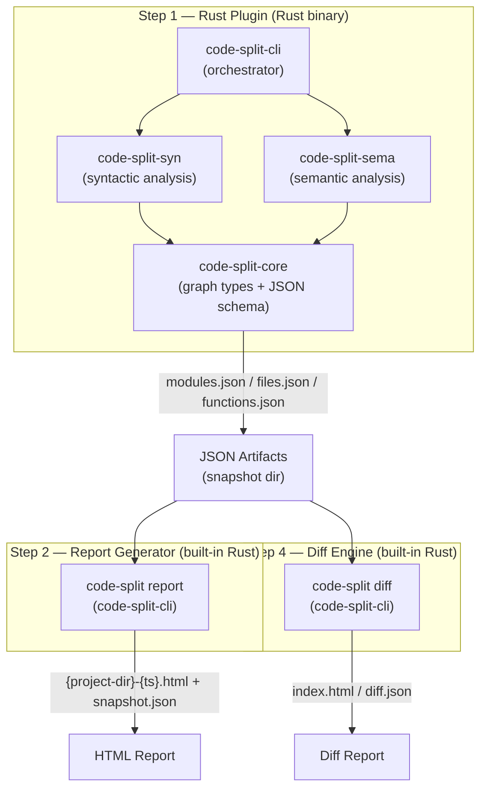
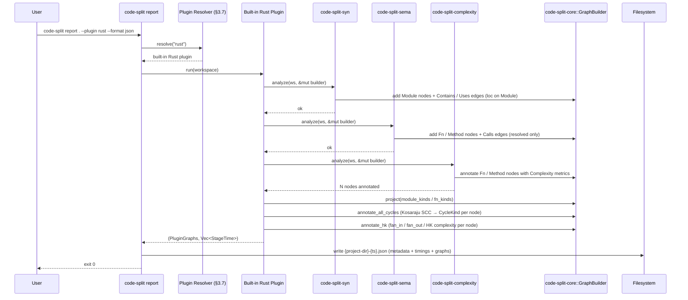
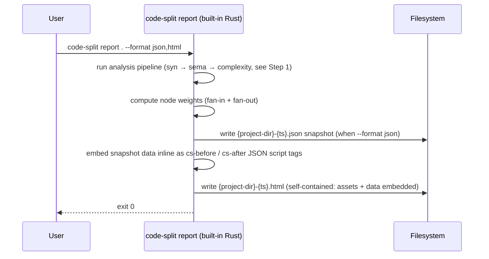
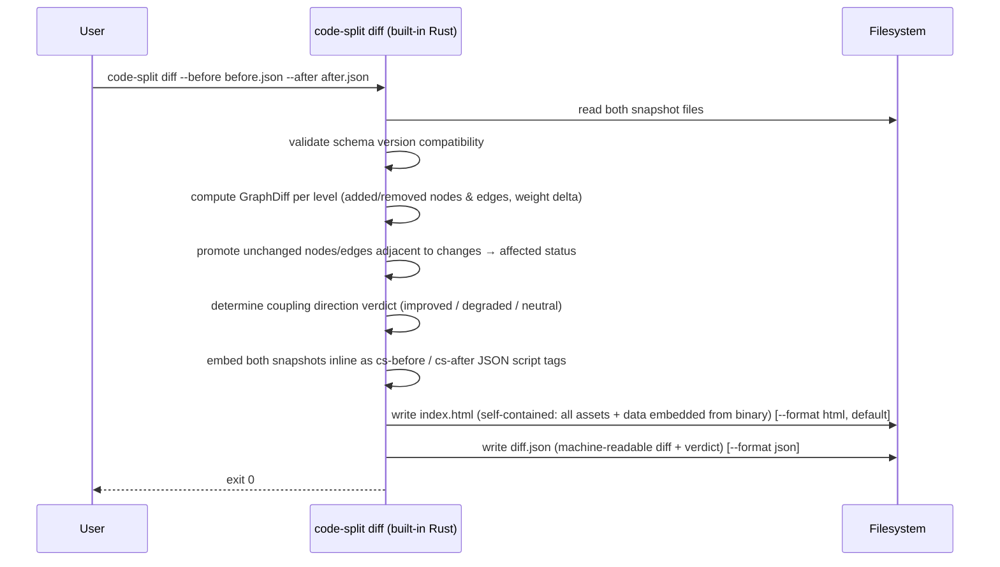

# Technical Design — Code Split

<!-- toc -->

- [1. Architecture Overview](#1-architecture-overview)
  - [1.1 Architectural Vision](#11-architectural-vision)
  - [1.2 Architecture Drivers](#12-architecture-drivers)
  - [1.3 Architecture Layers](#13-architecture-layers)
- [2. Principles & Constraints](#2-principles--constraints)
  - [2.1 Design Principles](#21-design-principles)
  - [2.2 Constraints](#22-constraints)
- [3. Technical Architecture](#3-technical-architecture)
  - [3.1 Domain Model](#31-domain-model)
  - [3.2 Component Model](#32-component-model)
  - [3.3 API Contracts](#33-api-contracts)
  - [3.4 Internal Dependencies](#34-internal-dependencies)
  - [3.5 External Dependencies](#35-external-dependencies)
  - [3.6 Interactions & Sequences](#36-interactions--sequences)
  - [3.7 Plugin System](#37-plugin-system)
  - [3.8 CLI Reference and Examples](#38-cli-reference-and-examples)
- [4. Additional Context](#4-additional-context)
- [5. Traceability](#5-traceability)

<!-- /toc -->

## 1. Architecture Overview

### 1.1 Architectural Vision

Code Split is a four-step pipeline: **extract → visualize → (user
modifies) → diff**. The platform is built around a single portable
JSON artifact format that decouples the extraction layer (plugins) from
the consumption layer (report generator, diff engine). Either layer can
evolve independently as long as the schema version is respected.

At P1 the platform ships three components:

- **Rust Plugin** (`code-split-rust`): a Cargo workspace analyzer built
  on `syn` (syntactic) and `ra_ap_*` (semantic) analysis; outputs a
  single snapshot `.json` file per run
- **Report Generator** (`code-split report`): built into `code-split-cli`;
  re-analyzes the workspace and writes artifacts — a snapshot `.json`
  and/or a single self-contained offline HTML viewer (optionally a diff
  view against a `--before` baseline in the same run); all JS/CSS assets
  embedded in the binary via `include_str!`
- **Diff Engine** (`code-split diff`): built into `code-split-cli`; compares
  two existing snapshot files (no analysis); produces an interactive HTML
  diff report (client-side layout, Modules/Files/Functions tabs, a Before/After
  toggle that renders each snapshot as its own clean diagram) and/or a
  machine-readable JSON diff with an `improved` / `degraded` / `neutral` verdict

The three pillars of the design are:

1. **JSON-first artifact contract** — the three artifact files are the
   sole handoff between all components; any plugin can feed any
   consumer
2. **Offline-first** — every P1 component runs without network access;
   generated HTML reports inline all assets
3. **Pluggable extraction layer** — the built-in plugins (`rust`,
   `python`, `javascript`) all produce the same JSON artifact, so new
   languages can be added as built-in plugins without touching the
   consumer tools

### 1.2 Architecture Drivers

#### Functional Drivers

| Requirement | Design Response |
|-------------|-----------------|
| `cpt-code-split-fr-rust-plugin` | Implemented by `code-split-syn` + `code-split-sema`, orchestrated in-process by `code-split-cli`'s `plugin::rust` module. Outputs a single snapshot `.json`. |
| `cpt-code-split-fr-lang-plugins` (Python, JS/TS) | Python: `plugin::python` using `tree-sitter-python`. JS/TS: `plugin::javascript` using `tree-sitter-javascript` / `tree-sitter-typescript`, supporting both ESM and CommonJS. Both annotate complexity via `code-split-complexity` and emit `Calls` edges via a heuristic second-pass tree-sitter sema step. |
| `cpt-code-split-fr-module-graph` | `code-split-syn` reads `cargo metadata` and walks local-crate source trees to emit `Module` nodes and `Contains`/`Uses` edges. |
| `cpt-code-split-fr-file-graph` | `code-split-syn` emits `File` nodes and `Contains`/`Uses` edges from the source tree structure; `loc` and `item_count` populated per file. |
| `cpt-code-split-fr-fn-graph` | `code-split-sema` loads the workspace with `ra_ap_load_cargo`, resolves call sites via `hir::Semantics`, emits `Fn`/`Method` nodes with stable IDs, `line`, `loc`, and `Calls` edges. |
| `cpt-code-split-fr-local-only` | `--local-only` passes `--no-deps` to `cargo metadata` and skips `code-split-sema`; the functions graph in the snapshot is empty. |
| `cpt-code-split-fr-html-report` | Built-in Rust renderer in `code-split-cli`: `report` re-analyzes the workspace, then renders an HTML template with inline assets alongside the JSON snapshot. |
| `cpt-code-split-fr-node-sorting` | Node weight (fan-in + fan-out) is computed at render time and embedded in the HTML; client-side JavaScript sorts the table on user interaction. |
| `cpt-code-split-fr-graph-diff` | Built-in diff in `code-split-cli`: reads two snapshot files, performs node/edge set difference per level, computes weight delta per node. |
| `cpt-code-split-fr-diff-html-report` | The diff data structure is rendered into a self-contained HTML template with color-coded before/after views; all assets inlined. |
| `cpt-code-split-fr-diff-text-report` | The diff data structure is serialized to a machine-readable JSON diff (`diff --format json`) with counts, top-delta nodes, and the `improved` / `degraded` / `neutral` verdict for CI parsing. |

#### NFR Allocation

| NFR ID | Summary | Allocated To | Design Response |
|--------|---------|--------------|-----------------|
| `cpt-code-split-nfr-offline` | Zero outbound network calls | All components | Rust plugin: no HTTP; `code-split report` / `code-split diff`: HTML assets embedded in binary, no CDN references in generated output. |
| `cpt-code-split-nfr-performance` | ≤ 30 s @ 50k LOC (plugin); ≤ 5 s @ 10k nodes (report/diff) | `code-split-sema`, `code-split-syn`, `code-split-cli` | Syntactic stage runs first; semantic stage reuses loaded HIR; report/diff subcommands process JSON in a single pass. |
| `cpt-code-split-nfr-portability` | JSON artifacts stable within a major version | All components | Schema version field in `meta`; diff tool aborts on mismatch; additive-only changes within a major version. |

### 1.3 Architecture Layers



| Layer | Responsibility | Technology |
|-------|---------------|------------|
| Plugin — Presentation | Argument parsing, output routing, artifact writing | `clap`, `anyhow` (Rust) |
| Plugin — Application | Orchestrate analyzers, write three JSON files | `code-split-cli` (Rust) |
| Plugin — Domain | Graph types, JSON schema, builder API | `code-split-core`, `petgraph`, `serde` (Rust) |
| Plugin — Infrastructure | Syntactic analysis, semantic call resolution | `code-split-syn`, `code-split-sema`, `syn`, `ra_ap_*` (Rust) |
| Report Generator | Re-analyze workspace, write snapshot JSON + offline HTML viewer | `code-split-cli` (Rust), assets embedded via `include_str!` |
| Diff Engine | Compare two existing snapshots, produce interactive HTML diff + JSON diff | `code-split-cli` (Rust), Graphviz WASM bundled in binary |

## 2. Principles & Constraints

### 2.1 Design Principles

#### JSON Artifact Contract as the Sole Integration Surface

- [x] `p1` - **ID**: `cpt-code-split-principle-json-contract`

The three JSON artifact files (`modules.json`, `files.json`,
`functions.json`) are the ONLY handoff between the plugin layer and
the consumer layer. No in-process coupling between the Rust plugin and
the Python tools is permitted. This contract is versioned via
`meta.schema_version`; the diff tool aborts on a version mismatch.

#### Offline-First

- [x] `p1` - **ID**: `cpt-code-split-principle-offline-first`

Every P1 component must work without network access. Generated HTML
files must contain no external resource references. This is a design
constraint, not a preference — it must be verified in CI.

#### Semantic Truth for Call Edges

- [x] `p1` - **ID**: `cpt-code-split-principle-semantic-calls`

`Calls` edges in `functions.json` MUST originate from rust-analyzer's
resolved view, not from textual pattern matching. Unresolved call sites
are recorded as metadata (`unresolved = true`), never promoted to edges.
This prevents false-positive coupling metrics from propagating into
reports and diffs.

#### Pluggable Extraction, Stable Consumers

- [x] `p1` - **ID**: `cpt-code-split-principle-pluggable`

The report generator and diff engine are schema consumers, not
language-aware tools. Adding a new language plugin MUST NOT require
changes to any consumer tool. All language-specific knowledge lives
exclusively in the plugin.

#### Volatile Backend Isolation

- [x] `p1` - **ID**: `cpt-code-split-principle-volatile-isolation`

`ra_ap_*` crates change shape across versions. `code-split-sema` is the
sole crate allowed to depend on them, behind the `SemanticIndex` trait
owned by `code-split-core`. Replacing the semantic backend later (e.g.
with `stable_mir`) must not touch any other crate.

### 2.2 Constraints

#### Stable Rust Toolchain

- [x] `p1` - **ID**: `cpt-code-split-constraint-stable-rust`

The Rust plugin must build on stable Rust. `rustc_private` and
nightly-only features are prohibited.

#### ra_ap_ Version Pinning

- [x] `p1` - **ID**: `cpt-code-split-constraint-ra-pinning`

The `ra_ap_*` crate set must be pinned to a single revision via the
workspace `Cargo.toml`. A version bump is a single dedicated commit
accompanied by a re-run of the accuracy corpus.

#### Python 3.9+ Minimum

- [x] `p3` - **ID**: `cpt-code-split-constraint-python`

The built-in Python language plugin targets Python 3.9+ as the minimum
version to analyze. No Python runtime is required by the `code-split`
binary itself; the constraint applies to the target workspace being
analyzed, not the execution environment.

## 3. Technical Architecture

### 3.1 Domain Model

**Technology**: Rust structs and enums in `code-split-core`; JSON schema
in `crates/code-split-core/schemas/graph.schema.json`.

| Entity | Description | Location |
|--------|-------------|----------|
| Graph | Ordered collection of nodes and edges; supports serialization to JSON per level | `crates/code-split-core/src/graph.rs` |
| Node | `id`, `kind`, `name`, `path`, `parent?`, `loc?`, `line?`, `external?`, `visibility?`, `item_count?`, `method_count?`, `complexity?`, `cycle_kind?` | `crates/code-split-core/src/graph.rs` |
| Edge | `from`, `to`, `kind`, `unresolved?`, `external?`, `visibility?` | `crates/code-split-core/src/graph.rs` |
| NodeKind | Enum: `Crate`, `Module`, `File`, `Fn`, `Method`, `Impl`, `Trait`. Note: the Rust plugin does not emit `File` nodes — a `.rs` file is its module; `loc` and `item_count` live directly on the `Module` node. | `crates/code-split-core/src/graph.rs` |
| EdgeKind | Enum: `Contains`, `Uses`, `Reexports`, `Calls` | `crates/code-split-core/src/graph.rs` |
| CycleKind | Enum: `TestEmbed` (Rust `#[cfg(test)]` back-edge), `Mutual` (SCC size 2), `Chain` (SCC size ≥ 3). Set on each node in a cycle via `cycle_kind`. | `crates/code-split-core/src/graph.rs` |
| CycleGroup | SCC with ≥ 2 nodes: `kind: CycleKind`, `nodes: Vec<NodeId>`. Stored in `Graph.cycles`. | `crates/code-split-core/src/graph.rs` |
| NodeId | Stable string key with no line numbers or byte offsets. Schemes: `crate:{name}`, `mod:{crate}::{path}`, `file:{rel-path}`, `fn:{crate}::{mod}::{name}`, `method:{crate}::{mod}::{type}::{name}` | `crates/code-split-core/src/graph.rs`, `crates/code-split-core/src/snapshot.rs` |
| Complexity | Nested code-metrics object on a node. Top-level scalars: `cyclomatic`, `cognitive`, `exits`, `args`, `functions`, `closures` (zero-valued fields omitted). Sub-objects: `coupling?` (`fan_in`, `fan_out`, `hk` — omitted when both fan values are 0), `maintainability?` (`mi`, `mi_sei`), `loc?` (`source`, `logical`, `comments`, `blank`), `halstead?` (`length`, `vocabulary`, `volume`, `effort`, `time`, `bugs`). Entire `complexity` object omitted when all sub-fields are zero/absent. Present on `Fn`, `Method`, and file-backed `Module` nodes (those with `line = null`); also on `File` nodes for non-Rust plugins. All numeric fields use 3-significant-digit truncation; whole numbers serialized without decimal point. | `crates/code-split-core/src/graph.rs` |
| AvgCoupling | Average coupling stored inside `GraphStats`: `fan_in`, `fan_out`, `hk` (all f64, zero-valued fields omitted). | `crates/code-split-core/src/graph.rs` |
| GraphStats | Optional summary attached to each `Graph` after all annotations. Mirrors the `Complexity` node structure with averages: top-level `cyclomatic`, `cognitive`; sub-objects `coupling?` (`AvgCoupling`), `maintainability?`, `loc?`, `halstead?`. Zero-valued scalar fields and absent sub-objects are omitted. Percentiles are not stored — the viewer computes them client-side from raw node data. Populated by `annotate_stats()` in `code-split-core`. | `crates/code-split-core/src/graph.rs`, `crates/code-split-core/src/stats.rs` |
| Snapshot | A single `.json` file combining `workspace` (cwd), `target` (analyzed project), `plugin`, `config_file?` (path of loaded config file, omitted when none), `roots` (named path prefixes), `versions`, `git`, `timings`, and a `graphs` object with up to three keys: `modules`, `files` (omitted when empty, e.g. Rust plugin), `functions` | `crates/code-split-core/src/snapshot.rs` |
| StageTime | Per-stage timing entry: `stage` (name), `ms` (elapsed milliseconds), `detail` (human summary). Stored in `Snapshot.timings` in execution order. | `crates/code-split-core/src/snapshot.rs` |
| GraphDiff | Computed from two `Snapshot`s: per-level sets of added/removed nodes and edges, weight-delta per node, coupling direction verdict | `crates/code-split-cli/src/main.rs` |

**Relationships**:

- `Node` → `Node`: linked via `Edge`.
- `Graph` → `Node`/`Edge`: ownership; nodes carry an optional `parent`
  pointing to the containing node.
- `GraphDiff` is computed from two `Snapshot`s and owns no graph data —
  it references node IDs only.

### 3.2 Component Model

#### code-split-core

- [x] `p1` - **ID**: `cpt-code-split-component-core`

Provides the shared vocabulary: graph types, kind enums, the
`GraphBuilder` API, the `SemanticIndex` trait, and the JSON
serialization logic. Has zero I/O. Depends on `petgraph` and `serde`
only; no `cargo_metadata`, `syn`, or `ra_ap_*`.

Modules beyond graph types:

- **`cycles.rs`** — `annotate_all_cycles`: Kosaraju SCC on each
  projected graph, classifies each SCC as `TestEmbed` / `Mutual` /
  `Chain`, sets `node.cycle_kind` and writes `graph.cycles: Vec<CycleGroup>`.
- **`hk.rs`** — `annotate_hk`: computes Henry-Kafura complexity
  (`hk = loc × (fan_in × fan_out)²`) for every non-`Contains` edge
  neighborhood and writes the result into `node.complexity.coupling`
  (`Coupling { fan_in, fan_out, hk }`). The `loc` factor is the same one
  shown in `complexity.loc` (`loc.source`); for crate-aggregate nodes that
  have no rust-code-analysis LOC, the structural `node.loc` is mirrored
  into `complexity.loc` so the displayed loc and `hk` always agree. With no
  loc or no in/out coupling, `hk` is 0. **Guard**: if the graph
  contains no `Calls` edges (sema was skipped via `--local-only`),
  `Fn` and `Method` nodes are NOT annotated — their `coupling` field
  remains absent. This prevents misleading zeros that would be
  indistinguishable from genuinely isolated nodes in a fully-analysed graph.
- **`diff.rs`** — `compare_snapshots(before, after) -> CompareSummary`:
  mirrors `computeDiff()` from `diff.js`; computes added/removed/affected/
  unchanged counts for nodes and edges per level, then propagates
  `affected` to unchanged nodes adjacent to changed edges. Used by
  `code-split diff --format json`.

#### code-split-syn

- [x] `p1` - **ID**: `cpt-code-split-component-syn`

Produces module graphs via syntactic analysis. Calls `cargo metadata`;
classifies crates as local vs. external; walks local source trees with
`syn` to extract module hierarchy and `use` statements. Does NOT resolve
names or emit `Calls` edges.

**Rust file = module**: the Rust plugin does not emit separate `File`
nodes. A `.rs` file IS its module; `loc` and `item_count` are set
directly on the corresponding `Module` node. A `visited_files`
`HashSet<PathBuf>` guard in `process_package` prevents double-walking
source files when a workspace has both `lib` and `bin` targets
declaring the same modules.

**Known limitation — bare path references**: `uses` edges are generated
only from `use` statements (`use crate::foo;`). Direct bare-path calls
such as `submod::some_fn()` without a corresponding `use` declaration
are NOT captured as `uses` edges. Consequence: a private sub-module
whose parent calls it exclusively via bare paths has `fan_in = 0` in
the coupling graph, even though a real dependency exists. The only
incoming edge is a `contains` edge from the parent, which is excluded
from `fan_in`/`fan_out` counts by design (structural ownership ≠
information flow). The HK metric for such sub-modules is therefore
always 0 regardless of their `fan_out`.

#### code-split-sema

- [x] `p1` - **ID**: `cpt-code-split-component-sema`

Produces the function-level call graph using rust-analyzer. Loads the
workspace via `ra_ap_load_cargo`; resolves call expressions via
`hir::Semantics::resolve_call` and `resolve_method_call`; emits `Fn` /
`Method` nodes and `Calls` edges. Is the ONLY crate allowed to depend
on `ra_ap_*`.

Node IDs are stable (no line numbers, no byte offsets):
- `fn:{crate}::{module_path}::{name}` for free functions
- `method:{crate}::{module_path}::{impl_type}::{name}` for methods

Each node carries `line` (1-based declaration line) and `loc` (body
length in lines), derived from `ra_ap_ide_db::line_index`.

**Performance profile** (measured on `user-provisioning`, ~500 fns, 361 loaded crates):

| Phase | Time | Root cause |
|-------|------|------------|
| `load_workspace_at` | ~2–3 s | cargo metadata + workspace load (output-dirs cached) |
| `krate.modules(db)` | ~80 s | Builds DefMap for **all** transitive crates (361); triggers HIR construction and macro expansion workspace-wide. Single-threaded, unavoidable with current RA APIs. |
| `resolve_method_call` × N | ~28 s | Per-call-site type inference; ~50 ms/call for 544 method calls |
| Everything else | < 1 s | |

`krate.modules(db)` dominates because rust-analyzer constructs
the full DefMap lazily on first access, and that DefMap depends on the
DefMaps of all transitive dependencies. Experiments with
`all_targets: false`, `ProcMacroServerChoice::None`, and increased
`num_worker_threads` showed no significant improvement — the bottleneck
is inherently sequential HIR construction in salsa.

**Known mitigation paths** (not yet implemented):
- **On-disk RA cache**: persist the salsa database between runs; repeat
  analyses of the same commit would skip the 80 s DefMap phase entirely.
- **Syntactic call graph fallback**: extract caller→callee edges from
  code-split-syn AST without type resolution; fast but loses trait-dispatch
  accuracy.
- **`--local-only` flag**: already shipped; skips code-split-sema entirely
  (functions graph is empty but all other graphs are present).

#### code-split-complexity

- [x] `p1` - **ID**: `cpt-code-split-component-complexity`

Annotates existing `Fn`, `Method`, file-backed `Module` (Rust: `line = null`),
and `File` (non-Rust plugins) nodes in the `GraphBuilder` with code complexity
metrics. Uses `rust-code-analysis` (Mozilla, via the `ffedoroff/rust-code-analysis`
fork on branch `patch/update-tree-sitter-0.26.8`) which is built on tree-sitter
and supports Rust, C++, JavaScript, Python, TypeScript, Kotlin, and more.

**Interface**:
- `code_split_complexity::analyze(workspace, builder)` — Rust (`.rs` files)
- `code_split_complexity::analyze_python(workspace, builder)` — Python (`.py`)
- `code_split_complexity::analyze_js(workspace, builder)` — JS/TS (`.js`, `.jsx`, `.ts`, `.tsx`)

All three delegate to a shared `analyze_extensions` implementation.

**Matching strategy**: builds three lookup tables:
1. `HashMap<canonical_path → node_idx>` — for `File` nodes and
   file-backed `Module` nodes (`line == None`); matched against the
   top-level `FuncSpace` (SpaceKind::Unit) of each processed file.
   For Rust this hits `Module` nodes (no `File` nodes exist); for
   Python/JS/TS it hits `File` nodes. Inline `Module` nodes
   (`line.is_some()`) are excluded — their path equals the enclosing
   file's path and must not receive file-level metrics.
   **Collision guard**: the map is populated with `entry().or_insert(i)`
   (not `insert`). When a Rust module contains an external test
   sub-module declared with a custom `#[path = "…_tests.rs"]` attribute,
   `code-split-syn` creates that sub-module node with `line = None` and
   `path = enclosing_file` (because `resolve_submodule_path` searches
   for `tests.rs` / `tests/mod.rs` and fails to find the custom-path
   file). Without the guard, the sub-module node would overwrite the
   parent module's entry in `file_index` (it appears later in the
   builder's node list), causing the parent to receive no complexity
   annotation. `or_insert` ensures the first (parent) node wins.
2. `HashMap<(canonical_path, fn_name) → node_idx>` — primary for `Fn`/`Method`;
   matches by bare function name (splitting `::` qualified names to the last segment).
3. `HashMap<(canonical_path, start_line) → node_idx>` — fallback for `Fn`/`Method`;
   matches by `FuncSpace.start_line` against `node.line`. Used for Python and
   JS/TS because `rust-code-analysis` reports function names as
   `<anonymous>` for those languages. Both sources use 1-indexed line numbers.

**Metrics computed per node**:

| Category | Fields (in `complexity` object) |
|----------|--------------------------------|
| Scalars | `cyclomatic`, `cognitive`, `exits`, `args`, `functions`, `closures` |
| Coupling | `coupling.fan_in`, `coupling.fan_out`, `coupling.hk` |
| Maintainability | `maintainability.mi`, `maintainability.mi_sei` |
| Lines of Code | `loc.source`, `loc.logical`, `loc.comments`, `loc.blank` |
| Halstead | `halstead.length`, `halstead.vocabulary`, `halstead.volume`, `halstead.effort`, `halstead.time`, `halstead.bugs` |

Each language entry point is called by its plugin after graph construction
and before projection. The Rust variant is skipped in `--local-only` mode
(no `code-split-sema` output to annotate). For JS/TS, annotation is
best-effort: regular `function` declarations match; arrow functions and
class method shorthand are not emitted as `FuncSpace` by
`rust-code-analysis` and therefore have no complexity data.

#### plugin::python (built-in)

- [x] `p3` - **ID**: `cpt-code-split-component-python-plugin`

In-process Python plugin implemented in `code-split-cli/src/plugin/python.rs`.
Uses `tree-sitter-python` (already a transitive dep via `rust-code-analysis`)
for AST traversal and `walkdir` for file discovery.

**Pipeline**:

1. **Scan** — walk all `.py` files under the workspace, skipping `.venv`,
   `__pycache__`, `node_modules`, and any dot-prefixed directory.
2. **Module index** — derive dotted module paths from file paths:
   `parser/shops/amazon/pdp.py` → `parser.shops.amazon.pdp`;
   `parser/shops/amazon/__init__.py` → `parser.shops.amazon`.
3. **Package nodes** — for each file, emit `Module` nodes for all ancestor
   packages (directories containing `__init__.py`), with `Contains` edges.
4. **Per-file parse** — emit a `File` node; parse source with tree-sitter,
   walk the AST to extract `function_definition`, `async_function_definition`,
   `class_definition`, and `decorated_definition` nodes.
5. **Class / function nodes** — emit `Impl` nodes for classes, `Fn` nodes for
   top-level functions, `Method` nodes for class methods; all linked via
   `Contains` edges to their parent (file or class).
6. **Import resolution** — resolve `import_statement` and
   `import_from_statement` nodes to project-internal files; emit `Uses` edges.
   Relative imports (`.`, `..`, `.submodule`) are resolved against the current
   module's package path.
7. **Heuristic sema** — after all files are parsed, build a `name →
   Vec<node_id>` index from all `Fn`/`Method` nodes in the builder; re-walk
   each file's AST looking for `call` nodes; resolve the callee (plain
   `identifier` or `attribute` access) against the index; emit `Calls` edges
   between matched pairs. Uses a `HashSet<(from, to)>` per file to deduplicate.

**ID scheme**:
- Package: `mod:parser::shops::amazon`
- File: `file:/abs/path/to/file.py` (relativized to `{target}/...` by
  `snapshot::relativize_graphs`)
- Class: `impl:parser::shops::amazon::pdp::ClassName`
- Function: `fn:parser::shops::amazon::pdp::func_name`
- Method: `method:parser::shops::amazon::pdp::ClassName::method_name`

**Visibility heuristic**: `__name` (no trailing dunder) → `Private`;
`_name` → `Restricted { path: "module" }`; otherwise → `Public`.

**Complexity**: annotated via `code_split_complexity::analyze_python`. Line-based
matching is used (see §3.2 `code-split-complexity`) because `rust-code-analysis`
reports Python function names as `<anonymous>`.

#### plugin::javascript (built-in)

- [x] `p3` - **ID**: `cpt-code-split-component-js-plugin`

In-process JavaScript / TypeScript plugin implemented in
`code-split-cli/src/plugin/javascript.rs`. Uses `tree-sitter-javascript` and
`tree-sitter-typescript` for AST traversal and `walkdir` for file discovery.

**Source root detection**: if `src/` exists in the workspace, scans from
`src/`; otherwise scans from the workspace root. This avoids picking up
non-source `.js` files (config, scripts, test fixtures) in projects that
follow the `src/` layout convention.

**Pipeline**:

1. **Scan** — walk `.ts`, `.tsx`, `.js`, `.jsx` files from source root,
   skipping `node_modules`, `dist`, `.venv`, dotfile directories,
   `.gen.ts`, `.config.ts/js`.
2. **File index** — map each file's relative module path (e.g.
   `src/components/ui/button.tsx` → `src::components::ui::button`) to its
   absolute path.
3. **Module / ancestor nodes** — emit `Module` nodes for every ancestor
   directory that contains source files; supports both ESM index-file
   conventions and flat CommonJS layouts.
4. **Per-file parse** — emit a `File` node; parse with tree-sitter to
   extract function declarations, arrow functions, class declarations, and
   method definitions.
5. **Class / function nodes** — emit `Impl` for classes, `Fn` for
   standalone functions and arrow functions, `Method` for class methods;
   all linked via `Contains` edges.
6. **Import resolution** — resolve ES `import` statements and CommonJS
   `require()` calls to project-internal files; emit `Uses` edges. Handles
   `@/` path alias (→ source root), relative paths, and index-file
   collapsing. Tries extensions in order: `.ts`, `.tsx`, `.js`, `.jsx`,
   `index.ts`, `index.tsx`, `index.js`, `index.jsx`.
7. **Heuristic sema** — after all files are parsed, build a `name →
   Vec<node_id>` index from all `Fn`/`Method` nodes in the builder; re-walk
   each file's AST looking for `call_expression` nodes; resolve the callee
   (plain `identifier` or `member_expression` property) against the index;
   named arrow functions in `variable_declarator` contexts are tracked as
   their declared name and enter the call search with a dedicated fn_id;
   emit `Calls` edges between matched pairs.

**ID scheme** (using `src` as the source root prefix):
- Module: `mod:src::components::ui`
- File: `file:/abs/path/to/file.ts` (relativized to `{target}/...`)
- Class: `impl:src::components::ui::button::Button`
- Function: `fn:src::lib::utils::cn`
- Method: `method:src::components::ui::button::Button::render`

**Visibility heuristic**: `_name` → `Private`; otherwise → `Public`.

**Complexity**: annotated via `code_split_complexity::analyze_js`. Best-effort:
regular `function` declarations are matched; arrow functions and class
method shorthand are not emitted as separate `FuncSpace` nodes by
`rust-code-analysis`.

#### code-split-cli

- [x] `p1` - **ID**: `cpt-code-split-component-cli`

The single user-facing binary `code-split`. There is no default command —
a bare invocation prints help. `main()` owns three subcommands:

The shared analysis core (used by both `check` and `report`) loads layered
config (`config.rs` — code-split.toml / Cargo.toml metadata / CLI flags);
resolves the plugin name (CLI `--plugin` → config `plugin` → marker
auto-detect, all under `auto`); invokes the selected built-in plugin
(`rust` / `python` / `javascript`) in-process. After the plugin run it calls
`relativize_graphs` + `rewrite_ids` from `code-split-core`, then applies
config filters: `config::apply_ignore` (path globs + `test_modules` +
`dev_only_crates` via `cargo metadata`), `annotate_all_cycles` +
`config::apply_cycle_rules`, `annotate_hk` + `annotate_stats`.

- **`check`** (the linter): runs the shared analysis core, then
  `config::check_violations` over cycle checks (`--cycle-rule <KIND=on|off|N>`,
  parsed into `config::CycleRule` = `Off` | `Max(n)`; a kind's cycles are reported
  only when their per-graph count exceeds its budget, so `Max(0)` is strict and
  `Max(7)` forbids the 8th) and metric thresholds (`--threshold
  <SCOPE[.avg].METRIC=N>`). No severity tiers. Threshold scopes map one-to-one to the
  graphs: `file` (files graph), `module` (modules graph), `function` (functions
  graph). Each scope is a `config::ScopeThresholds` with a `single` bucket
  (`#[serde(flatten)]`, metrics written directly under the scope table) and an
  `avg` bucket (nested `<scope>.avg` table). Per graph, `check_node_metrics` runs
  that graph's `single` bucket on every node and `check_avg_metrics` runs its
  `avg` bucket against the graph stats — emitting `threshold.<scope>.<metric>` and
  `threshold.<scope>.avg.<metric>` respectively. Threshold values accept `_`
  separators and `K`/`M`/`G` suffixes via `config::parse_number` (CLI flags and a
  `deserialize_with` adaptor on `MetricThresholds` for quoted TOML strings); an
  invalid configuration is a hard error, never a silent fallback to defaults. Every `Violation` is identified
  by its dotted rule id (the config key / CLI flag, e.g. `threshold.file.loc`) and
  tagged with a concern group from the `config::RULES` catalog
  (`CYC`/`CPX`/`CPL`/`SIZ`; one entry per metric resolved by `rule_doc` — the
  trailing metric segment — with `rule_tuning` deriving the flag/config knob,
  documented in [ERRORS.md](ERRORS.md)). Prints diagnostics in the selected `--output-format`
  (`human` / `json` / `github` / `sarif`): `human` (`print_human_diagnostics`)
  renders each finding as a self-contained block (rule id, group, `where` = `id —
  path:line`, `issue`, `why`, `fix`, `tune`, `ref`) so it doubles as an AI prompt;
  the `ref` link and the `sarif` `helpUri` are absolute GitHub URLs (`DOCS_URL` →
  `…/blob/main/docs/ERRORS.md#group-<g>`) so they're clickable from anywhere.
  `sarif` describes the fired rules under `tool.driver.rules`. With
  `--suggest-config`, `human` output then calls `print_current_values` — the
  current per-kind cycle counts and per-scope metric maxima (`single`) / averages
  (`avg`) as paste-ready `code-split.toml` blocks for baselining (off by default;
  machine formats omit it). Honours `--top <N>` (report only the N worst) and exits
  non-zero on any violation; `--exit-zero` suppresses the non-zero exit. Writes no
  files.
- **`report`**: runs the shared analysis core (re-analyzing the workspace),
  then writes artifacts into `--report-path` (default `.code-split`) per
  `--format` (`json`, `html`; default both). The JSON snapshot records
  `config_file` when a config was found; default name
  `{project-dir}-{ts}.json` (`--json-name`). The HTML viewer template and all assets
  (CSS, JS) are embedded in the binary via `include_str!` from
  `crates/code-split-cli/src/assets/`, and the snapshot data is embedded
  inline in the same file as `cs-before` / `cs-after` JSON `<script>` tags;
  default name `{project-dir}-{ts}.html` (`--html-name`). With
  `--before <snapshot>` the HTML becomes a diff view (after = this run, before
  = the file) plus a verdict, named `{project-dir}-{ts}-diff.html` (`-diff`
  inserted before `.html`). `--before` accepts a `.json` snapshot or a prior
  `.html` report (the embedded snapshot is extracted via `load_snapshot_any`).
- **`diff`**: reads two **existing** snapshot files (`--before` / `--after`,
  no analysis), computes a structured diff via
  `code_split_core::compare_snapshots()`, and emits per `--format`
  (default `html`):
  - JSON diff (`--format json`, default name `diff.json`): `{ identical,
    before, after, modules, files, functions }` — each level has
    `{ nodes: { added, removed, affected, unchanged }, edges: { … },
    cycle_nodes_before, cycle_nodes_after, sccs_before, sccs_after }`, plus
    the `improved` / `degraded` / `neutral` verdict.
  - Interactive HTML viewer (`--format html`): all JS/CSS assets
    (`graphviz.umd.js`, `diff.js`, `layout.js`, etc.) are embedded via
    `include_str!` constants (`ASSET_GV`, `ASSET_DIFF`, …); the snapshots
    are also embedded **inline** as `<script type="application/json">` tags
    (`cs-before` / `cs-after`), which the viewer reads on load. The single
    `.html` file is fully self-contained — no relative-path references, no
    `fetch`, so it opens straight from `file://`.

**Responsibility boundary**: holds no domain logic; no analysis, no
rendering, no rules. Its sole job is argument parsing, plugin
dispatch, and artifact I/O routing.

#### HTML assets (`crates/code-split-cli/src/assets/`)

- [x] `p1` - **ID**: `cpt-code-split-component-html-assets`

Static assets for the `code-split report` and `code-split diff` HTML output,
embedded into the `code-split` binary via `include_str!`. Files:

| File | Purpose |
|------|---------|
| `index.html` | Shell template with three per-level view sections (Modules / Files / Functions) and the diff/review summary table. Header: `.header-brand` ("CODE SPLIT"), `#title` (`<target> — diff/review`), before/after metadata, and the `↑ change` / `↑ compare…` snapshot-swap buttons (`#btn-remove-after`). Nav: the `View:` level switcher (Modules / Files / Functions), `[data-side]` Before/After buttons (diff mode only — hidden in review), and `#nav-prompt-btn` ("Prompt Generator AI", always visible). No control panel / status chips / review buttons — the UI is simplified so Before/After each render a clean single-snapshot diagram. |
| `index.css` | Layout, nav, SVG styling; cross-highlight: `.row-hl` (solid blue bg) and `g.node.node-hl` (blue drop-shadow) for hover; `.row-selected` (solid amber bg `rgb(254,245,222)`) and `g.node.node-selected > polygon/ellipse` (yellow fill + amber stroke) for persistent selection — hover rules last so they win; `body.mode-review` hides `#meta-arrow` and after-group metadata; `#node-modal` fills 100% width/height (fullscreen); `body.overflow:hidden` set on open, cleared on close. (Legacy chip / `hide-*` / `show-cycle-*` visibility rules remain in the file but are unused after the UI simplification.) |
| `graphviz.umd.js` | Graphviz compiled to WASM via `@hpcc-js/wasm` (~802 KB, self-contained, no network required); renders DOT→SVG in-browser |
| `diff.js` | Browser-side diff computation: `computeDiff()` (node/edge status), `computeCycles()` via `buildSCCOf()` helper — prefers backend `graph.cycles` array when present (accurate `CycleKind` classification); falls back to Tarjan SCC on edges when absent; marks nodes/edges as `before-only`/`after-only`/`both`/`none`; `computeMeta()` |
| `layout.js` | `buildDOT()` — all nodes uniform blue (`fillcolor="#dbe9f4" color="#4d6f9c"`); all edges uniform blue solid (`color="#4d6f9c" style="solid"`); cycle-status class still added for CSS red-stroke overlay; `class="node-<kind> status-<status> cycle-status-<cs>"` on every node/edge |
| `modal.js` | `getModal()` returns (or lazily creates) the `#node-modal` overlay; `closeModal()` / `closeModalSilent()` hide it and restore `body.overflow`; fixed-position tooltip on `.nm-has-hint`; delegated click handler for `.nm-copy-btn` |
| `export-popup.js` | `openExportPopup(level)` — "Prompt Generator" popup. Top row: checkbox group (IDs / Paths / connections common / in / out) **OR** radio source selector (`Selected` = nodes checked in the node table; `Recommended` = top-N nodes sorted by HK then LOC, or by cycle membership for ADP preset) with numeric count input. Preset buttons map to named prompt templates (SOLID principles: ADP, SRP, OCP, LSP, ISP, DIP; DRY, KISS, LoD, MISU, CoI, YAGNI; plus Reduce Complexity, Split Components). Each preset auto-selects relevant checkboxes via `PRESET_CHECKS`. Named-principle prompts also append `Full principle: <url>` linking the full principle online (`principles/<lang>/<slug>.md` on GitHub via `PRINCIPLE_DOCS`/`principleUrl`; `lang` from the snapshot's `plugin`, JS→`typescript`). Textarea output = selected prompt text + node ids/paths/edge lists per active checkboxes. Fixed-size `Copy ⎘` button overlaid bottom-right of textarea. Popup is created once and re-used across opens. |
| `panzoom.js` | `setupPanZoom()` — viewBox-based drag-to-pan; +/−/fit/fullscreen buttons bottom-right (visible when mouse in right 15% of frame); size-mode buttons (■/LOC/HK) top-right re-render the active view; dblclick on SVG background zooms 2× at cursor; stores the fit-all viewBox on `frame.dataset.naturalVB` so `renderView` can preserve pan/zoom across re-renders; fullscreen overlay (`fs-bar`) hosts the live `<nav>` (the control panel was removed) |
| `ui.js` | Intentionally empty — before/after is now two separate clean diagrams (one graphviz layout per snapshot), so there is no chip-based filtering of a merged layout. Kept as a file because the report inlines its assets by name. |
| `app.js` | `DOMContentLoaded` handler. `window.viewSide` (`'before'`/`'after'`) selects which snapshot the diagram / node table / modal show; `activeLocalGraph(level)` returns that snapshot's graph with external (3rd-party) nodes and their edges dropped (externals appear only in the per-node modal). `setViewSide()` (the Before/After buttons) re-renders the active view; `renderView()` runs `drawSVG`, re-applies `window._ntSelected[level]` selection, and — across Before/After **and** size-mode re-renders — preserves pan/zoom by carrying the *relative* zoom + fractional centre vs `frame.dataset.naturalVB` (so differing layout extents don't drift the framing). `updateHeader()` switches review/diff mode and shows/hides the Before/After buttons; `buildSummary()` is mode-aware. Reads inline `cs-before` / `cs-after` JSON via `readEmbeddedSnapshot`; `setupFileControls()` / `recomputeAll()` swap a `.json` snapshot or prior `.html` report from disk; `#nav-prompt-btn` → `openExportPopup(currentLevel())`; `updateFilesTab()` toggles the Files tab by data presence. |
| `diagram.js` | `buildDiagramSVG(node, level)` — inline SVG popup diagram for a selected node. Edges are read from the raw snapshot (`window.AFTER ?? window.BEFORE`) so that external crate nodes (filtered from `window.DIFF` by `computeDiff`) are still visible. Outgoing and incoming edges are grouped by `kind` (`uses`, `calls`, `reexports`, `contains`) and rendered as proportionally-sized vertical columns left-to-right: column width = `max(1, min(count, floor(count/total × 4)))` card-slots; in-columns are bottom-anchored to the central node, out-columns are top-anchored. One arrow per column; non-`contains` arrows labelled `fan_in: N` / `fan_out: N` to the right. Main node width dynamically expands to cover all arrow X positions. `nodeMap` is augmented with external nodes from the raw snapshot so side-node cards render with correct metadata. `MAX_ITEMS = 24` per column. |
| `nav.js` | `openModalForNode(nodeId, level)` — looks up node data first in `window.DIFF[level].nodes`, then falls back to the raw snapshot (`window.AFTER ?? window.BEFORE`) to support external crate nodes that are excluded from the diff. |

**Affected status**: unchanged nodes/edges adjacent to changed (added/removed)
nodes or edges are promoted to `affected` status. Computed in `diff.js`
`computeDiff()` (browser-side), not in Rust.

**Cycle detection**: `computeCycles()` in `diff.js` runs Tarjan SCC on the
before and after adjacency lists for each graph level. `contains` edges are
excluded from SCC construction (they form a tree and create false positives
via test-module parent references). Nodes/edges receive
`cycle-status-{before-only|after-only|both|none}` class in the DOT output, and
the summary table reports cycle counts per graph. (The chip-driven cycle
highlighting was removed with the control panel in the UI simplification; the
per-snapshot Before/After diagrams render each snapshot's own cycles inherently.)

**Offline guarantee**: no CDN references in any asset; `graphviz.umd.js`
embeds the WASM binary as a base91-encoded string and instantiates it from
an `ArrayBuffer` — works from `file://` with no network access.

### 3.3 API Contracts

Interfaces are defined in PRD §7. This section notes the implementation
binding.

#### Unified CLI (`cpt-code-split-interface-cli`)

- **Technology**: Rust binary with `clap`-derived subcommands
  (`check`, `report`, `diff`; no default command)
- **Location**: `crates/code-split-cli/src/main.rs`
- **Output**: `report` writes a snapshot `.json` to
  `{--report-path}/{project-dir}-{ts}.json` (default dir `.code-split`); name and
  directory tunable via `--json-name` / `--report-path`

#### Plugins (built-in, in-process)

Plugins are not external binaries. The three plugins — `rust`, `python`,
`javascript` — are compiled into the `code-split` binary and invoked
in-process; each writes its graphs directly into the shared `GraphBuilder`.
See [§3.7 Plugin System](#37-plugin-system).

#### Report Generator (`cpt-code-split-interface-report-cli`)

- **Technology**: built-in Rust renderer in `code-split-cli`
- **Location**: `crates/code-split-cli/src/main.rs` (`run_report`)
- **Template**: inline HTML string with all JS/CSS embedded

#### Diff Engine (`cpt-code-split-interface-diff-cli`)

- **Technology**: built-in Rust renderer in `code-split-cli`
- **Location**: `crates/code-split-cli/src/main.rs` (`run_diff`)

#### Graph JSON Schema (`cpt-code-split-interface-graph-schema`)

- **Location**: defined by `Snapshot`, `Node`, `Edge` structs in
  `crates/code-split-core/src/`
- **Versioning**: `schema_version: "1"`; additive fields are minor;
  breaking changes require a major-version bump

### 3.4 Internal Dependencies

| Consumer | Dependency | Interface |
|----------|------------|-----------|
| `code-split-cli` | `code-split-syn` | `analyze(workspace, &mut GraphBuilder)` |
| `code-split-cli` | `code-split-sema` | `analyze(workspace, &mut GraphBuilder)` |
| `code-split-cli` | `code-split-complexity` | `analyze(workspace, &mut GraphBuilder) -> Result<usize>` |
| `code-split-cli` | `code-split-core` | `Graph::project(node_kinds, edge_kinds)`, `compare_snapshots()`, `serde_json` serialization |
| `code-split-syn` | `code-split-core` | `GraphBuilder` write API |
| `code-split-sema` | `code-split-core` | `GraphBuilder` write API, `SemanticIndex` trait |
| `code-split-complexity` | `code-split-core` | `GraphBuilder` read+write API, `Complexity` struct |
| `code-split-cli` (`run_report`) | snapshot `.json` | top-level metadata + `graphs` object |
| `code-split-cli` (`run_diff`) | two snapshot `.json` files | top-level metadata + `graphs` objects from both |
| `code-split-cli` (`run_compare`) | two snapshot `.json` files | `CompareSummary` JSON or self-contained HTML via `render_compare_html` |

**Rules**:

- No circular dependencies among the five Rust crates.
- Only `code-split-sema` may depend on `ra_ap_*`.
- Only `code-split-syn` may depend on `cargo_metadata` and `syn`.
- Only `code-split-complexity` may depend on `rust-code-analysis`.
- `code-split-core` has zero I/O and zero analyzer dependencies.
- `code-split-cli` reads JSON artifacts from disk; no in-process coupling
  between the analysis crates and the report/diff rendering code.

### 3.5 External Dependencies

| Dependency | Interface | Purpose |
|------------|-----------|---------|
| `cargo_metadata` crate | `MetadataCommand::exec()` | Enumerate workspace crates and path-dependencies |
| `syn` crate | `syn::parse_file`, `syn::visit::Visit` | Parse Rust source for module hierarchy and `use` statements |
| `ra_ap_*` crate set (pinned) | `ra_ap_load_cargo::load_workspace_at`, `ra_ap_hir::Semantics` | Workspace loading and call resolution |
| `rust-code-analysis` (fork: `ffedoroff/rust-code-analysis`, branch `patch/update-tree-sitter-0.26.8`) | `metrics(&parser, path) -> Option<FuncSpace>` | Tree-sitter-based multi-language complexity metrics |
| `petgraph` crate | `DiGraph` | Internal graph storage |
| `serde` + `serde_json` | derive macros, `to_writer_pretty` | JSON serialization |
| `clap` | derive macros | CLI argument parsing |
| Python stdlib | `json`, `pathlib`, `argparse` | JSON processing, file I/O, CLI parsing in Python tools |

### 3.6 Interactions & Sequences

#### Step 1 — Plugin Dispatch and Artifact Write

**ID**: `cpt-code-split-seq-extract`



#### Step 2 — Report Generation

**ID**: `cpt-code-split-seq-report`

`report` re-analyzes the workspace (the same plugin pipeline as Step 1) and
then writes artifacts.



#### Step 4 — Diff

**ID**: `cpt-code-split-seq-diff`



### 3.7 Plugin System

#### Plugin Resolution

All plugins are built into the `code-split` binary; there is no external
or dynamic plugin loading. Resolution only selects which built-in plugin
to run.

The plugin defaults to `auto`. When `--plugin auto`, the analysis core
(behind `check` / `report`) resolves the plugin *name* in this order,
stopping at the first match:

```
1. Explicit flag    --plugin <name> (≠ auto) on the command line
                    → use that built-in plugin

2. Config           the `plugin` key in code-split.toml /
                    Cargo.toml metadata (if set and ≠ auto)
                    → use that built-in plugin

3. Auto-detect      project markers in the workspace root:
                    Cargo.toml → rust;
                    pyproject.toml / setup.py / setup.cfg → python;
                    package.json / tsconfig.json → javascript
```

The resolved name must be one of the three compiled-in plugins — `rust`,
`python`, or `javascript` (JS+TS) — which is then invoked in-process.
Multiple matching markers or none → error asking for an explicit
`--plugin`.

#### Snapshot File Format

`code-split report` writes the snapshot into `--report-path` (default
`.code-split` in the current working directory) with a slug-and-timestamp
name (`--json-name`, default `{project-dir}-{ts}.json`):

```
.code-split/{project-dir}-<YYYYMMDD-HHMMSS>.json
```

Example: `code-split report /path/to/axum-api --plugin rust --format json`
(run from `~/projects/code-split`) →
`~/projects/code-split/.code-split/axum-api-20260522-112233.json`

The file combines metadata and all three graphs in one document:

```json
{
  "schema_version": "1",
  "generated_at":   "2026-05-22T11:22:33Z",
  "command":        "code-split report /path/to/axum-api --plugin rust --format json",
  "workspace":      "/Users/alice/projects/code-split",
  "target":         "/Users/alice/projects/axum-api",
  "plugin":         "rust",
  "local_only":     false,
  "versions": {
    "code-split": "0.3.1",
    "plugin_rust": "0.3.1",
    "rustc": "1.78.0"
  },
  "roots": {
    "cargo":    "/Users/alice/.cargo",
    "registry": "/Users/alice/.cargo/registry/src/index.crates.io-abc123",
    "rustup":   "/Users/alice/.rustup",
    "rust-src": "/Users/alice/.rustup/toolchains/stable-aarch64-apple-darwin/lib/rustlib/src/rust/library"
  },
  "git": {
    "branch": "refactor/split-handlers",
    "commit": "a3f9c21",
    "dirty_files": 4
  },
  "graphs": {
    "modules":   { "nodes": [...], "edges": [...] },
    "files":     { "nodes": [...], "edges": [...] },
    "functions": { "nodes": [...], "edges": [...] }
  }
}
```

`workspace` is the directory where `code-split` was invoked (cwd). `target`
is the analyzed project path. `roots` are named prefixes for path
resolution: `roots[name] + "/" + rest` → absolute path. All node `path`
values and `file:` IDs use `{name}/…` notation referencing these roots.

The Rust plugin populates roots automatically via `detect_roots()`:

| Root | Source | Example |
|------|--------|---------|
| `target` | analyzed project path | `/path/to/my-crate` |
| `cargo` | `$CARGO_HOME` or `~/.cargo` | `/Users/alice/.cargo` |
| `registry` | first `index.crates.io-*` dir under cargo | `.../registry/src/index.crates.io-abc123` |
| `rustup` | `$RUSTUP_HOME` or `~/.rustup` | `/Users/alice/.rustup` |
| `rust-src` | `rustc --print sysroot` + `/lib/rustlib/src/rust/library` | `.../toolchains/stable-aarch64-apple-darwin/.../library` |

`rust-src` is only added when the path exists on disk; omitted otherwise.
It shortens stdlib paths like `{rustup}/toolchains/stable-aarch64-apple-darwin/lib/rustlib/src/rust/library/alloc/src/vec/mod.rs`
to `{rust-src}/alloc/src/vec/mod.rs`.

**Assembly**: the built-in plugin produces the `graphs` object in-process
(written into the shared `GraphBuilder`). `code-split` then runs
`relativize_graphs` + `rewrite_ids`, prepends all metadata fields, and
writes the final snapshot file.

`rewrite_ids` rewrites node `id`, `parent`, and edge `from`/`to` fields.
For `parent` fields that reference nodes not present in any graph (e.g.
stdlib `File` nodes emitted as parents of external `Fn`/`Method` nodes),
the rewriter applies path relativization directly rather than relying on
the `id_map` lookup — ensuring `file:/abs/path` becomes `file:{root}/…`
even when the referenced node was never collected.

`versions.plugin_<name>` is the built-in plugin's version, which equals
the `code-split` binary's own version (all plugins ship inside it).

The `git` fields are collected by `code-split` before invoking the plugin:

| Field | Source |
|-------|--------|
| `branch` | `git -C <workspace> rev-parse --abbrev-ref HEAD` |
| `commit` | `git -C <workspace> rev-parse --short HEAD` |
| `dirty_files` | `git -C <workspace> status --porcelain \| wc -l` |

If any call fails the `git` key is omitted entirely — no error is raised.

`code-split report` (from the snapshot it just produced) and `code-split diff`
(from the two snapshot files it reads) embed this metadata in the generated
HTML as a visible "Snapshot info" panel.

#### Built-in Plugin: Rust

At P1 the only built-in plugin is `rust`. It is compiled directly into
the `code-split` binary and invoked in-process, so no sub-process overhead
is incurred. Its internal structure is the existing `code-split-syn` +
`code-split-sema` Rust crates; it is not a separate binary on disk.

##### Analysis Modes and Prerequisites

The Rust plugin has two modes selected by flags on the analyzing commands
(`code-split check` / `code-split report`):

| Mode | Flag | `cargo` required | Network / registry | Call graph |
|------|------|------------------|--------------------|------------|
| Full | *(none)* | yes | yes (or cached) | yes |
| Local-only | `--local-only` | yes | no | no |

The project does NOT need to compile in any mode. `ra_ap_load_cargo`
runs rust-analyzer's workspace loader, which works on projects with
compile errors the same way the IDE does — it builds a best-effort
HIR. Only dependency resolution is required for full mode.

##### Full Mode — Step-by-Step

```
code-split report /path/to/my-crate --plugin rust
```

1. `code-split-cli` creates the output directory (`--report-path`, default
   `.code-split/`).
2. Collects git state (`branch`, `commit`, `dirty_files`) from
   `/path/to/my-crate`.
3. Invokes `code-split-syn::analyze`:
   a. Runs `cargo metadata --format-version=1` inside the workspace.
   b. Identifies all local packages (those with a `path` source).
   c. For each local package, locates the crate root (`lib.rs` /
      `main.rs` / `[lib] path`).
   d. Recursively follows `mod foo;` declarations using `syn`, building
      the module tree and collecting all `use` statements.
   e. Emits `Crate`, `Module`, `File` nodes and `Contains`, `Uses`
      edges into `GraphBuilder`.
   f. External crates are added as opaque `Crate` nodes with
      `external = true`; their source is never read.
4. Invokes `code-split-sema::analyze`:
   a. Calls `ra_ap_load_cargo::load_workspace_at(workspace_path)` —
      this is the expensive step (bulk of the 30 s budget); it loads
      the workspace into rust-analyzer's internal database.
   b. Iterates every `hir::Function` in every local crate.
   c. For each function body, calls `Semantics::resolve_call` and
      `resolve_method_call` on every call expression.
   d. Resolved callee → emits `Fn`/`Method` nodes and a `Calls` edge.
   e. Unresolved callee → records `unresolved = true` on the edge or
      skips, never guesses.
5. Invokes `code-split-complexity::analyze`:
   a. Walks all `.rs` files in the workspace with `walkdir`.
   b. For each file, parses it with `rust-code-analysis` to obtain a
      `FuncSpace` tree.
   c. Annotates matching `File` nodes with metrics from the root space.
   d. Annotates matching `Fn`/`Method` nodes with metrics from nested
      `SpaceKind::Function` spaces, matched by (canonical_path, name).
6. Projects the `GraphBuilder` result to three level-filtered subgraphs.
7. Writes the final snapshot `.json` (metadata + `timings` + all graphs).

##### Local-Only Mode — Step-by-Step

```
code-split report /path/to/my-crate --plugin rust --local-only
```

Steps 1–3 are identical to full mode except `cargo metadata` is called
with `--no-deps`, so external packages are not enumerated and
`metadata.resolve` is `None`. Step 4 (`code-split-sema`) is skipped.

`functions.json` is written as a valid but empty graph:

```json
{ "meta": { "level": "fn", ... }, "nodes": [], "edges": [] }
```

Use this mode when: dependencies are unreachable, or you only need
module/file coupling without call edges.

##### Failure Modes

| Situation | Behavior |
|-----------|----------|
| `cargo` not on `$PATH` | exit 1 — "cargo not found" (the Rust plugin requires `cargo` for `cargo metadata`) |
| `cargo metadata` fails (dependency resolution error) | exit 1 — cargo stderr forwarded verbatim + hint to try `--local-only` |
| Workspace member glob matches no directories | warning logged; zero crates emitted for that glob |
| A source file has a syntax error | `syn` parse failure logged as a warning; file is skipped; analysis continues |
| `ra_ap_load_cargo` fails to load a crate | crate is skipped with a warning; partial graph is still written |
| Output directory not writable | exit 1 before analysis starts |

#### P3 Framework-Specific Plugins

Framework plugins (Django, WordPress, etc.) MAY emit node and edge
kinds beyond the base schema vocabulary by using the `metadata` object
on nodes and edges. The `kind` field MUST remain one of the base kinds
(`module`, `file`, `fn`, `method`, `crate`) so base consumers can still
process the graph. Framework-specific semantics are expressed in
`metadata.<plugin>.*` keys and are ignored by base consumers.

Example — Django signals as a `metadata` extension:

```json
{
  "id": "myapp.signals.user_created",
  "kind": "fn",
  "name": "user_created",
  "path": "myapp/signals.py",
  "metadata": {
    "django": {
      "signal": "post_save",
      "sender": "User"
    }
  }
}
```

### 3.8 CLI Examples

#### Snapshots — `code-split report --format json`

`code-split report` always re-analyzes the project and writes the snapshot
to `--report-path` (default `.code-split/`) under the `--json-name` template
(default `{project-dir}-{ts}.json`, e.g. `.code-split/my-lib-20260522-112233.json`).

**Rust (built-in)**

```bash
# 1. Default snapshot: .code-split/my-crate-20260522-112233.json
code-split report . --plugin rust --format json

# 2. Explicit file name — for a named state
code-split report . --plugin rust --format json --json-name before-refactor.json

# 3. Local-only mode — modules and files only, no call graph
code-split report . --plugin rust --local-only --format json
# → .code-split/my-crate-20260522-114500.json, "local_only": true
```

**Python (built-in)**

```bash
# 1. Default dated snapshot
code-split report ~/projects/my-lib --plugin python --format json

# 2. Explicit name for a named state
code-split report . --plugin python --format json --json-name v2.4.0.json

# 3. Pass the root package via plugin-args
code-split report . --plugin python --format json -- --root-package src/myapp
# → .code-split/my-lib-20260522-120000.json
```

**JavaScript / TypeScript (built-in)**

```bash
# 1. Default dated snapshot
code-split report ~/projects/frontend --plugin javascript --format json

# 2. Explicit tsconfig via plugin-args
code-split report . --plugin javascript --format json -- --tsconfig ./packages/core/tsconfig.json

# 3. Only src/, ignore node_modules and dist
code-split report . --plugin javascript --format json \
    --json-name src-only.json \
    --ignore node_modules --ignore dist -- --root src
```

---

#### Visualization — `code-split report`

`report` always re-analyzes the project and writes the snapshot `.json` **and** the
HTML viewer together.

```bash
# 1. Snapshot + report side by side, in .code-split/ (default format json,html)
code-split report . --plugin rust
open .code-split/my-crate-20260522-112233.html   # default {project-dir}-{ts}.html

# 2. Report in docs/ for sharing with the team
code-split report . --plugin rust \
    --report-path docs --html-name coupling.html

# 3. CI: analyze the project → artifacts into the CI folder
code-split report . --plugin rust \
    --report-path /artifacts/code-split --html-name report-pr-1234.html
```

---

#### Diff — `code-split diff`

`diff` compares two existing snapshots (no analysis). The default is
`--format html` (`index.html`); `--format json` writes a machine-readable
`diff.json` with a verdict for CI.

```bash
# 1. Before and after a refactor — HTML viewer
code-split diff \
    --before .code-split/app-20260520-093000.json \
    --after  .code-split/app-20260522-112233.json \
    --html-name diff-20260522.html

# 2. Named snapshots
code-split diff \
    --before .code-split/before-refactor.json \
    --after  .code-split/after-refactor.json \
    --html-name diff-refactor.html

# 3. CI: main vs PR, JSON verdict for a PR comment
code-split diff \
    --before /artifacts/code-split/main.json \
    --after  /artifacts/code-split/pr-1234.json \
    --report-path /artifacts/code-split --format json
cat /artifacts/code-split/diff.json | jq '.verdict'
```

---

#### Full end-to-end workflow

```bash
# Steps 1+2: snapshot before the refactor + report (report does both)
code-split report . --plugin rust --json-name before.json
open .code-split/my-crate-20260522-112233.html   # {project-dir}-{ts}.html, inspect the heavy nodes

# -- Step 3: the user makes changes (by hand or with an AI) --

# Steps 1+2 again: snapshot after the changes + report
code-split report . --plugin rust --json-name after.json

# Step 4: diff the two snapshots
code-split diff \
    --before .code-split/before.json \
    --after  .code-split/after.json \
    --html-name diff.html
open .code-split/diff.html

# Alternative: report + compare against a baseline in one run (--before)
code-split report . --plugin rust --before .code-split/before.json
open .code-split/my-crate-20260522-112233-diff.html   # --before names it -diff.html; already a diff view + verdict
```

## 4. Additional Context

**Repository layout**:

```
code-split/
  crates/
    code-split-core/          # Rust — graph types, JSON schema, StageTime
    code-split-syn/           # Rust — syntactic analysis
    code-split-sema/          # Rust — semantic call graph (ra_ap_*)
    code-split-complexity/    # Rust — code complexity metrics (rust-code-analysis)
    code-split-cli/           # Rust — orchestrator, artifact writer, report/diff renderer
      src/
        assets/            # HTML/CSS/JS assets embedded via include_str!
          index.html       # Shell template; its ./data.js script placeholder is replaced at render time with inline cs-before / cs-after JSON script tags
          index.css        # Node/edge/nav styling
          dagre.min.js     # Dagre.js v0.8.5 (bundled offline, 277 KB)
          state.js         # App state and layout cache
          panzoom.js       # Pan/zoom logic
          render.js        # SVG rendering, Catmull-Rom splines
          layout.js        # Dagre graph construction
          ui.js            # (empty — before/after now render as separate diagrams)
          main.js          # Entry point, event wiring
          diagram.js       # Popup fan-in/fan-out SVG diagram (column layout)
          nav.js           # openModalForNode — node popup navigation
  docs/
    PRD.md
    DESIGN.md
  principles/              # Principle corpus (used at P3 for prompt generation)
    rust/                  # Rust-specific principle docs
    python/                # Python-specific principle docs
    typescript/            # TypeScript/JavaScript principle docs
```

**Out of scope for this revision (deferred to P2/P3)**:

- Recommender rules catalog and `Finding` types (removed from P1)
- LLM prompt generation (P2 for AI prompts, P3 for principles prompts)
- CI artifact integration (P2)
- Additional language plugins (P3)

**Syntactic call extraction trade-off**: We could perform syntactic
call extraction as a fallback when `ra_ap_*` fails to resolve a site.
This is rejected: it reintroduces the false-positive problem the project
exists to avoid. Unresolved sites are surfaced as metadata, not as
edges.

**HTML asset bundling**: All JS/CSS assets for `code-split report` and
`code-split diff` are embedded into the binary via `include_str!`. The
Dagre.js library (v0.8.5, 277 KB minified) is committed to
`crates/code-split-cli/src/assets/dagre.min.js` — downloaded once from
unpkg and never fetched at runtime. Generated HTML files work offline
via `file://` with no network access.

## 5. Traceability

- **PRD**: [PRD.md](PRD.md)
- **Graph JSON Schema**: `crates/code-split-core/schemas/graph.schema.json`
- **ADRs**: pending — `docs/ADR/0001-ra-ap-semantic-backend.md` and
  `docs/ADR/0002-four-step-pipeline.md` to be authored after this
  design is accepted
